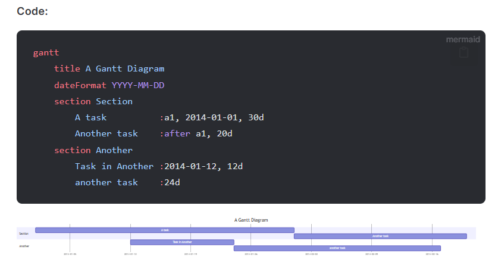

+++
title = "Material for MkDocs 中 mermaid 甘特图渲染过小踩坑记录"
slug = "mermaid-gantt-too-small-in-material-for-mkdocs"
+++

# Material for MkDocs 中 mermaid 甘特图渲染过小踩坑记录

在折腾 MkDocs + Material for MkDocs 里的 Mermaid 渲染时，发现如果直接按照 Material for MkDocs 文档[^1]来做，那么甘特图内容时间跨度较大、宽度较长时会被渲染得很小（甚至包括 Mermaid 的官方文档[^2]也是这样）



<!-- more -->

经过查阅，最终在 PyMdown Extension 的文档[^3]中找到了原因：

> Gantt charts usually are too big to render properly in a page. If the element is big enough to hold it, and the chart is large, they render too small to see. If the element is not wide enough, the chart can sometimes render squished and hard to read.

Mermaid 默认的渲染设置默认是启用了 `useMaxWidth` 的，而这体现在图表元素上就是一个 `width: 100%`，但是如果其父组件宽度较窄时就会导致图标被压缩到父组件的宽度，导致内容严重缩小难以阅读。

PyMdown Extension 的文档[^3] 中也有提到一种解决办法，即使用 js 来在所有 mermaid 元素外套一层标签，并为其添加 `overflow: auto;` 的样式，然后再修改 mermaid 的渲染设置关闭 `useMaxWidth` 即可。

然而这里我又踩了个坑，如果直接按照 PyMdown Extension 文档[^3] 的 Using in MkDocs 一节中的做法来做的话，是不起作用的。

原因推测是自从某一个版本的 Material for MkDocs 后，其内置了对 Mermaid 的自动加载（根据 class 为 `mermaid` 来判断），也就是说最终完成对 Mermaid 图表渲染的并不是我们自己定义了渲染设置的 mermaid，而是 Material for MkDocs 中内置的 mermaid。

解决办法也很简单，将 class 改为 `mermaid` 意外即可（`extra-loader.js` 中也要记得对应修改）：

```yml hl_lines="7"
markdown_extensions:
  - pymdownx.superfences:
      preserve_tabs: true
      custom_fences:
        # Mermaid diagrams
        - name: mermaid
          class: diagram
          format: !!python/name:pymdownx.superfences.fence_code_format
```

以及记得在 Mermaid 的渲染设置中设置 gantt 的 `useMaxWidth` 为 `false`：

```js hl_lines="3-5"
const defaultConfig = {
  //...
  gantt: {
    useMaxWidth: false
  }
}
```


[^1]: [Diagrams - Material for MkDocs (squidfunk.github.io)](https://squidfunk.github.io/mkdocs-material/reference/diagrams/)
[^2]: [Gantt diagrams | Mermaid](http://mermaid.js.org/syntax/gantt.html)
[^3]: [Advanced Mermaid Notes - PyMdown Extensions Documentation (facelessuser.github.io)](https://facelessuser.github.io/pymdown-extensions/extras/mermaid/#practical-diagrams)