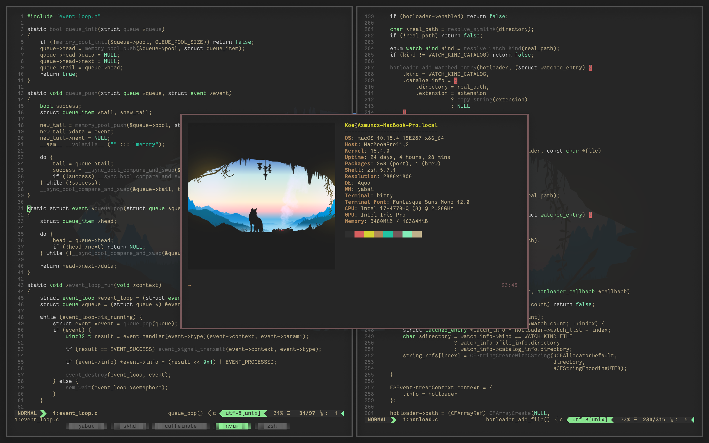

+++
title = "「Mac」Yabai 窗口管理器"
slug = "yabai"
tag = ["mac"]
+++

# 「Mac」Yabai 窗口管理器

!!! note

​	本篇文章中所用设备为 MacBook Pro M2 Max。




Yabai 是一个 Mac 下的平铺窗口管理器，它作为 MacOS 内置的窗口管理器的扩展运行，可以使得窗口、空间、显示控制变得十分高效。

Github：[koekeishiya/yabai: A tiling window manager for macOS based on binary space partitioning (github.com)](https://github.com/koekeishiya/yabai)

## 一、安装

## 1. 关闭 SIP

自 MacOS 10.13 起，一个叫做 系统完整性保护（System Integrity Protection）的功能被引入，它会保护一些特定的文件和目录不被修改（即便以 root 用户的身份）。

而 Yabai 的如下功能会需要向 Dock.app 中注入一些脚本：

- 工作空间的 聚焦、移动、切换、创建、销毁
- 移除窗口阴影
- 启用窗口透明
- 启用窗口动画
- 控制窗口层级（比如置顶某一窗口）
- 粘性窗口（使某一个窗口在所有工作空间显示）

所以，为了这些功能，首先我们需要关闭 SIP：

1. 关机

2. 长按关机键直至显示“Loading startup options”，然后点击“选项”，再点击“继续”

3. 于菜单栏中选择 `Utilities` 然后选择 `Terminal`

4. 运行如下命令来部分关闭 SIP：

   ```bash
   csrutil enable --without fs --without debug --without nvram
   ```

5. 重启

6. 运行如下命令启用非苹果签名的 arm64e 可执行文件

   ```
   sudo nvram boot-args=-arm64e_preview_abi
   ```

7. 再重启

> 可以通过 `csrutil status` 来查看 SIP 的状态。
>
> 如果想要再启用 SIP，重复上面的步骤并在第4步执行 `cstutil enable` 即可

### 2. 安装 Yabai

```bash
brew install koekeishiya/formulae/yabai
```

然后配置注入脚本：

```bash
# create a new file for writing - visudo uses the vim editor by default.
# go read about this if you have no idea what is going on.

sudo visudo -f /private/etc/sudoers.d/yabai

# input the line below into the file you are editing.
#  replace <yabai> with the path to the yabai binary (output of: which yabai).
#  replace <user> with your username (output of: whoami). 
#  replace <hash> with the sha256 hash of the yabai binary (output of: shasum -a 256 $(which yabai)).
#   this hash must be updated manually after running brew upgrade.

<user> ALL=(root) NOPASSWD: sha256:<hash> <yabai> --load-sa
```

再编辑 yabairc 配置文件（`~/.yabairc`）：

```bash
# for this to work you must configure sudo such that
# it will be able to run the command without password

yabai -m signal --add event=dock_did_restart action="sudo yabai --load-sa"
sudo yabai --load-sa

# .. more yabai startup stuff
```

使用 `yabai --start-service` 来启动。

### 3. 配置

Yabi 提供了很多命令，比如：

> 见：[Commands · koekeishiya/yabai Wiki (github.com)](https://github.com/koekeishiya/yabai/wiki/Commands#message-passing-interface)

- `yabair -m config` 进行一些选项的设定，

- `yabai -m display/space/windows xxx` 来对显示器/工作空间/窗口进行调整
- `yabai -m query xxx` 来获取一些当前 Yabai 中窗口等东西的信息
- `yabai -m rule` 来添加窗口规则
- `yabai -m signal` 来添加时间监听


而前面的 `.yabairc` 实际上是一个脚本，其中的内容会在每次 Yabai 启动的时候运行，那么就可以通过 `yabai -m config` 来在其中设置相关的选项。

> 见：[Configuration · koekeishiya/yabai Wiki (github.com)](https://github.com/koekeishiya/yabai/wiki/Configuration#configuration-file)


而对于快捷键则需要安装 [koekeishiya/skhd: Simple hotkey daemon for macOS (github.com)](https://github.com/koekeishiya/skhd)，其配置文件 `.skhdrc` 中包含了按键到命令的绑定，也就是说在其中可以通过其他的命令来实现各种快捷键的功能。

> 见：[yabai/examples/skhdrc at master · koekeishiya/yabai (github.com)](https://github.com/koekeishiya/yabai/blob/master/examples/skhdrc)

