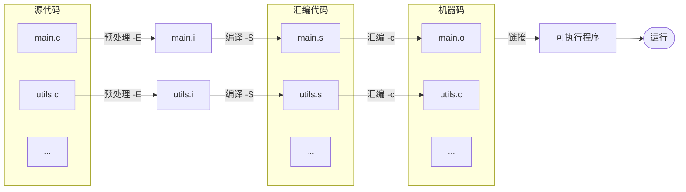

## 〇、前置
- [[../../「计算机基础」/『计算机基础』编程语言 与 程序]]
- [[../../「计算机基础」/『计算机基础』进制]]

## 一、C语言 -> 程序
**C语言** 是一门 **高级语言**、**编译型语言**，
故需要借助 **编译器** 来将 **C语言代码** 转换为 **二进制机器码 —— 程序**。
> 有关编程语言：[[../../「计算机基础」/『计算机基础』编程语言 与 程序]]
> 有关进制：[[../../「计算机基础」/『计算机基础』进制]]
### 1. GCC
**GCC（GNU Compiler Collection）** 是包含于 **GNU计划** 的一套编译器，支持多种语言与多种硬件平台。
> 有关 **GNU**：[[../../「计算机基础」/『计算机基础』操作系统]]

**GCC** 编译 **C语言** 的过程：


#### 1.1 获取 Mingw-w64（Minimum GNU for Windows）
[MinGW-w64 - for 32 and 64 bit Windows - Browse Files at SourceForge.net](https://sourceforge.net/projects/mingw-w64/files/)
下载 `x86_64-win32-seh` 并将其解压至一个合适的位置，其内部包含的就是编译器软件，`bin/` 目录下就是可执行文件。

>**seh** 是新发明的，而 **sjlj** 则是古老的。  
> **seh** 性能比较好，但不支持32位。 **sjlj** 稳定性好，支持32位。

将 `bin/` 目录添加到环境变量 `path` 中。

#### 1.2 完整地实现一个C语言程序

##### 1.2.1 编写代码
创建 `hello.c` 文件，输入以下内容：

```c
#include <stdio.h>

int main() {

	printf("Hello World!\n"); // 打印 Hello World! 到控制台

	return 0;
}
```

这就是一个基础的简单C语言程序。

它其中包含以下内容：

- **预处理器（Preprocessor）**：

    ```c
    #include <stdio.h>
    ```

    `#include` 语句用于引入其他C语言文件

- **主函数（Main function）**：程序运行的起始点

    ```c
    int main() {
        // ...
    }
    ```

- **语句（Statements）**：顾名思义，一句句话。

    ```c
    printf("Hello World!\n");
    ```

    ```c
    return 0;
    ```

- **注释（Comments）**：不会被执行的内容，用来为代码做标注、解释。

    ```c
    // 打印 Hello World! 到控制台
    ```

##### 1.2.2 完整地进行一次编译操作
1. 预处理

   ```shell
   gcc -E hello.c -o hello.i
   ```

   - `-E` 表示进行预处理操作
   - `-o xxx` 表示设定输出文件为 `xxx` 

   ![[../../../__Obisidan附件__/Pasted image 20220113154848.png]]
   可以发现，`#include <stdio.h>` 其实是把 `stdio.h` 文件（可以在编译器目录中找到）的内容插入到了文件当中。
   预处理其实就是一些关于文本字符串插入替换的操作。

2. 编译

   ```shell
   gcc -S hello.i -o hello.s
   ```

   - `-S` 表示进行编译操作

   得到的汇编语言代码：

   ```assembly
   	.file	"hello.c"
   	.text
   	.def	__main;	.scl	2;	.type	32;	.endef
   	.section .rdata,"dr"
   .LC0:
   	.ascii "Hello World!\0"
   	.text
   	.globl	main
   	.def	main;	.scl	2;	.type	32;	.endef
   	.seh_proc	main
   main:
   	pushq	%rbp
   	.seh_pushreg	%rbp
   	movq	%rsp, %rbp
   	.seh_setframe	%rbp, 0
   	subq	$32, %rsp
   	.seh_stackalloc	32
   	.seh_endprologue
   	call	__main
   	leaq	.LC0(%rip), %rcx
   	call	puts
   	movl	$0, %eax
   	addq	$32, %rsp
   	popq	%rbp
   	ret
   	.seh_endproc
   	.ident	"GCC: (x86_64-win32-sjlj-rev0, Built by MinGW-W64 project) 8.1.0"
   	.def	puts;	.scl	2;	.type	32;	.endef
   
   ```

3. 汇编

   ```shell
   gcc -c hello.s -o hello.o
   ```

   - `-c` 表示进行汇编操作

   如果再用文本编辑器打开，会看到很多乱码，因为 `.o` 文件内容已经是二进制机器码的形态了，如果用十六进制编辑器打开可以看到我们在程序中写的 `Hello World!` 字符串常量：
   ![[../../../__Obisidan附件__/Pasted image 20220113155825.png]]

4. 链接

   ```shell
   gcc hello.o -o hello
   ```

   > 直接使用 `gcc` 会自动完成所有步骤 见下面1.2.3↓。
   
   得到 `hello.exe`。
   
   可以使用 `./hello.exe` 来运行，得到输出：
   ![[../../../__Obisidan附件__/image-20220113160043970.png]]

##### 1.2.3 一步到位的编译

```shell
gcc hello.c -o hello
```

![[../../../__Obisidan附件__/image-20220113160109079.png]]

### 二、一些基础内容
**C语言** 中，每一个 **语句（Statement）** 都以分号结尾。
#### 2.1 注释
单行注释：

```c
// 被注释掉的文字不会以及 “//” 都不会被运行
```

多行注释：

```c
/*
被这两个符号围起来的部分以及他们自己
都
不会
被
执行
*/
```

#### 2.2 输出
见 [[『C语言简明教程』1. 变量、输入输出 咕咕咕]]
#### 2.3 算术运算符

| 算术运算符 | 名称/含义                                  |
| ---------- | ------------------------------------------ |
| `+`        | 加                                         |
| `-`        | 减                                         |
| `*`        | 乘                                         |
| `/`        | 都是整数时为整除，有一个是小数是是正常除法 | 
| `%`        | 取模（前者除以后者的余数）                 |

---

至此，你已经踏入 C 的大门了。 