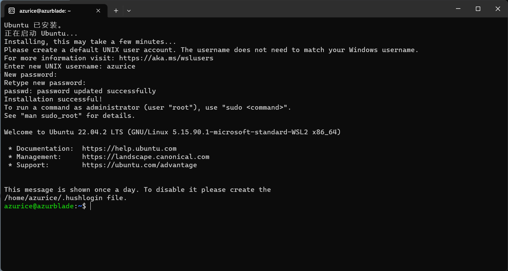

# WSL —— 在Windows 中使用 Linux 系统

**WSL（Windows Subsystem for Linux）** ，又叫做 **适用于 Linux 的 Windows 子系统**，可以在 Windows 中运行 GNU/Linux 环境，且不产生传统虚拟机或者双系统的启动开销。

它历经两个版本：

- WSL1：没有使用虚拟机，但 Linux 内核不完整，不过跨 OS 的文件系统性能高于 WSL2。
- WSL2：使用了虚拟机，有完整的 Linux 内核，以及完整的系统调用兼容性，甚至借助 WSLg 可以实现在 Windows 中使用 Linux 中的 GUI 应用。

本文将使用 WSL2。

> **系统要求**：Windows 10 2004（内部版本 19041）及以上或 Windows 11

## 一、安装

在终端中运行以下命令：

```powershell
wsl --install
```

> WSL 默认安装的 Linux 发行版是 Ubuntu，如果想安装其他的发行版可以使用 `wsl --install -d <Distribution Name>`。
>
> 所有发行版名称的有效列表可以通过 `wsl --list --online` 来获取。
>
> 所有已安装的发行版名称的有效列表可以通过 `wsl --list --verbose` 来获取。
>
> （可以安装多个发行版，并在其之间切换）

随后会提示进行重启，重启后会自动弹出一个窗口要求你设定用户名和密码：



输入完毕后便会进入到 WSL 的 Shell，就可以当作普通的 Linux 系统来使用了。

## 二、使用

使用 `wsl` 命令即可打开 WSL 的 Shell，可以使用 `wsl -d xxx` 来指定某一个已安装的发行版，使用 `wsl -s xxx` 来将某一个发行版设为默认。

### 1. 在任意目录打开

WSL 一大好处就是可以无缝与 Windows 的文件系统交互，我们可以在任何地方直接打开 WSL 的 Shell。

在 Windows中任意目录下空白位置按住 Shift 按右键，选择打开 Linux Shell 即可在当前目录打开 WSL 的 Shell：


### 2. 与 vscode 连接

首先需要 vscode 安装插件 WSL。

然后在 WSL 的 Shell 中

```terminal
code 要打开的路径
```

即可。


比如我要打开 `F:\azurice.github.io` 这个目录，那么我可以首先通过 2.1 的方法在这个目录下打开 Linux shell，然后输入 `code .` 即可。

## 三、导入任何 Linux 发行版


