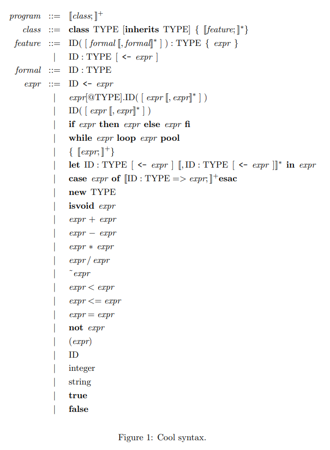

## 一、环境准备

在虚拟机中的合适位置创建一个目录，用于存放此次作业相关内容。

在目录中执行下面的命令：

- 如果使用 C++：`make -f /usr/class/cs143/assignments/PA2/Makefile`
- 如果使用 Java：`make -f /usr/class/cs143/assignments/PA2J/Makefile`

然后会多出来一些文件和符号链接。

需要我们完成的只有 `cool.flex`（使用 C++）或 `cool.lex`（使用 Java）。

如果要构建词法分析器，则需要运行 `make lexer`。

## 要求

首先，阅读 [cool-manual.pdf](./PA1.assets/cool-manual.pdf) 中 Section 10 和 Figure 1 的内容，然后参考在 `cool-parse.h` 中定义的 token 编写 Pattern 和 Action。

## 测试方法

There are at least two ways that you can test your scanner. The first way is to generate sample inputs and run them using lexer, which prints out the line number and the lexeme of every token recognized by your scanner. The other way, when you think your scanner is working, is to try running mycoolc to invoke your lexer together with all other compiler phases (which we provide). This will be a complete Cool compiler that you can try on any test programs. In addition, for the public version of the class, we will provide the students with scripts that provide automated feedback on what works and what doesn’t.