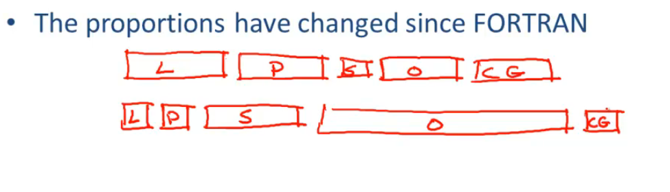

# -Week 1 01-02-structure-of-a-compiler-final

[Week 1 01-02-structure-of-a-compiler-final_哔哩哔哩_bilibili](https://www.bilibili.com/video/BV1NE411376V?p=2)

编译器工作的五个主要阶段：
- 词法分析（Lexical Analysis）
- 解析（Parsing）
- 语义分析（Semantic Analysis）
- 优化（Optimization）
- 代码生成（Code Generation）

### 1. 词法分析（Lexical Analysis）

即识别词语。

例如对于一个句子：

```
This is a sentence
```

人类可以十分自然地识别出它包含四个词语，依据分隔符（空格以及标点符号）。

如果我们将分隔符的位置改变一下：

```
ist his ase nte nce
```

就会不太好理解。

**词法分析** 这个阶段的目的就是划分程序代码为一个个词（Words），在编译器中，他们被称作 **词法单元（Tokens）**。

例如对于下面一段程序代码：

```
if x == y then z = 1; else z = 2;
```

经过 **词法分析** 应当可以识别出其组成如下：

- 关键词：`if`、`then`、`else`
- 变量：`x`、`y`、`z`
- 常量：`1`、`2`
- 运算符：`==`、`=`
- 以及一些分隔符和引号

在理解了 **词法结构** 后就要理解 **句法结构**

### 2. 解析（Parsing）

也就是将句法结构化为一张图表（树）

```
This    line is     a       long   sentence
 |        |   |     |         |       |
article noun verb article adjective noun
     |    |     |       |      |      |
      \  /      |        \     |     /
    Subject     |            Object
         \      |             /
          --- Sentence -------
```

对应的上面的代码可以被解析为这样：

```
if x == y then z = 1; else z = 2;

  x == y      z    1      z    2
  \ | /        \  /        \  /
 relation     assign      assign
    |            |           |
predicate   then-stmt   else-stmt
         \      |      /
          \     |     /
           if-then-else
```

在这之后我们便理解了 **句法**，接下来就可以开始理解其意思。

### 3. 语义分析

对于下面这个例子：

```
Jack said Jerry left his assignment at home.
```

要理解推断出其中的的 `his` 是代指 Jack 还是 Jerry 是很难的，更进一步，如何区分这个句子和以问号结尾的同样的句子的语义的差别也是很难的。

对于编程语言来说，**语义分析** 要分析的一个例子就是变量绑定：

```c++
{
	int Jack = 3;
	{
		int Jack = 4;
		cout << Jack;
	}
}
```

编程语言制定了严格的规则来避免歧义。

### 4. 优化

比如有时可以将 `X = Y * 0` 优化为 `X = 0`（对于整数来说）。
但是对于浮点数，在 IEEE 标准中有个特殊的数值 `NaN`，`NaN * 0` 依旧是 `Nan`。

### 5. 代码生成

生成目标语言，比如对应平台的二进制码。

---

以往的编译器结构复杂度与现代编译器的比较：

