T18:06:00+08:00
## 一、Java 与 C 的不同

先来看看一个 **C语言程序** 从编写到运行所经历的过程：

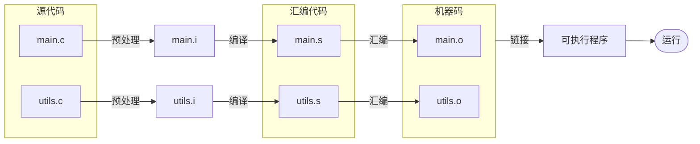

**源代码** 编译为 **汇编代码** 再汇编为 **机器码** 再链接为最终的 **可执行程序**。

不同平台（如 Max, Windows, Linux...）所识别的机器语言是不同的。

**C语言程序** 在不同平台运行的实现方式是 **针对不同平台进行特定的编译操作** 得到对应平台的机器码，即 **<font color="red">到处编译，到处运行</font>**。

**Java** 是 **跨平台** 的语言，是无论对于什么目标平台都编译为统一的 **字节码**，在不同的平台上引入一个 **虚拟机** 来执行这些字节码（将这些字节码“翻译”为对应平台的机器码并执行），即 **<font color="red">一次编译，到处运行</font>**，而这个虚拟机有一个名字 —— **Java Virtual Machine(JVM)**。

不过这样也有不方便的缺点，即要想运行就需要有 **JVM** 环境。

以下是一个 **Java语言程序** 从编写到运行所经历的过程：

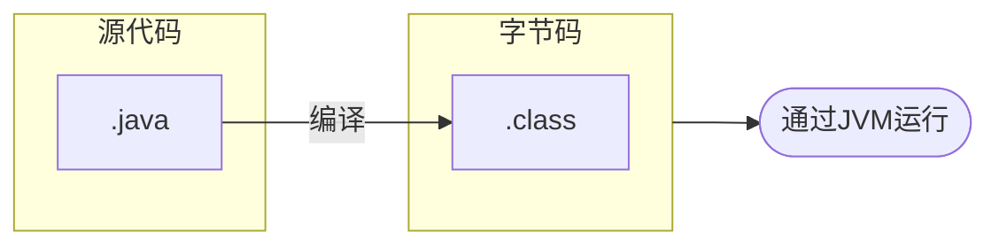

因此，开发一个 **Java语言程序** 所需要的东西就很清晰了：

1. 编译器
2. 虚拟机

在 **Java8** 及之前版本时，发行的工具包有两个版本：

- **Java Runtime Environment(JRE)** 其中只包含 **JVM**
- **Java Development Kit(JDK)** 其中包含 **JVM** 以及 **编译器**

而 **Java8** 之后，就只发行 **JDK** 了。

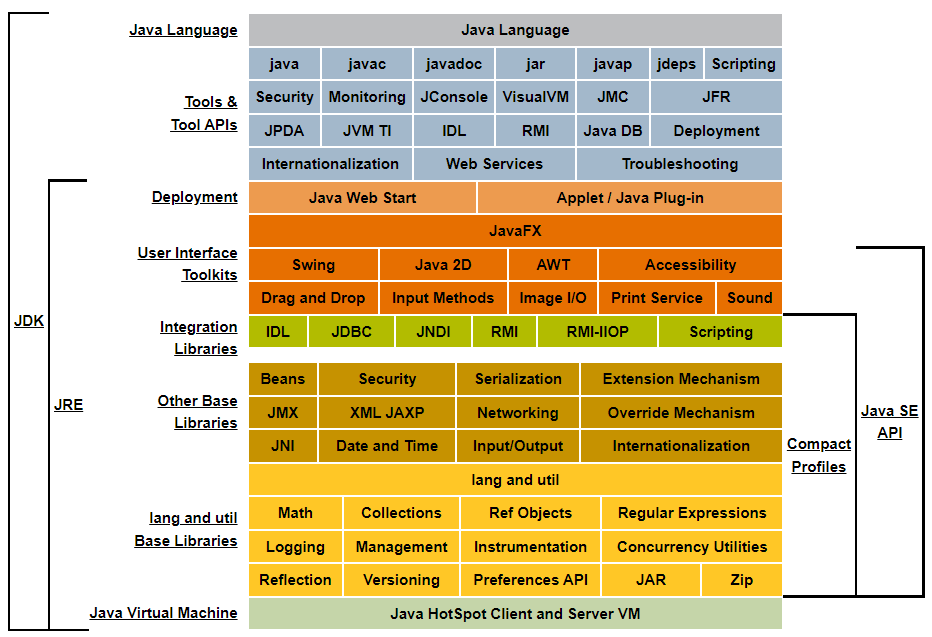

> 图：**JDK** 与 **JRE** 的关系
> 可以在这个网站深入挖掘一下 [Java Platform Standard Edition 8 Documentation (oracle.com)](https://docs.oracle.com/javase/8/docs/)

## 二、开发环境配置 - 上

**Java** 最初的开发公司是 **Sun公司** 后来被 **甲骨文(Oracle)公司** 收购，这是 **Oracle官网** ：

[Oracle | Cloud Applications and Cloud Platform](https://www.oracle.com/index.html)

在其中可以找到 **JDK** 的下载页面（Products -> Java -> Download Java）：

[Java Downloads | Oracle](https://www.oracle.com/java/technologies/downloads/)

在这里，很多 **Java** 版本并没有被显示出来，目前出现在页面中可以下载的 **Java8**, **Java11** 和 **Java17** 是一些长期支持 **Long-Term Support(LTS)** 的版本。

> **LTS版本** 即为开发商保持维护（修bug之类的工作）的版本。

如今 **Java** 每6个月便会迭代一个主要版本，公布一些新特性以及虚拟机的优化。

直接冲最新版就好了😁。

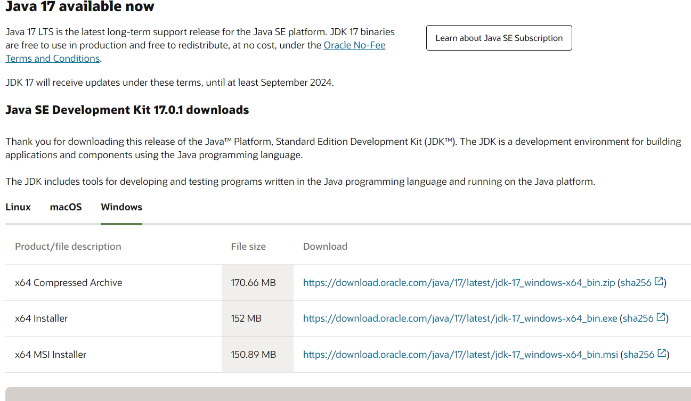

选择 **Windows** 下载 **Installer** （两个都行），然后安装一路下一步（**<font color="red">最好不要改位置</font>**），之后它应该会出现在这里：


打开看一看里面的结构：

```
jdk-17.0.1
    ├─bin
    ├─conf
    ├─include
    ├─jmods
    ├─legal
    └─lib
```

`bin/` 目录下是可执行文件，其中就包含我们会经常使用到的：

- **编译器** `javac.exe`
- **JVM虚拟机**
  - `java.exe`
  - `javaw.exe` w代表windows，不会显示控制台内容（在运行有 图形用户界面 **Graphical User Interface(GUI)** 的程序时就不会出现控制台的黑框。

此时打开 **Cmd** 或 **PowerShell**，输入 `java --version`，应该会得到如下内容：

```powershell
PS C:\Users\azurice> java --version
java 17.0.1 2021-10-19 LTS
Java(TM) SE Runtime Environment (build 17.0.1+12-LTS-39)
Java HotSpot(TM) 64-Bit Server VM (build 17.0.1+12-LTS-39, mixed mode, sharing)
```

> - 打开 **Cmd** 方法
>
>   **Windows + R** 输入 `cmd` 确定。
>
>   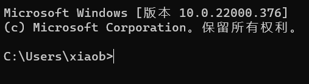
> - 打开 **PowerShell** 方法
>
>   **Windows + R** 输入 `powershell` 确定。
>
>   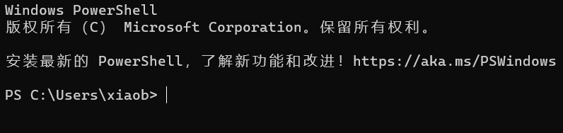

如果没有，提示不是命令或无法识别的话还需要配置环境变量：

> 在终端输入命令运行一个程序的时候，计算机会在当前目录去查找对应的可执行文件。
>
> 例如如果当前目录有一个 `nb.exe`，在 **Cmd** 中输入 `nb` 或 `nb.exe`（**PowerShell** 中为 `./nb` 或 `./nb.exe`）的时候会在当前目录去查找并运行，找不到就会报错。

> 环境变量中的 `Path` 就包含很多路径，使计算机也在这些路径中进行查找。

自行百度查找 `修改环境变量`，打开下面的界面，编辑 `Path` 添加刚刚的 `bin/` 目录

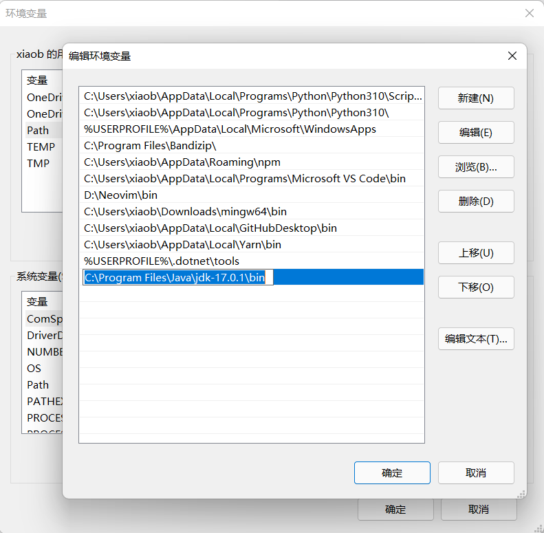

然后一路确定，重启一下大概就好了。

## 🐳、宕开一笔 小试一下

找个地方新建一个 `HelloWorld.java`，输入以下内容：

```java
public class HelloWorld {
    public static void main(String[] args) {
        System.out.println("Hello World");
    }
}
```

之后保存。

在文件所在位置打开 **Cmd** 或 **PowerShell**（Win10）：

> 如果你是 **Win11** 的话，可以直接打开特别特别特别好用的 **Windows Terminal** 来使用 **Cmd** 或 **PowerShell**。
>
> （Windows Terminal 和 Cmd 或 PowerShell并不是一个东西，Terminal更像是个外壳，内容是后者，具体详细知识见 [Shell 与 Terminal 的区别]()【还没写】）。

然后介绍一些基础命令来切换当前目录到文件所在目录：

- `盘符` 来切换到对应盘符下
- `cd xxx` 来切换到xxx目录
- `dir` 列出当前目录下的文件

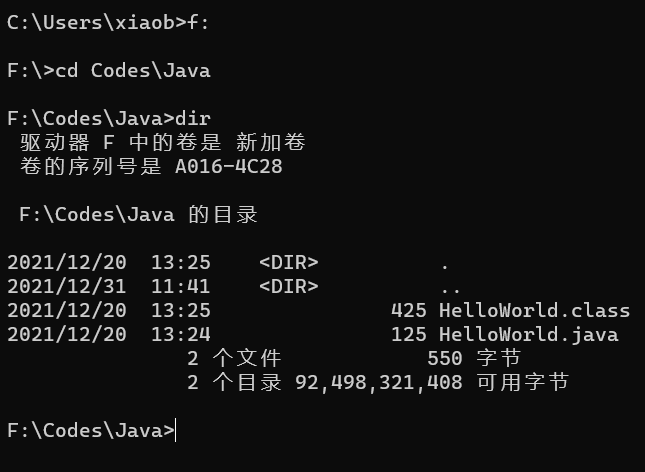

> 目录、文件名什么的不用手动打完的，可以输一个 `code` 甚至 `cod`，按几下 tab键，就可以自动补全

> 🎈当然也有快捷的直接在目录打开的方法：
>
> 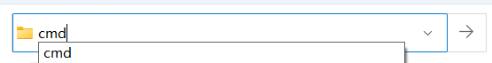
>
> 直接在这里输入 `cmd` 或 `powershell` 回车就可以啦。

> 🎈对于 `powershell` 也可以按着 Shift 右键当前目录的空白处：
>
> 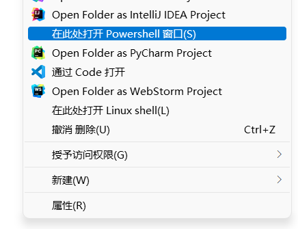

> 🎈🎈🎈当然，**Win11** 的 **Windows Terminal** 最方便，直接右键空白处：
>
> 

打开以后我们来 **编译** 并 **运行** `HelloWorld.java`：

> 注意下面执行的命令是 `PS xxxxxx>` 后面的内容！

1. 编译

   ```powershell
   PS F:\Codes\Java> javac .\HelloWorld.java
   ```

   你会发现多了一个 `.class` 字节码文件
2. 运行

   ```powershell
   PS F:\Codes\Java> java HelloWorld
   ```

   得到输出：

   ```powershell
   PS F:\Codes\Java> java HelloWorld
   Hello World
   ```

到这里,大概应该已经对 **Java语言** 有所了解了。

接下来推荐几款 集成开发环境 **Integrated Development Environment(IDE)**，当然你要是想 **繁华落尽见真淳** 文本编辑器 + 命令行也不错，**比如我这种 NeoVim 忠诚教徒**。

不过对于比较大的项目，当然还是 **IDE** 配置成本低一些，所以我的 **NeoVim** 主要写 **C** 或小体量项目。

## 二、开发环境配置 - 下

我就只推荐一个 —— **IntelliJ IDEA**。

**Jetbrain全家桶yyds**

下载页面：[下载 IntelliJ IDEA：JetBrains 功能强大、符合人体工程学的 Java IDE](https://www.jetbrains.com/zh-cn/idea/download/#section=windows)

注意要下载 **Community** 版本（除非你有钱，或者你像我一样申请了学生包✈️）

安装依旧一路下一步，这里建议把这个 **Open Folder As A Project** 勾上，蛮实用的：

## 三、IntelliJ IDEA 的使用

### 3.1 创建项目

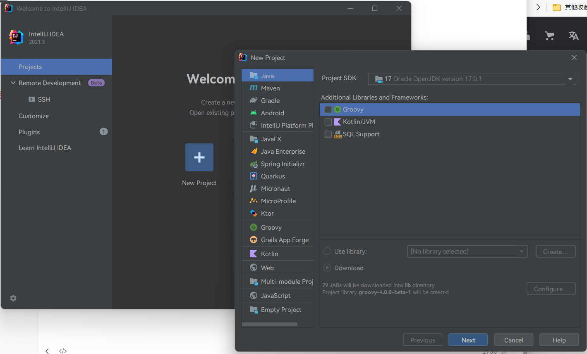

创建一个 `HelloWorld` 项目：


**Base package** 暂时先不用管，以后会讲。


创建完成：

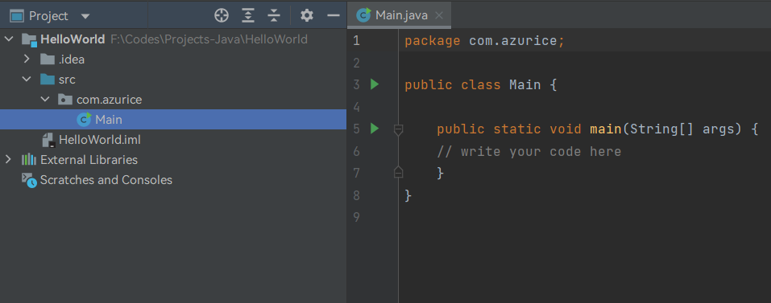

看一下目录结构：

```
HelloWorld
    ├─.idea
    ├─src
    │   └─com
    │       └─azurice
    │       	└─Main.java
    └─HelloWorld.iml
```

- `.idea/` 目录

  **IntelliJ IDEA** 的项目相关文件，不用管
- `src` 目录

  存放源码的目录
- `HelloWorld.iml` 文件

  项目相关文件，不用管

### 3.2 运行


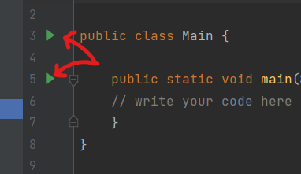

会在内置的终端运行：

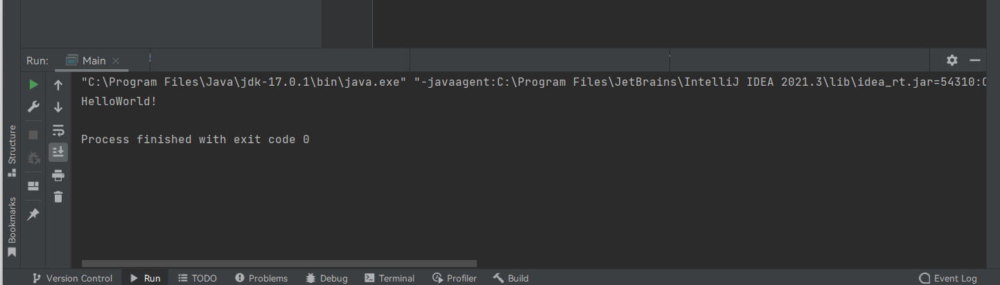

有些时候并不好用。。。（比如调试CSI序列等内容时）

### 3.3 调试


---

那么，这篇大概就这样了？

一会见！