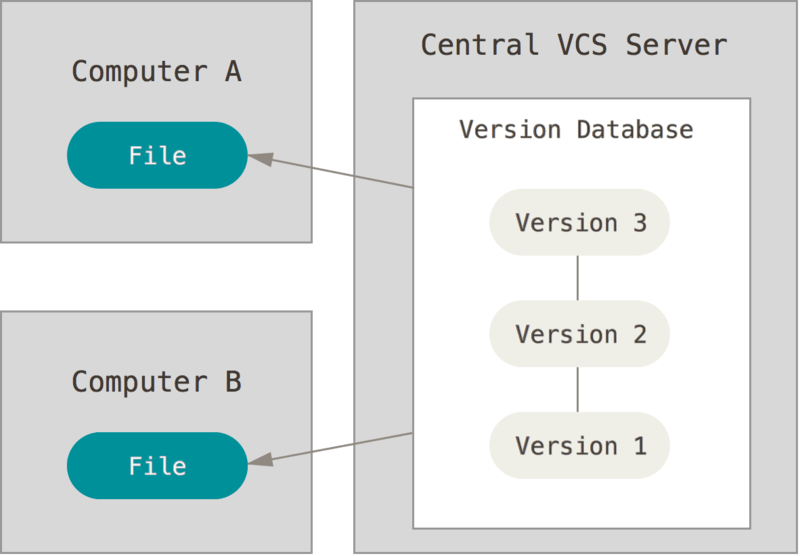

# 『git』0. 概述

T21:46:00+08:00
什么是 git？是一款免费、开源、分布式 **版本控制系统**。那么版本管理系统又是什么？

## 一、什么是版本管理

**版本管理系统**（**Version Control System** or **VCS**）即记录一个或一组文件随着时间的推移所发生的变化，以便你以后可以找回特定的版本。日常计算机使用中对一个文件的最常见最简单的的版本管理就是 撤销/重做 系统，然而版本管理并不局限于单个文件以及文件的类型，它完全可以扩展到对一个目录内所有内容的管理。

一个被用于版本管理的最关键的工具就是 **修订管理系统**（**Revision Control System** or **RCS**），它的工作原理是在每一次文件更新时记录文件不同版本之间的差异（也叫做补丁集），并将其以一种特殊的格式保存在磁盘上；然后它可以通过将所有的补丁相加来重新创建任何文件在任何时间点的样子。

### 1. 中心化 VCS

也就是将版本文件存储在一个中央服务器上，所有其他人从这个服务器中获取最新版本的文件，修改后再传回服务器。
然而这有一些坏处，如果服务器寄了，那就寄了。在本地管理也是如此，硬盘寄了，那就寄了。

### 2. 分布式 VCS

各个客户不再只是检查文件的最新快照；相反，他们将所有版本信息，包括其完整的历史，完全保存。因此，如果有任何服务器寄了，任何一个客户端的仓库都可以被复制到服务器上，以恢复它。每个克隆实际上是所有数据的完整备份。

而 git，就是一个分布式的版本管理系统。

## 二、什么是 git

Git 与其他版本管理系统相比，存储和思考信息的方式非常不同，因此如果你理解了什么是 Git 以及它如何工作的基本原理，那么有效地使用 Git 对你来说可能就会容易得多。

### Git 存储快照 而非差异

首先，Git 与其他任何 VCS（CVS、Subversion、Perforce、Bazaar等等）的主要区别在于 Git 对其数据的思考方式。

git并不记录随着时间推移产生的不同文件版本之间的差异，而是记录一个完整的文件快照。每次提交或保存项目状态时，Git 基本上都会拍下所有文件在那一刻的样子，并存储对该快照的引用。为了提高效率，如果文件没有变化，Git不会再次存储该文件，而只是存储一个与之前相同的文件的链接。