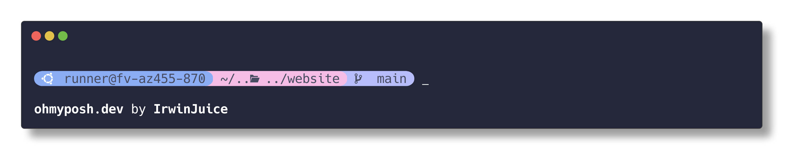

> 官网：[Home | Oh My Posh](https://ohmyposh.dev/)
>
> Github：[JanDeDobbeleer/oh-my-posh: The most customisable and low-latency cross platform/shell prompt renderer (github.com)](https://github.com/jandedobbeleer/oh-my-posh)


「可定制性最强、延迟最低的跨平台 / Shell 提示符渲染器」

懒得写介绍了，简单来说，就是把你的命令行 / shell 变好看。

## 安装

### 1. Oh My Posh 本体

可以通过 Scoop / Winget 来安装，当然也可以通过一行 Powershell 命令下载官方的安装脚本并执行手动安装，这里选择使用 Scoop 安装：

```powershell
scoop install https://github.com/JanDeDobbeleer/oh-my-posh/releases/latest/download/oh-my-posh.json
```

上面的命令会安装两样东西：

- `oh-my-posh.exe` 可执行文件
- `themes` 最新的 Oh My Posh 主题

可以在 `POSH_THEMES_PATH` 环境变量对应的文件夹中找到主题，

### 2. 字体

> Nerd Fonts 官网：[Nerd Fonts - Iconic font aggregator, glyphs/icons collection, & fonts patcher](https://www.nerdfonts.com/)
>
> Github：[ryanoasis/nerd-fonts: Iconic font aggregator, collection, & patcher. 3,600+ icons, 50+ patched fonts: Hack, Source Code Pro, more. Glyph collections: Font Awesome, Material Design Icons, Octicons, & more (github.com)](https://github.com/ryanoasis/nerd-fonts)


Oh My Posh 显示图标需要 Nerd Fonts 字体，所以这一步我们需要安装一款 Nerd Fonts 字体并设置终端使用它。Nerd Fonts 字体并不是一个具体的字体，而是一系列字体。其中的每一个字体都可以看作是 某一个流行字体 + 一系列图标字体（如上图）。同时，Nerd Fonts 中大部分经过修改后的字体会拥有一个新的名字，但是和原本的名字很像，比如很知名的 SourceCodePro，在 Nerd Fonts 中经过“改造后”就被称为 SauceCodePro Nerd Font，很有趣。

你可以选择手动从官网下载并安装，不过现在 Oh My Posh 命令可以直接安装：

```
sudo oh-my-posh font install
```

> 这里 `sudo` 是通过 scoop 安装的，用处就是以管理员权限执行该命令。如果没有 `sudo` 就在有管理员权限的终端下执行命令。
>
> 当然也可以制动 `--user` 来不用管理员权限，仅安装到当前用户下，不过对于一些应用可能会有一些副作用，字体还是安装到整个系统而非某个用户比较好。

不过我这里依旧选择使用 scoop，主要是方便更新之类的：

```terminal
sudo scoop install -g nerd-fonts/JetBrainsMono-NF-Mono
```

然后在 Windows Terminal 中设置使用它：


### 3. 修改 prompt

> 针对不同的 shell 有不同的方式，这里只写 powershell 的方式，详情参考官方文档：[Change your prompt | Oh My Posh](https://ohmyposh.dev/docs/installation/prompt)
> 如果不知道使用的是哪个 shell 可以运行：
> 
> ```powershell
> oh-my-posh get shell
> ```

编辑 PowerShell 的 profile 脚本（你可以使用任意的编辑器，这里我就用 neovim 了）：

```powershell
nvim $PROFILE
```

添加下面一行：

```powershell
oh-my-posh init pwsh | Invoke-Expression
```

然后通过下面的命令来重新加载 profile：

```powershell
. $PROFILE
```

可以看到效果已经生效了：


## 二、配置

如果不指定配置，Oh My Posh 会使用其默认配置，若想指定配置则需要修改 profile 中的初始化命令添加 `--config` 选项：

可以添加两种 `--config` 选项:

- 到一个本地配置文件的路径

```powershell
oh-my-posh init pwsh --config 'C:/Users/Posh/jandedobbeleer.omp.json' | Invoke-Expression
```

- 到一个远端配置文件的 URL

```powershell
oh-my-posh init pwsh --config 'https://raw.githubusercontent.com/JanDeDobbeleer/oh-my-posh/main/themes/jandedobbeleer.omp.json' | Invoke-Expression
```

我们首先先使用一些 Oh My Posh 中的 `themes` 中带有的配置：

使用 `Get-PoshThemes` 可以在 powershell 中渲染出每一个主题的样子。

比如我们切换使用 catppuccin 主题：



```powershell
oh-my-posh init pwsh --config "$env:POSH_THEMES_PATH/catppuccin.omp.json" | Invoke-Expression
```

有关更详细的自定义，参阅文档：[General | Oh My Posh](https://ohmyposh.dev/docs/configuration/overview)。

