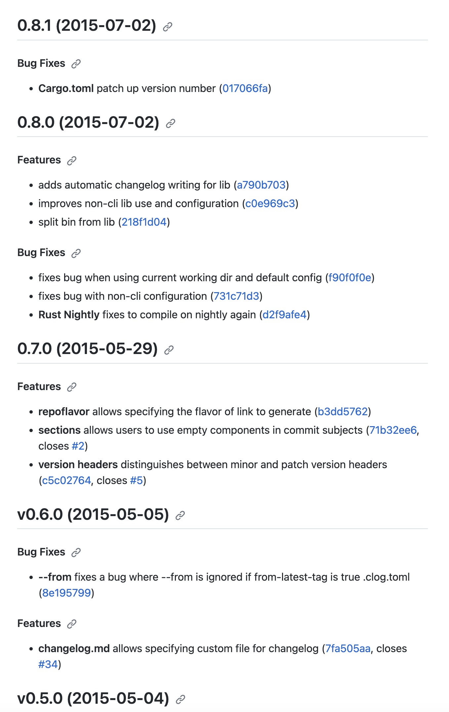

# 使用 clog-cli 由 git 提交生成 changelog

https://github.com/clog-tool/clog-cli

https://github.com/conventional-changelog/conventional-changelog/blob/a5505865ff3dd710cf757f50530e73ef0ca641da/conventions/angular.md

`clog` 能够使用本地 git 仓库的信息自动生成 changelog：



只需要确保你的每一次提交都满足 conventional 格式，之后在希望更新 changelog 的时候只需要简单地运行 clog 即可。

可以通过一个 `.clog.toml` 文件来配置，以下为默认配置：

```toml
[clog]
# A repository link with the trailing '.git' which will be used to generate
# all commit and issue links
repository = "https://github.com/clog-tool/clog-cli"
# A constant release title
subtitle = "my awesome title"

# specify the style of commit links to generate, defaults to "github" if omitted
link-style = "github"

# The preferred way to set a constant changelog. This file will be read for old changelog
# data, then prepended to for new changelog data. It's the equivilant to setting
# both infile and outfile to the same file.
#
# Do not use with outfile or infile fields!
#
# Defaults to stdout when omitted
changelog = "mychangelog.md"

# This sets an output file only! If it exists already, new changelog data will be
# prepended, if not it will be created.
#
# This is useful in conjunction with the infile field if you have a separate file
# that you would like to append after newly created clog data
#
# Defaults to stdout when omitted
outfile = "MyChangelog.md"

# This sets the input file old! Any data inside this file will be appended to any
# new data that clog picks up
#
# This is useful in conjunction with the outfile field where you may wish to read
# from one file and append that data to the clog output in another
infile = "My_old_changelog.md"

# This sets the output format. There are two options "json" or "markdown" and
# defaults to "markdown" when omitted
output-format = "json"

# If you use tags, you can set the following if you wish to only pick
# up changes since your latest tag
from-latest-tag = true
```

