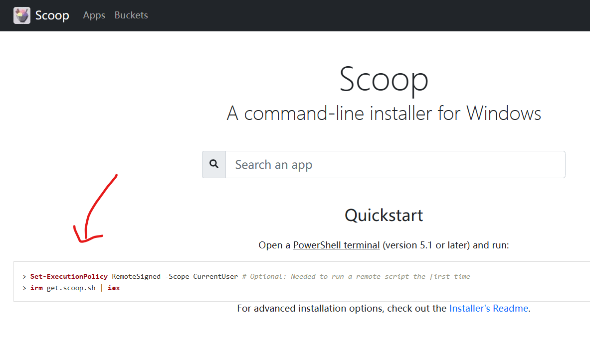
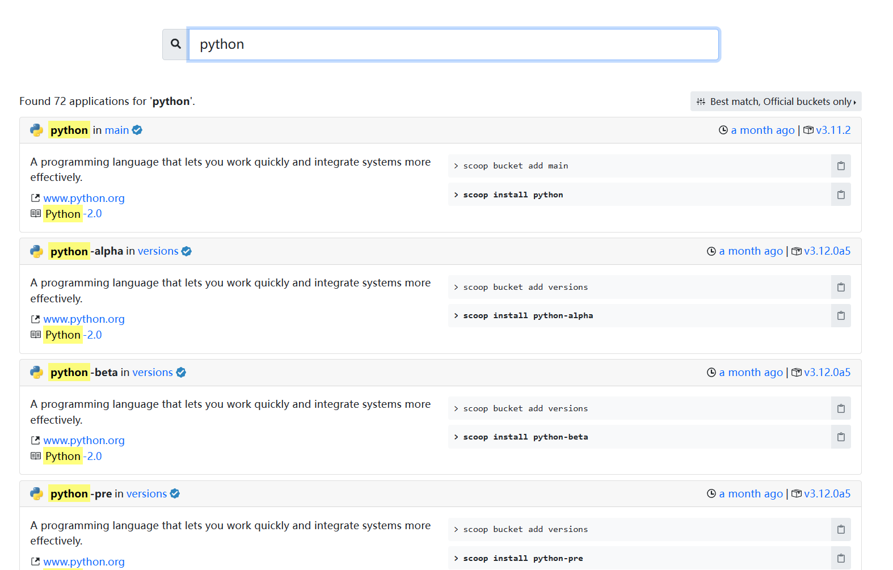
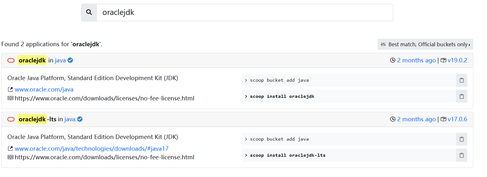

# 告别繁琐安装界面，使用Scoop管理Windows软件

T11:15:27+08:00
写这篇文章的起因是一位舍友问我怎么配置 Python 环境，我想了想虽然普通的方式也不算复杂环境变量会被安装器自己加上，但是想了想曾经他们配置 Java 环境时的费劲程度，我想起了假期遇见的能让人从这一系列繁琐配置过程中解脱出来的软件 —— Scoop。所以这篇文章将以安装 Python 为引，介绍一下 Scoop 的基本使用。

## 一、什么是 Scoop

> 官网：[Scoop](https://scoop.sh/)
>
> Github：[ScoopInstaller/Scoop: A command-line installer for Windows. (github.com)](https://github.com/ScoopInstaller/Scoop)

它可以被看作是 Windows 下的 **包管理器**，而 **包管理器** 一般是 Linux 系统中的概念。在 Linux 的各种发行版中通常都会包括一个特殊的软件（包管理器），使得可以通过这个软件方便的管理所有其他的包（软件、字体等等）。

下面为了直观感受，举几个例子，在 Ubuntu 下使用 apt-get：

```
apt-get install python
```

在 Archlinux 下使用 Pacman：

```shel
pacman -S python
```

诸如此类。

而说 Scoop 是 Windows 下的包管理器也就不难理解了，其实就像官网的副标题一样，它是一个「用于 Windows 的命令行安装程序」。它会将 GUI 式的安装引导、权限请求窗口隐藏起来，自动安装依赖，同时能够避免 PATH 环境变量污染以及由于安装与卸载导致的意外的副作用。

它的工作方式就是将安装源文件内的所有文件按照仓库中的指定方式配置到你的系统中，默认它会将应用安装到 `~/scoop/`（即 `C:\Users\<YOURUSERNAME>\scoop`）

## 二、安装 Scoop

要学会看官网、看 Github 的 README：




总而言之就是在 PowerShell 中运行下面一行简单的命令：

```powershell
iwr -useb get.scoop.sh | iex
```

如果你获得了一坨报错，那是因为 Windows 默认不允许运行远程的未签名的脚本，需要在 设置>隐私和安全性>开发者选项>PowerShell 中将「更改运行策略，以允许……」选项打开。

如果还报错，就是网络问题，毕竟 Github 在国外（），要么多试几次没准玄学就出来了，要么相信你也会科学上网。

## 三、基本使用

### 1. 基础的使用

安装完毕后回到正题，怎么安装 Python？很简单，一行命令：

```powershell
scoop install python
```

结束。你可以在终端输入 `python` 就能直接使用。

如果你想更新：

```powershell
scoop update python
```

或者使用 `scoop update *` 来更新所有使用 Scoop 管理的软件

如果你想卸载：

```powershell
scoop uninstall python
```

如果你想查看 Scoop 都安装了什么软件：

```powershell
scoop list
```

---

我怎么知道我可以用 Scoop 安装什么软件呢？可以到官网（[Scoop](https://scoop.sh/)）去查：


在这里搜软件的名字。

比如可以查到刚才安装的 Python：



比如我们还想安装 jdk，就搜 jdk。

不过你会发现它有很多很多 jdk，有 `corretto-jdk` 有 `liberica-jdk` 甚至还有 `microsoft-jdk` 等等，而我们以前从官网下载的就是 `oraclejdk`。他们都是遵循着 Java 的规范做的不同实现，在性能以及选项上会有一定的差异，而且他们的开闭源性也不同，开源的协议也不同。

这里搜索 `oraclejdk` 为例：



这里又会发现，名字后面的 `in xxx` 和刚才有区别，刚才是 `python in main`，现在是 `oraclejdk in java`，这里就引入 Scoop 中 Bucket 的概念。

### 2. Bucket

Scoop 将各种软件分门别类的放在了不同的仓库中，每一个仓库就是一个 Bucket。你可以在 ScoopInstaller 的 Github 中看到每个 Buckets 的仓库：


当然在官网你还可以方便地找到一些非官方的 Buckets。


Scoop 默认是只包含 main Bucket 中的内容的，要想使用其他 Bucket 需要将其他的 Bucket 添加进来：

```powershell
scoop bucket add java
```

如果你没有安装过 git 他会提示你需要 git，而 git 其实在 main Bucket 中，那你也可以直接使用 Scoop 安装 git：

```powershell
scoop install git
```

然后再添加 Bucket。

添加过后就可以安装 `oraclejdk` 了：

```powershell
scoop install oraclejdk
```

现在你不需要管那些繁琐的环境变量配置，直接输入 `java -version` 就能够使用。

## 三、装到哪去了？它是怎么搞定环境变量的？

其实到上一步你已经可以使用 Scoop 了，不过后面会继续讲解一些 Scoop 的机制，这样在遇到一些问题是你才会知道怎么解决以及原因是什么。

前面提到 Scoop 会将软件安装到 `~/scoop/`（即 `C:\Users\<YOURUSERNAME>\scoop`），我们可以打开这个目录看看：


- `apps/`：存放安装的软件的目录
- `buckets/`：存放 Bucket 信息的目录
- `shims/`：存放可执行文件的硬链接

---

如果你到 `apps/python/` 里去看一看，它会长下面这样：


刚才安装的 Python 3.11.2 就在 `3.11.2/` 这个目录下，那这个长得像快捷方式但又不是快捷方式的 `current/` 又是什么？它其实是一个“链接”，指向真正的版本。

如果你查看一下环境变量，会发现里面的 `PATH` 多了这些：

```
C:\Users\<username>\scoop\apps\python\current\Scripts
C:\Users\<username>\scoop\apps\python\current
C:\Users\<username>\scoop\shims
```

多了一个 `JAVA_HOME`：

```
C:\Users\<username>\scoop\apps\oraclejdk\current
```

在正常安装 Java 时即是手动配置 `JAVA_HOME` 添加安装的目录，在正常安装 Python 时，也是在环境变量中添加安装目录及其下面的 `Scripts/` 目录。

而如果你去看一看 `scoop/shims/` 目录，里面会有一些可执行文件和 `.shims` 文件（这些可执行文件其实只是 `apps/` 中真正的的文件的链接）。

好像东西有点多？那先缓一缓。

---

这里给出了一个更新 Pandoc 时的输出：

```
Updating 'pandoc' (3.1 -> 3.1.1)
Downloading new version
pandoc-3.1.1-windows-x86_64.zip (25.1 MB) [================================================================] 100%
Checking hash of pandoc-3.1.1-windows-x86_64.zip ... ok.
Uninstalling 'pandoc' (3.1)
Removing shim 'pandoc.shim'.
Removing shim 'pandoc.exe'.
Unlinking ~\scoop\apps\pandoc\current
Installing 'pandoc' (3.1.1) [64bit] from main bucket
Loading pandoc-3.1.1-windows-x86_64.zip from cache
Extracting pandoc-3.1.1-windows-x86_64.zip ... done.
Linking ~\scoop\apps\pandoc\current => ~\scoop\apps\pandoc\3.1.1
Creating shim for 'pandoc'.
'pandoc' (3.1.1) was installed successfully!
```

在更新 Pandoc 时，它首先获取了新的版本。

卸载旧的版本时，移除了 `shims/` 中的两个文件，并取消了 `current/` 的链接。

然后安装新的版本，重新创建 `shims/` 中的链接，并重新将 `current/` 链接到新的版本。

现在，是不是清楚了？

---

Scoop 在环境变量中添加的并不是真正的安装的目录以及文件，因为如果一旦目录进行更改，环境变量就要重新修改。它添加的是一个个“链接”的存在。

在更新新的版本时，只需要把链接重新指向新的文件即可，不必再次修改环境变量。而且对于每个软件都如此管理。

## 四、管理员权限请求的窗口？

Scoop 安装的位置是在 **用户** 目录 `C:/Users/<username>/` 中的 `scoop/` 目录下，而非位于系统目录 `C:\Program Files`，因此不需要管理员权限。

也因此，使用 Scoop 能够良好管理的软件有一定的局限性，比如他们一般是 Portable 的。

不过它也能够在系统层面安装一些东西，比如我的安装系统的脚本中一口气安装我所需要的字体的部分：

```powershell
scoop install sudo
sudo scoop install -g SarasaGothic-SC JetBrainsMono-NF-Mono LXGW-Bright # nerd-fonts
```

使用 sudo 会弹出请求窗口并获取权限，使用 `-g` 来安装在全局而非用户。

## 五、终极奥义

于是，可以写一个脚本，来在重装完系统后一口气安装所有所需的包。

比如我还使用了 choco 与 scoop 搭配使用，完整见我的 gist：

<script src="https://gist.github.com/AzurIce/1e0b076a54cfe99b33b740d37baeae4b.js"></script>

