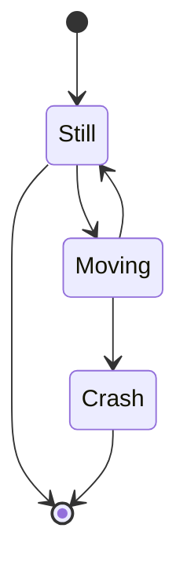
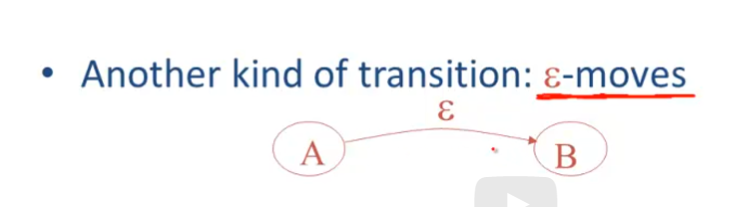
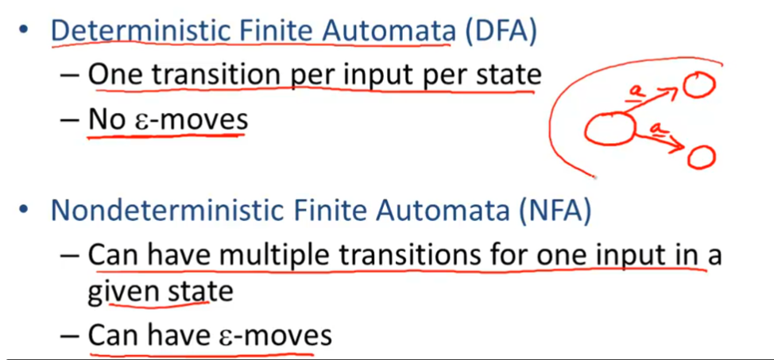
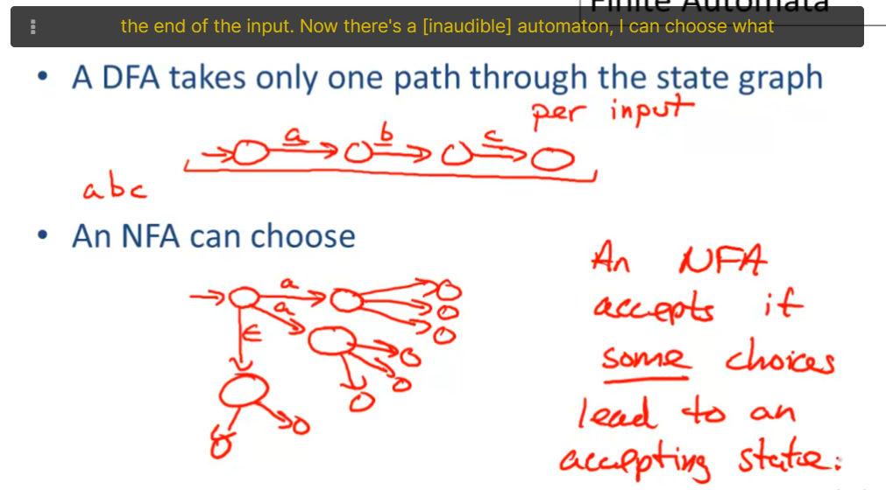
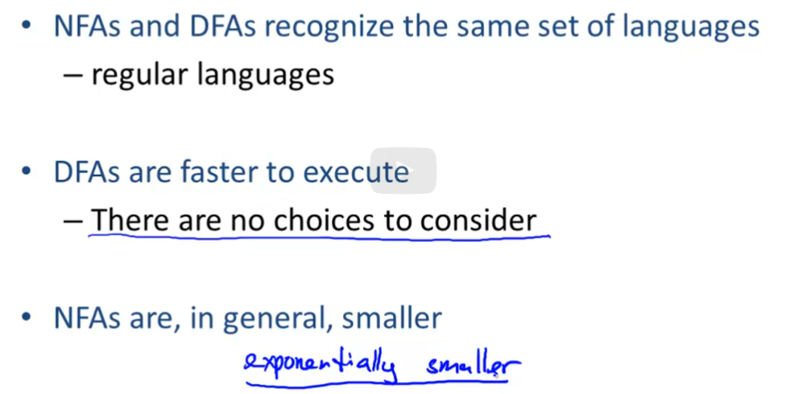

# -04-02-finite-automata

有限自动机

一个有限自动机所对应的语言就是接受字符串的集合

正则表达式是声明，而有限自动机则是实现。

一个有限自动机由以下部分组成：

- 一个输入字母表 $\Sigma$
- 一组状态的有限的集合 $S$
- 一个起始状态 $n$
- 一组可接受的状态 $F \subseteq S$
- 一组状态的转移 $state \to^{input} state$

Transition
$$
S_1 \to^{a} S_2
$$
读作：在状态 $S_1$ 时输入 $a$ 到状态 $S_2$

如果在输入结束的时候状态位于 $F$ 内则为接受，否则为拒绝（在状态 $S \notin F$ 终止 或 卡住）

## 状态图

每一个节点是一个状态，由一个五源的箭头指向的一个节点为起始节点，双边框节点为一个接收状态，箭头为一个转移

不消耗输入的状态移动，可做选择移动与否

