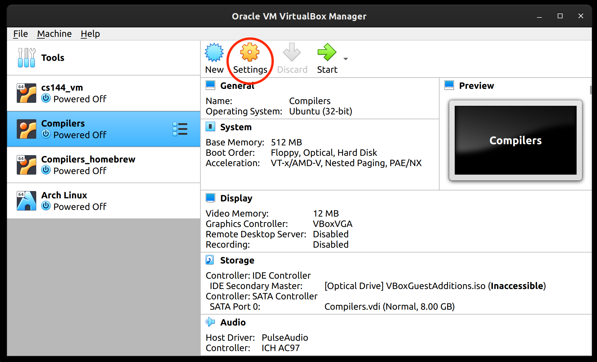
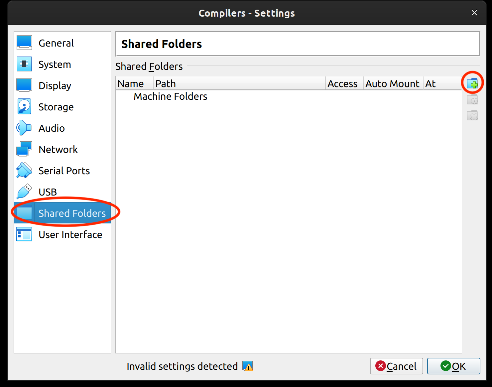
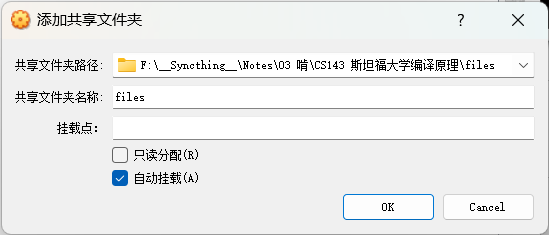

# CS143 课程相关资料及环境搭建

课程内容及资料可以在 EdX 上找到：[Course | edX](https://learning.edx.org/course/course-v1:StanfordOnline+SOE.YCSCS1+3T2020/home)

## 一、课程 VM 环境

### 1. 安装 VirtualBox

官网：[Downloads – Oracle VM VirtualBox](https://www.virtualbox.org/wiki/Downloads) 或 [Oracle VM VirtualBox - Downloads | Oracle Technology Network | Oracle](https://www.oracle.com/virtualization/technologies/vm/downloads/virtualbox-downloads.html)

### 2. 获取课程系统镜像

[here (google.com)](https://drive.google.com/file/d/193-Tmx-DSR3dPhTstEWwWGdhji_HGqE6/view?usp=sharing)，约 750MB

如果无法下载可以尝试使用 https://github.com/wkentaro/gdown 来下载。

<!-- more -->

可以在 Python 中使用它：

```shell
pip install gdown
```

```python
import gdown
gdown.download(url="https://drive.google.com/file/d/193-Tmx-DSR3dPhTstEWwWGdhji_HGqE6/view?usp=sharing", fuzzy=True)
```

下载后解压到一个合适的位置，大概 2GB，然后直接双击打开 `Compilers.vbox` 应该就可以打开了。

-   **The provided account is "compilers" and the password is "cool"**.

### 3. 设置共享文件夹

注意：先关闭虚拟机（右上角x选正常关闭或直接开始菜单找关机）。

共享文件夹可以在虚拟机和实体机之间共享，也就是说可以在虚拟机例使用到你硬盘上的一个文件夹。







比如上面是我的设置。


然后启动系统，如果勾选了自动挂载，那应该可以在 `/media/sf_<folder_name>` 处找到。

然后需要添加写权限（这条命令执行完也需要重启，重启可以开始菜单选重启，也可以 `sudo reboot` 还可以右上角 x 选正常关闭再启动）：

-   To make the shared folder editable, you will need to run the following command and reboot the virtual machine.

```shell
sudo usermod -a -G vboxsf compilers
```

为了方便使用可以建立一个连接：比如我把这个 `/media/sf_files` 链接到了 `/home/compilers/cool/files`：

> 有关 Linux 的 `~` 路径：
>
> Linux 中不同用户的文件会保存在 `/home/<UserName>/` 目录下，就像 Windows 下的 `C:/Users/<UserName>` 一样。
>
> 所以在本例中由于用户名为 `compilers` 所以，我们的 `~` 对应的就是 `/home/compilers` 路径。
>
> 也可以使用 `pwd` 命令来打印当前所在的路径

- Now any files written to your shared folder will appear in both your virtual machine and your host machine. For ease of access, you can create a symbolic link from your shared folder into ~/cool with the following:

```shell
ln -s /media/sf_<FolderName> /home/compilers/cool/<FolderName>
```

---

测试你编写的编译器功能相关的东西，先在这放一下，到时候整理：

-   To use the grading scripts, download the script for to your host machine's shared folder and run the following command, where <num> is the number of the programming assignment you want to download.

$ mv /media/sf_<FolderName>/pa<num>-grading.pl /home/compilers/cool/assignment/PA<num>

-   Now you can run the script by running the following in the assignment directory.

$ perl pa<num>-grading.pl

---

下面是原文：

原文地址：[VirtualBox VM Setup | SOE.YCSCS1 | edX](https://courses.edx.org/courses/course-v1:StanfordOnline+SOE.YCSCS1+3T2020/7b74698308574f3c89d2ed498f26a019/)

## VirtualBox VM setup

If you have not used a VM before, the idea is that you will be running an entire operating system inside a program (VirtualBox) that looks to the virtual guest operating system like real hardware. We provide a downloadable image of the guest OS with everything installed, so that you only need to do minimal setup to get started.

Note that since a VM contains a whole second operating system, the system requirements are high. **The VM will take a bit over 512MB of ram (so you will probably want to have 2GB of total ram to keep Windows or Mac OS X running smoothly), plus a bit over 2GB of hard disk space.**

**Getting VirtualBox**

-   First, download Oracle's VirtualBox, either from the VirtualBox website at [https://www.virtualbox.org/wiki/Downloads](https://www.virtualbox.org/wiki/Downloads), or from Oracle's download page at [http://www.oracle.com/technetwork/server-storage/virtualbox/downloads/index.html](http://www.oracle.com/technetwork/server-storage/virtualbox/downloads/index.html). Choose the version for the operating system you are running on your computer. (N.B. If you are running macOS, you will need to download version 5 of VirtualBox. Not version 6.)
-   Once the download completes, run the installer to install VirtualBox. You will need administrator access on your computer to do so.

**Getting our VM image**

-   Download our linux virtual machine image [here](https://drive.google.com/file/d/193-Tmx-DSR3dPhTstEWwWGdhji_HGqE6/view?usp=sharing). Note that this download is approximately 750MB.
-   Unzip the file into a convenient directory. The unzipped files are about 2GB, so make sure you have enough disk space available. If you are a Windows XP user and have trouble opening the zip file, try WinZip (shareware) or 7-Zip (free, open source) instead of the built-in zip support in Windows.
-   Once you have unzipped the VM, double-click on the file "Compilers.vbox". This should open the VM in VirtualBox.

**Using the VM**

-   **The provided account is "compilers" and the password is "cool"**.
-   To start the VM, click the green "Start" button. This should make the VM boot.
-   To shut down the VM, click on the round "Bodhi" button at the bottom left and click System. Then choose Power Off.
-   We have installed what you need to do the assignments, plus a few other programs, such as vim and emacs. If you want to install other packages, you can use the Aptitude graphical package manager (under the Bodhi menu->Applications->Preferences) or the apt-get command line tool. If you are not familiar with these, there are many tutorials online that you can find through a quick Google search.
-   To get a terminal, click on the terminal icon at the bottom of the screen. This should get you to the point where you can start the assignments.

This VM is based on Bodhi Linux, which is itself based on the popular linux distribution Ubuntu. We used Bodhi Linux in order to keep the download size more manageable, since a full Ubuntu install is quite large. However, since it is based on Ubuntu, most Ubuntu software packages can be installed on Bodhi Linux as well.

If you have a problem that you cannot solve, please post in the course's Discussion Forum.  This course is unmoderated, so your best resource in this course will be the documentation, the video lectures, and fellow participants in the Discussion Forum. 

**Downloading Grading Scripts and Making a Shared Folder  
**

In order to complete the assignments for this course, you need to download the grading scripts for each assignment. Since this version of Bodhi doesn't support TLS, you need to set up a shared folder between your host operating system and the virtual machine. That way you can download the scripts to your host system and access them on your VM.

-   Go the VirtualBox home screen and click on the settings icon


-   Go to the shared folders menu and click the "add" button


-   Select a path where you want your shared folder to be on the host system
-   Tick auto-mount


-   Click Ok


**Using the Shared Folder**

For this section, we're going to refer the name of your shared folder as \<FolderName\>. For instance, in the example above, \<FolderName\> refers to tmp.

-   Auto-mounted folders are in /media/sf\_\<FolderName\>

-   If you didn’t tick auto-mount, you can mount a shared folder with the following:

\$ sudo mkdir -p /media/sf\_\<FolderName\>  
\$ sudo mount -t vboxsf -o rw,gid=vboxsf \<FolderName\> /media/sf\_\<FolderName\>  

-   To make the shared folder editable, you will need to run the following command and reboot the virtual machine.

$ sudo usermod -a -G vboxsf compilers

-   Now any files written to your shared folder will appear in both your virtual machine and your host machine. For ease of access, you can create a symbolic link from your shared folder into ~/cool with the following:

\$ ln -s /media/sf\_\<FolderName\> /home/compilers/cool/\<Foldername\>

-   To use the grading scripts, download the script for to your host machine's shared folder and run the following command, where \<num\> is the number of the programming assignment you want to download.

\$ mv /media/sf\_\<FolderName\>/pa\<num\>-grading.pl /home/compilers/cool/assignment/PA\<num\>

-   Now you can run the script by running the following in the assignment directory.

\$ perl pa\<num\>-grading.pl