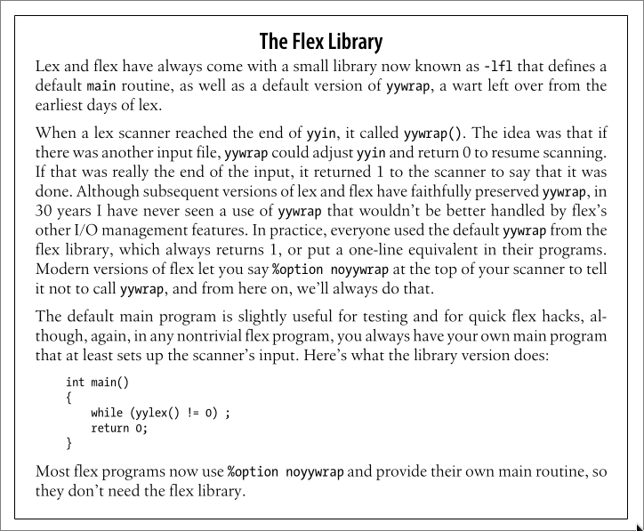

# 编译原理 1. 词法分析 - flex

## 一、概述

> flex 手册：[Lexical Analysis With Flex, for Flex 2.6.2: Top (westes.github.io)](http://westes.github.io/flex/manual/index.html)

**flex** 是一个用于生成基于 C/C++ 的词法分析器的程序。

它的输入是一个 `.flex` 文件，其中包含着一对对由 **正则表达式** 和 **C 语言代码** 组成的 **规则**。

它的输出是一个 C 语言源文件，其中会包含一个 `yylex()` 函数，该函数会对输入的字符序列进行扫描，根据 **规则** 中的一个个 **正则表达式** 进行匹配并执行其对应的 **C 语言代码**。

`.flex` 文件的结构大致如下：

```lex
definitions
%%
rules
%%
user code
```

其中：

- **definitions** 部分用来设置选项、做一些相关的定义
- **rules** 部分用来编写一条条 **规则**
- **user code** 部分用来编写一些 C 代码，会被直接复制到 `lex.yy.cc` 中。

下面是一个简单的例子：

```lex
%option noyywrap

DIGIT    [0-9]
%%
{DIGIT}             printf("Digit");
{DIGIT}+            printf("Integer");
{DIGIT}+"."{DIGIT}+ printf("Decimal");
%%
int main() {
    yylex();
}
```

- **definition** 部分：

  通过 `%option` 设定了选项 `noyywrap`，（具体含义先暂时忽略）

  定义了 `DIGIT` 为 `[0-9]`，此后可以通过 `{DIGIT}` 来使用，会被展开为 `([0-9])`

- **rules** 部分：

  定义了三条规则，分别匹配单个数字、整数和小数。

  如果有多个规则可以匹配，flex 会有限匹配最后一个规则。

  若规则成功匹配则执行其对应的 C 代码，若无规则成功匹配，则直接复制到输出。

  > 每条规则形如：`pattern action`
  >
  > 详细的有关 Pattern 的内容见 [Lexical Analysis With Flex, for Flex 2.6.2: Patterns (westes.github.io)](http://westes.github.io/flex/manual/Patterns.html#Patterns)
  >
  > 有一些特殊的 action，比如：`ECHO` 直接复制到输出，详细的有关 Action 的内容见 [Lexical Analysis With Flex, for Flex 2.6.2: Actions (westes.github.io)](http://westes.github.io/flex/manual/Actions.html#Actions)

- **user code** 部分：

  编写了主函数，简单地直接调用 `yylex()`

使用 flex 生成 `lex.yy.c` 并编译运行：

```terminal
PS F:\__Syncthing__\Notes\03 啃\CS143 斯坦福大学编译原理\playground> flex hello.flex
PS F:\__Syncthing__\Notes\03 啃\CS143 斯坦福大学编译原理\playground> g++ lex.yy.c
PS F:\__Syncthing__\Notes\03 啃\CS143 斯坦福大学编译原理\playground> ./a
asdasd 123 213 2.0 1
asdasd Integer Integer Decimal Digit
```

---

除了 `yylex()` 外，flex 还会生成很多其他的变量或函数，并会在进行词法分析的时候使用。

比如有一个关键的变量叫做 `yyin`，它的类型是 `FILE *`，它规定词法分析其从何处读入内容，若没有进行定义则会被设置为 `stdin` 也就是标准输入。

所以我们可以这样子来接受参数使其从一个文件读入：

```diff
%option noyywrap

DIGIT    [0-9]
%%
{DIGIT}             printf("Digit");
{DIGIT}+            printf("Integer");
{DIGIT}+"."{DIGIT}+ printf("Decimal");
%%
int main(int argc, char** argv) {
    if(argc > 1) {
        if(!(yyin = fopen(argv[1], "r"))) {
            perror(argv[1]);
            return (1);
        }
    }
    yylex();
}
```

> `perror()` 是 C 语言标准库 `<stdio.h>` 中的函数，用于向标准错误 stderr 输出描述性错误信息

---

> 有关 `noyywrap`：
>
> 
>
> 当 `yylex()` 被调用的时候，它会从全局输入文件 `yyin`（默认是 `stdin`）中扫描词法单元，直到触及 EOF 或者其中某一个 Action 执行了 `return`。当扫描器从 YY_INPUT 接收到了一个 EOF 指示，它就会调用 `yywrap()` 函数，如果它返回 false，则认为 `yyin` 已经被设置为另一个输入文件并继续扫描，如果返回 true，则会终止，并向调用者返回 0。
>
> 而 `yywrap()` 这个函数需要我们进行编写，如果我们不提供该函数的话在编译 `lex.yy.c` 时会提示 `undefined reference to 'yywrap'` 。
>
> 当然不设置这个选项也可以写一个最简单的 `yywrap()`（注意返回值规定是 `int` 型）：
>
> ```c
> int yywrap() { return true; }
> ```

## 二、正则表达式

之前讲到 **记号的类型（Token Class）**就是若干字符串组成的集合。而 **正则表达式（Regular Expression）**就是用于表达这些集合的工具。

具体内容见书（有空再整理

## 三、flex 的 Start States

有时根据上下文的不同，词法分析的过程会有一些差异，比如对于 SQL 的 `AND` 来说，在一般的语句中它都作为一个逻辑运算符出现，但是在 `BETWEEN ... AND ...` 中，它却作为关键字出现；再比如对于一些程序语言中的注释，在遇见注释开始符号后的所有内容都应当被视为注释，直到遇到注释结束符号。

这时就需要设定 Start Condition。

### Start Conditions

Start Conditions 在 **definitions** 部分被定义，要求没有缩进。

格式如下：

```lex
%s xxx yyy zzz
%x aaa
```

上面的两行一共定义了4个状态：`xxx`，`yyy`，`zzz`，`aaa`。

由 `%s` 定义的为 `inclusive` 的，而由 `%x` 定义的为 `exclusive` 的。

不带有开始条件的规则会被前者匹配，而不会被后者匹配。

一个开始条件可以使用 `BEGIN` 来激活，直到下一个 `BEGIN` 动作被执行，其他的开始条件被激活，所有带有指定开始条件的规则都将可以被匹配。

> 默认被激活的为 `INITIAL` 它是 `inclusive` 的。

比如一个解析 C 语言多行注释的词法分析器：

    %x comment
    %%
        int line_num = 1;
    
    "/*"         BEGIN(comment);
    
    <comment>[^*\n]*        /* eat anything that's not a '*' */
    <comment>"*"+[^*/\n]*   /* eat up '*'s not followed by '/'s */
    <comment>\n             ++line_num;
    <comment>"*"+"/"        BEGIN(INITIAL);

`<*>` 匹配所有 Start Condition。

BEGIN(0) 激活初始状态（即 `INITIAL`）

可以在 action 中使用 BEGIN xxx 来开始一个状态

## 四、一些例子

### 1. Hello World

下面编写一个简单的例子，当遇到字符串 `"test"` 的时候将其替换为 `"Hello world 2023"`。

编写 `hello_world.flex`：

```flex
%option noyywrap

%%
test printf("Hello world %d", 2023);
%%
int main() {
    yylex();
}
```

```
flex -o hello_world.yy.c .\hello_world.flex
g++ -o hello_world .\hello_world.yy.c
```

```
./hello_world
test asdhsadjhktest
Hello world 2023 asdhsadjhkHello world 2023
```

### 2. 字符数统计

编写 `char_count.flex`：

```flex
%option noyywrap

%{
int num_lines = 0, num_chars = 0;
%}

%%
\n      ++num_lines; ++num_chars;
.       ++num_chars;
%%
int main() {
    yylex();
    printf( "# of lines = %d, # of chars = %d\n", num_lines, num_chars );
}
```

```shell
flex -o char_count.yy.c .\char_count.flex
g++ -o char_count .\char_count.yy.c
```

```
./char_count
asdhfaskfasd
f sd
fa
sd
s
sad
c
sa

# of lines = 9, # of chars = 36
```

> 最后使用 `CTRL-C` 退出时得到输出。

## 参考

[词法分析器flex - 知乎 (zhihu.com)](https://zhuanlan.zhihu.com/p/52290783)

OReilly.flex.and.bison.2009.8.pdf
