# 人工智能基础项目 1.环境配置

## 首先需要了解的东西

假设你了解基本的 Python 语言知识，并理解 Python 包的管理方式。

以下内容需要进行了解：

1. **Jupyter Notebook**

   Jupyter Notebook 顾名思义，是一个笔记应用，它编辑的笔记后缀为 `.ipynb`，笔记的内容以块为单位组织，块分为 Markdown 内容块和 Python 代码块（其实也支持一些其他数据科学常用的语言），其中的每一个块都可以执行，Markdown 内容快执行的效果即进行渲染，代码块执行的效果即将运行的输出以及最后一条语句的值显示出来。

   但说他是个应用，其实不完全是，因为它其实是一个 Web 服务，分为前后端。前端网页负责提供笔记的界面并与后端沟通，而后端 Jupyter 内核负责与 Python 解析器交流。

   可以达到下面的效果：

   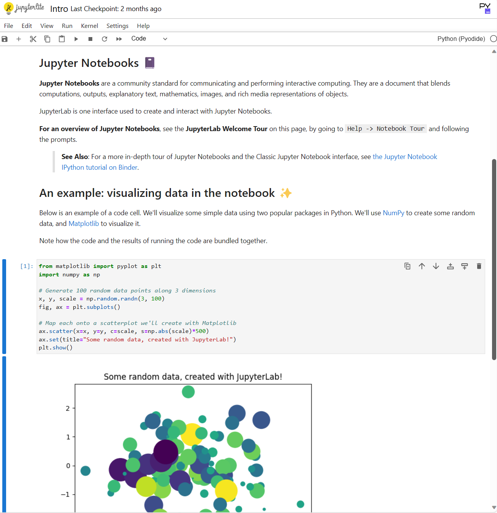

2. **Anaconda、conda、pip、venv/virtual env**

   **Anaconda** 是一个 Python 发行版本，其中包含 Python 本体、conda 以及 180+ 个和数据科学有关的 Python 包。他还有另一个精简版本叫做 Miniconda，可以理解为不带有那 180+ 个 Python 包，使得用户可以选择只安装自己需要的包，减小了占用的空间大小。

   **pip** 是 python 用于管理依赖的工具，比如我要安装一个名为 `matplotlib` 的包，我只需执行 `pip install matplotlib`。

   **venv** 和 **virtual env** 都是用于创建独立的 Python 环境的工具，前者是 Python3 标准库自带的，而后者是一个单独的 Python 包。有时我们写的不同项目会用到不同版本的 Python，甚至会用到不同版本的同一个包，此时独立的环境就极为重要。

   **conda** 是一个用于管理依赖和环境的工具，可以理解为对 **pip** 和 **venv** 的组合，使用起来更加便捷。

## 一、安装

### DataSpell

前往 Jetbrains 官网：[JetBrains: 软件开发者和团队的必备工具](https://www.jetbrains.com/zh-cn/)

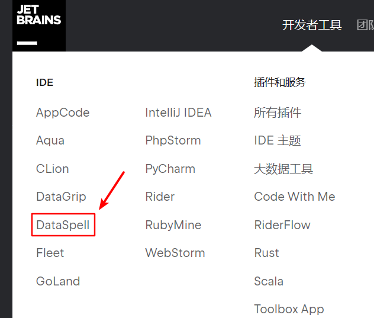

安装完成后打开会有这样一个界面：

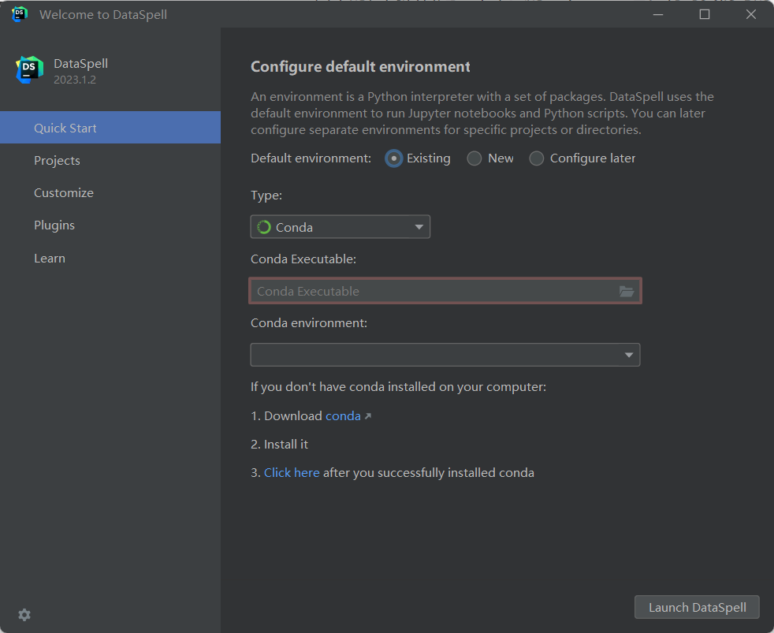

这里要求你对默认的环境进行配置，其中：

- **Type** 为环境的类型，这里选择使用 Conda（接下来会说怎么安装 Conda）

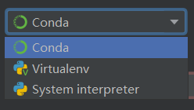

- **Conda Executable** 为 Conda 可执行文件的路径
- **Conda environment** 为使用的 Conda 环境，填完 **Conda Executable** 后应当会自动显示一个默认的环境。

### Conda

可以选择去官网下载安装，但是这里我选择使用 Scoop 安装。

> 有关 Scoop 见 [aoike - 告别繁琐安装界面，使用Scoop管理Windows软件 (azurice.github.io)](https://azurice.github.io/posts/告别繁琐安装界面，使用Scoop管理Windows软件.html)

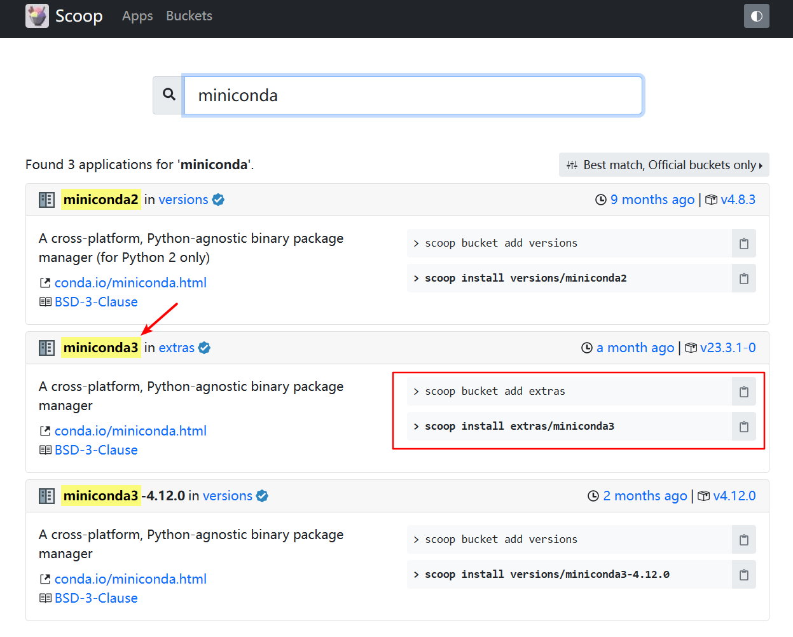

```terminal
scoop install extras/miniconda3
```

然后在刚才 DataSpell 的 **Conda Executable** 中选择这个文件：

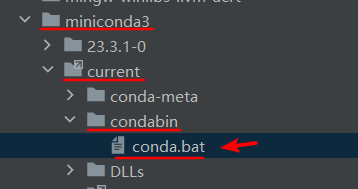

Launch DataSpell！

## 二、基本使用

进去后，就是经典的 Jetbrains IDE 的布局。

但是它并不是按照 项目（Project）来组织的而是按照 工作区（Workspace）来组织的：

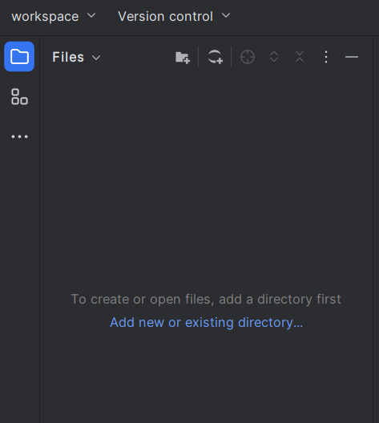

每一个工作区中可以包含多个目录，目录可以通过按钮来进行添加。也就是说它是连接到各个位置的目录，而非将一切放到一个目录下。

比如我这里添加了一个路径为 `F:\Dev\AI` 的目录：

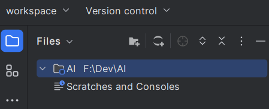

你可以为每一个目录选择不同的解释器：

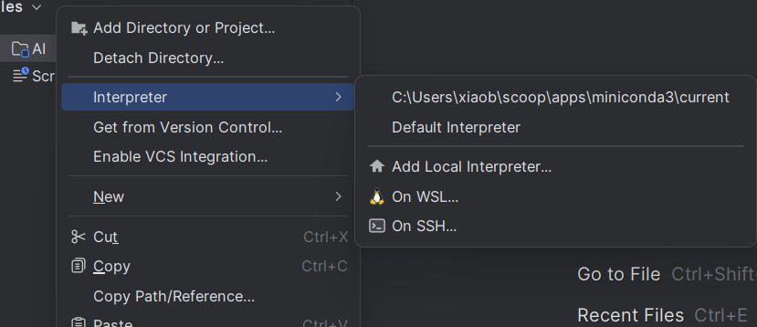

不过目前我们不用管他。

创建一个 Jupyter Notebook 文件：

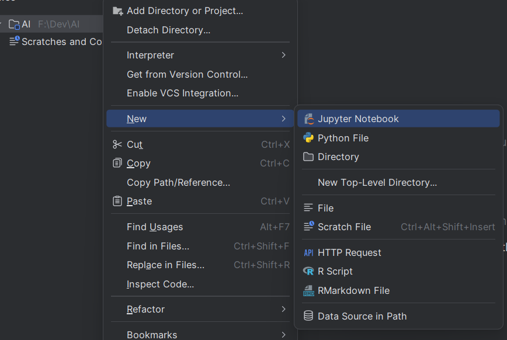

创建完毕后打开，它会提示你没有安装 Jupyter，点击安装，安装完成后等待 Updating skeletons 完成，即可：

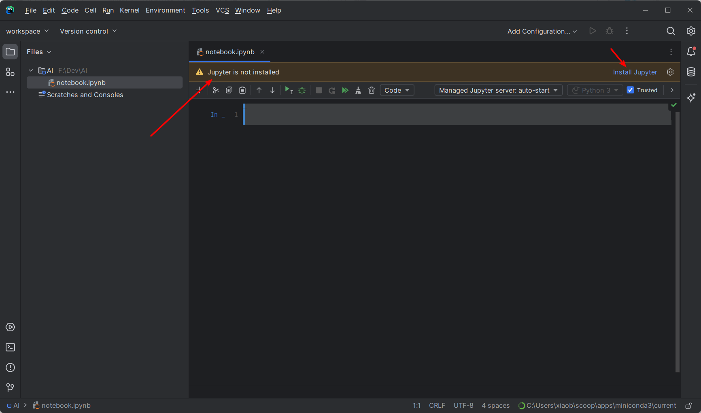

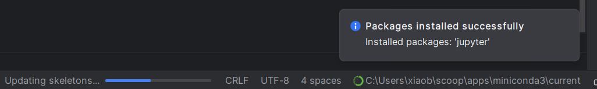

至于为什么用 DataSpell 而不直接用 Jupyter 呢？因为 DataSpell 有代码补全：

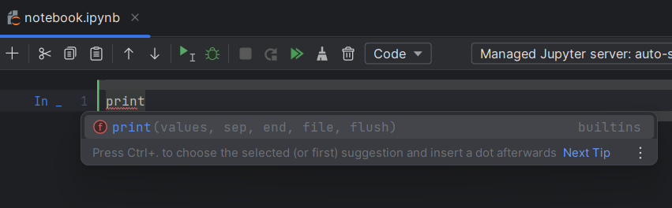

这些个按钮自己理解一下，这个代码块的运行效果如下：

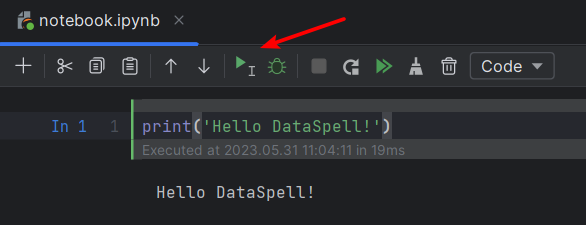

## 三、更多例子

```python
import numpy as np
import seaborn as sns
import matplotlib.pyplot as plt
sns.set_theme(style="dark")

# Simulate data from a bivariate Gaussian
n = 10000
mean = [0, 0]
cov = [(2, .4), (.4, .2)]
rng = np.random.RandomState(0)
x, y = rng.multivariate_normal(mean, cov, n).T

# Draw a combo histogram and scatterplot with density contours
f, ax = plt.subplots(figsize=(6, 6))
sns.scatterplot(x=x, y=y, s=5, color=".15")
sns.histplot(x=x, y=y, bins=50, pthresh=.1, cmap="mako")
sns.kdeplot(x=x, y=y, levels=5, color="w", linewidths=1)
```

提示没有安装库可直接将鼠标移到红线上后点击浮动框中的 Install，或者手动执行：

```terminal
conda install numpy seaborn matplotlib
```

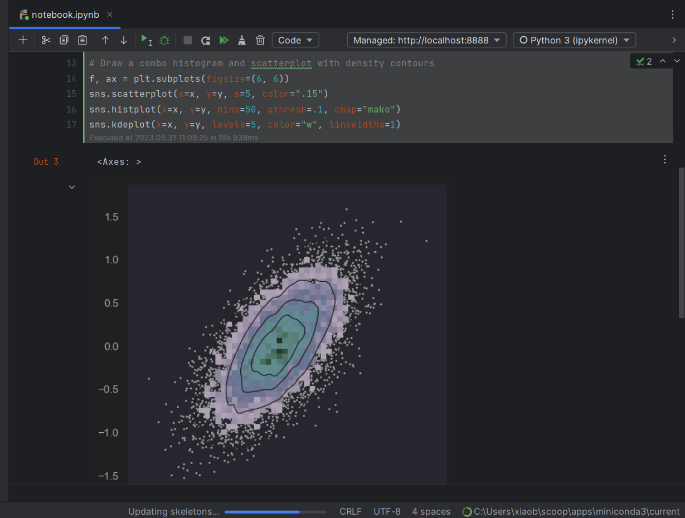