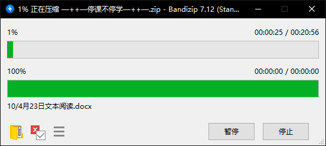
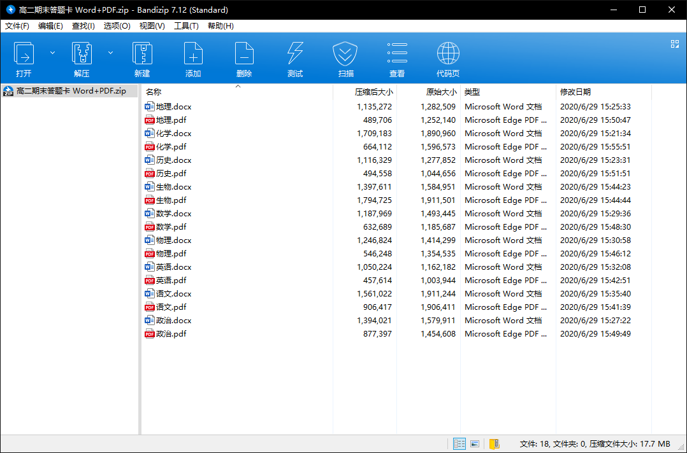
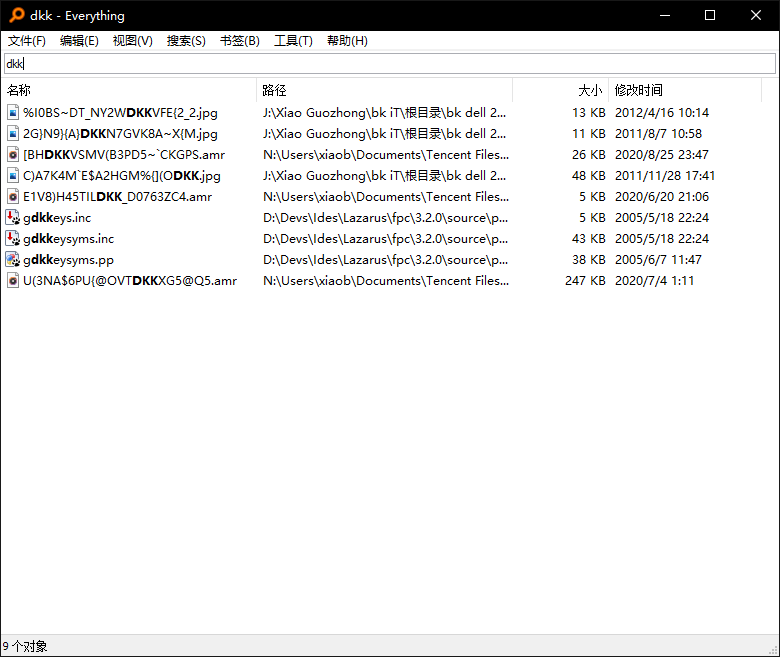
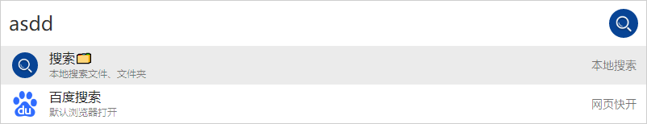
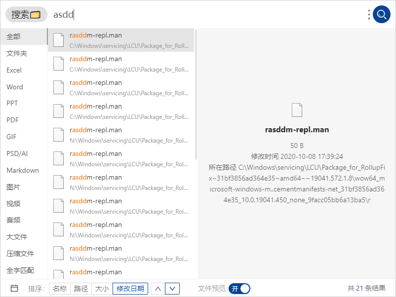
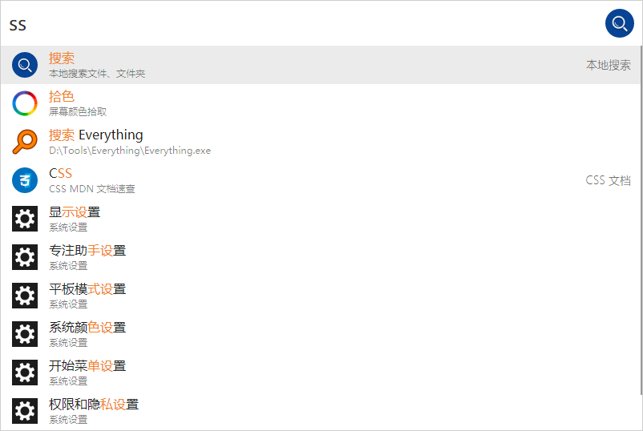
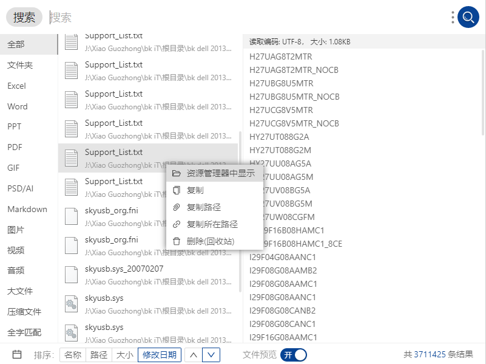
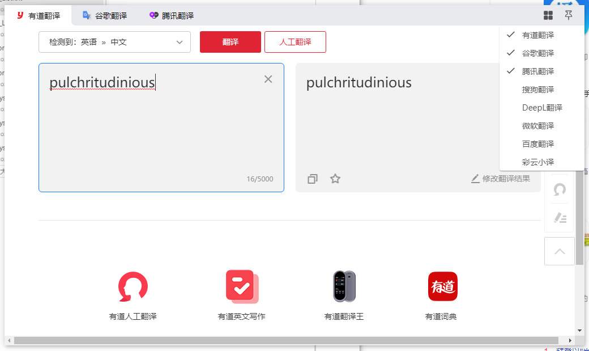
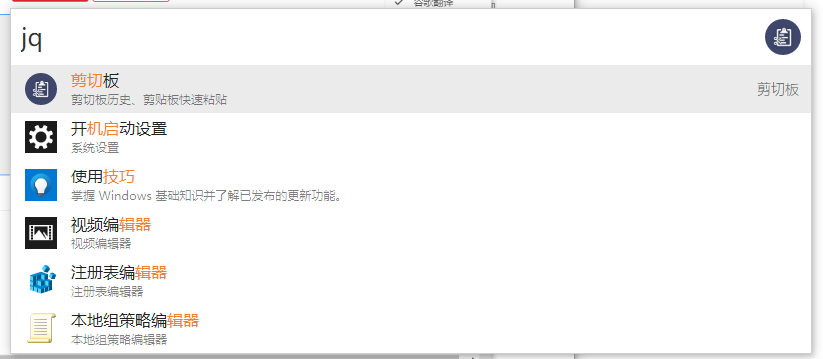
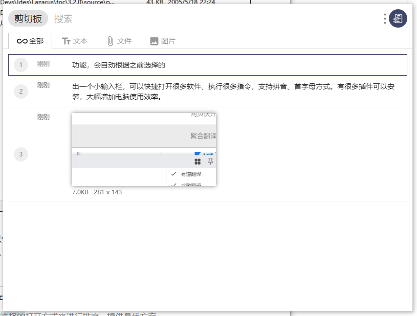

# 提高生产力的工具们（持续更新）

T17:15:00+08:00
## 文件下载
1. [**Neat Download Manager**](http://www.neatdownloadmanager.com/index.php/en/)
多线程文件下载管理器，并且有资源嗅探功能，堪比 **IDM** ，更重要的是 **它** **免** **费**

## 小工具

1. [Bandizip](http://www.bandisoft.com/)

  非常好用的 **压缩**/**解压缩** 软件，界面清洁友好。

  

  

2. [everything](https://www.voidtools.com/zh-cn/)

	超级快速的 **文件搜索** 软件。可以搭配 *uTools* 使用

	

3. [uTools](https://www.u.tools/)

  `Alt` + `Space` 呼出一个小输入栏，可以快捷打开很多软件、执行很多指令，支持拼音、首字母方式。有很多插件可以安装，大幅增加电脑使用效率。

  

  **基础使用：上下键选择，空格进入，esc或在没有文字的时候回格退出。**

  > *uTools* 有记忆功能，会自动根据之前选择的打开方式来进行排序，提供最优方案。

  点击右侧的图标可以进入设置以及插件安装界面

  

  下面介绍一些插件：

  - 文件搜索

  	> 需要先安装everything

  	

  	安装后，每次呼出 *uTools* 若输入内容未找到合适内容，会有搜索选项（或者可以通过手动输入 “搜索” （支持拼音、首字母方式）来进行文件搜索）还有文件预览、分类检索、复制路径等功能。

  	> 输入内容后选择搜索，按空格来进入。

  	

  	

  	> 手动打开搜索，按空格来进入。

  	

  	

  - 聚合翻译

    > 快捷使用多种翻译。

    

    

  - 剪切板历史

    

    

    

    进入剪切板工具后会显示出剪切板历史。

    

  - 持续更新......
