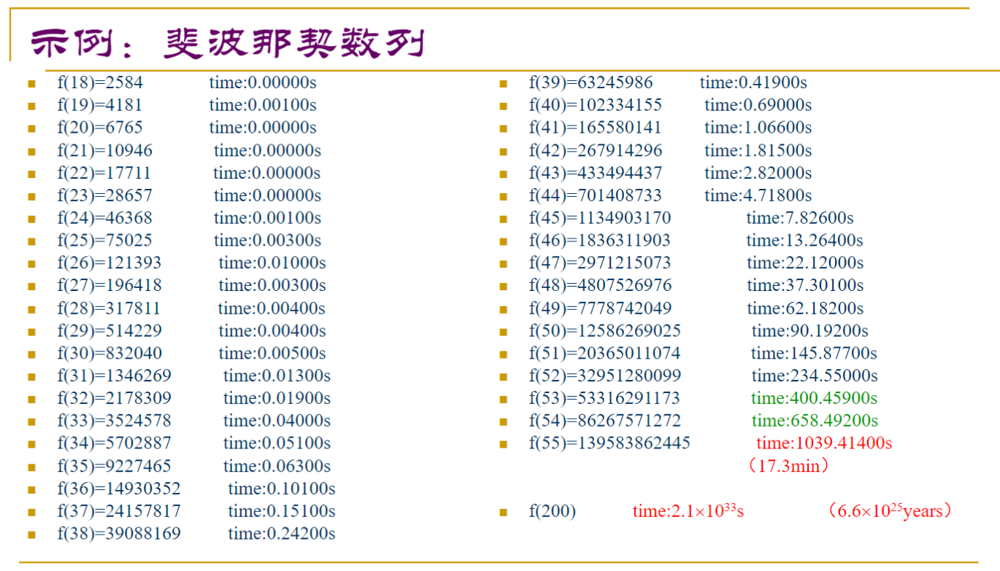
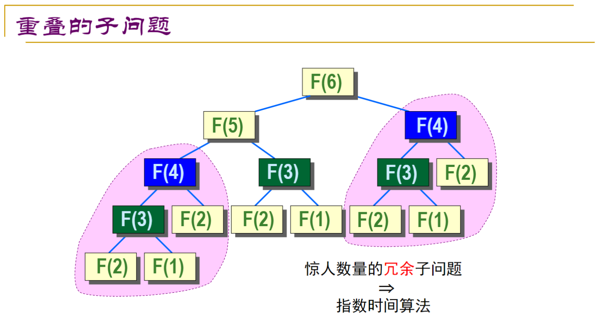

## 一、引子1 —— 斐波那契数列

### 1. 递归

斐波那契数列的定义如下：

$$
f_n = \begin{cases}
1, & n = 1, 2\\
f_{n-1} + f_{n-2}, &n > 2
\end{cases}
$$

根据这个我们不难写出 **递归** 方式求解斐波那契数列的代码：

$$
\begin{array}{l}
\text{Fibonacci-Recursive}(n)\\
\begin{array}{ll}
1 &  \textbf{if } n < 2 \\
2 &  \qquad\textbf{return } 1 \\
3 &  \textbf{else} \\
4 &  \qquad\textbf{return } \text{Fibonacci-Recursive}(n-1) + \text{Fibonacci-Recursive}(n-2)
\end{array}
\end{array}
$$

然而通过简单的实验，可以发现这种方式效率极低：

其时间复杂度 $T(n) = T(n-1) + T(n-2)$，可以推导出为 $O(2^n)$ 的。造成如此的效率低下的原因就是 <u>进行了太多次重复的运算</u>。如果我们将递归求解的过程化成一棵树，我们可以发现其中有太多太多重复的部分：

### 2. 递推

另一种方法是以递推的方式进行求解：

$$
\begin{array}{l}
\text{Fibonacci-Iteration}(n)\\
\begin{array}{ll}
1 &  F_1 \leftarrow 1， F_2 \leftarrow 1\\
2 &  \textbf{for } i \leftarrow 3 \textbf{ to } n \\
3 &  \qquad F_i \leftarrow F_{i-1} + F_{i-2}\\
4 &  \textbf{return } F_n
\end{array}
\end{array}
$$

如此其时间复杂度是线性的，能够解决上述递归方式重复计算子问题导致效率低下的问题。

### 3. 记忆化搜索

另外还有一种方式，通过对递归方式加一点修改也可以解决这个问题。那就是 **记忆化搜索**，将搜索过程中的结果保存下来，并在之后的搜索过程中加以利用：

$$
\begin{array}{l}
\text{Fibonacci-Recursive-Memorized}(n)\\
\begin{array}{ll}
1 &  \textbf{if } F_i = NIL\\
2 &  \qquad\textbf{if } n < 2 \\
3 &  \qquad\qquad F_i \leftarrow 1 \\
4 &  \qquad\textbf{else} \\
5 &  \qquad\qquad F_i \leftarrow \text{Fibonacci}(n-1) + \text{Fibonacci}(n-2) \\
6 &  \textbf{return } F_i
\end{array}
\end{array}
$$

## 二、引子2 —— 找零问题

### 1. 递归（暴力搜索）

**目标**：给定面值分别为1元、5元、10元的硬币（每种都有足够多枚），请设计一个算法，可以使用最少数量的硬币向客
户支付给定金额。

- 此时，贪婪策略（即收银员算法）是有效的

如果还有面值为7元的硬币，那么贪婪算法可能就无法得到最优解了

- 例如凑出19元，贪婪算法需要使用4枚硬币（10+7+1+1），但事实上只需要3枚硬币（7+7+5）

对于给定的硬币组，如何找到凑成给定金额 n 的最小硬币数？

每一次选择必定要从 1、5、7、10 中选一个，于是可以据此将选择分为四种情形：

- 给一枚面值为 1 元的硬币，此时仍需给顾客 n-1 元
- 给一枚面值为 5 元的硬币，此时仍需给顾客 n-5 元
- 给一枚面值为 7 元的硬币，此时仍需给顾客 n-7 元
- 给一枚面值为 10 元的硬币，此时仍需给顾客 n-10 元

而为了保证最终的金额最小，上面的 n-1、n-5、n-7、n-10 要以最优方式拼凑出来。

分别计算以上情形后选择一个最佳方案即可。

$$
\begin{array}{l}
\text{Find-Recursive}(n)\\
\begin{array}{ll}
1 &  \textbf{if } n = 0 \textbf{ then return } 0\\
2 &  \textbf{if } n < 0 \textbf{ then return } \infty\\
3 &  \textbf{return } \min\{\\
  &  \qquad \text{Find-Recursive}(n-1) + 1,\\
  &  \qquad \text{Find-Recursive}(n-5) + 1,\\
  &  \qquad \text{Find-Recursive}(n-7) + 1,\\
  &  \qquad \text{Find-Recursive}(n-10) + 1\\
  &  \}
\end{array}
\end{array}
$$

但是。。这不就是暴力搜索么。

假如将问题一般化，对于目标数值 $n$ 和 $m$ 种面值分别为 $d_1, d_2, \cdots, d_m$ 的硬币，当 $n$ 和 $m$ 更时，这种算法的效率将极其低下，原因依旧是太多的 **重复计算**。

我们能不能依旧按照 一 中的思路，使用递推来降低时间复杂度呢？

### 2. 递推（“动态规划”）

可以发现，我们要想求解 $n$ 元的问题，就要先求解 $n-d_1, n-d_2, \cdots, n-d_m$ 元的问题，以此类推直到求解 $d_1$ 元的问题，此时只有一个选项，就是选它。

那么我们可以换一种思路，从 $d_1$ 元的问题开始，利用已知的信息逐步推演得到 $d_1 + d_1, d_1 + d_2, \cdots d_1 + d_m$ 元的问题的答案，以此类推利用已知的信息推演出所有最优情况，最终确定 $n$ 元的问题的答案：

$$
\begin{array}{l}
\text{Find-Iteration}(n)\\
\begin{array}{ll}
1 &  F_0 \leftarrow 0\\
2 &  \textbf{for } i \leftarrow 1 \textbf{ to } n\\
3 &  \qquad\textbf{for } j \leftarrow 1 \textbf{ to } m\\
4 &  \qquad\qquad\textbf{if } i - d_j > 0\\
5 &  \qquad\qquad\qquad F_i \leftarrow \min(F_i, F_{i-d_j} + 1)\\
6 &  \textbf{return } F_n
\end{array}
\end{array}
$$

## 三、动态规划（咕）

咕

## 四、最长上升子序列（咕）

## 五、0-1 背包问题（咕）

## 六、最长公共子序列（咕）

## 七、最短公共超序列（咕）

## 八、序列对齐（咕）

## 九、矩阵链乘积

### 1. 矩阵乘法

首先先回顾一下矩阵的乘法：

$$
\begin{pmatrix}
  \colorbox{#aaffff}{$a_{11}$} & \colorbox{#aaffff}{$a_{12}$}\\
  a_{21} & a_{22}\\
  a_{31} & a_{32}\\
  \end{pmatrix}
  \times
  \begin{pmatrix}
  \colorbox{#aaffff}{$b_{11}$} & b_{12} & b_{13}\\
  \colorbox{#aaffff}{$b_{21}$} & b_{22} & b_{23}\\
\end{pmatrix} = \begin{pmatrix}
  \colorbox{#aaffff}{$a_{11}b_{11} + a_{12}b_{21}$} & a_{11}b_{12} + a_{12}b_{22} & a_{11}b_{13} + a_{12}b_{23}\\
  a_{21}b_{11} + a_{22}b_{21} & a_{21}b_{12} + a_{22}b_{22} & a_{21}b_{13} + a_{22}b_{23}\\
  a_{31}b_{11} + a_{32}b_{21} & a_{31}b_{12} + a_{32}b_{22} & a_{31}b_{13} + a_{32}b_{23}\\
\end{pmatrix}
$$

可以写作：

$$
c_{i,j} = \sum_{k = 1}^q a_{i,k}b_{k,j}
$$
很容易可以写出其伪代码：
$$
\begin{array}{l}
\text{Matrix-Multiply}(A_{p \times q}, B_{q \times r})\\
\textbf{Notes. }A, B, C \text{ are matrix, and } a_{i,j}, b_{i, j}, c_{i, j} \text{ are the elements in the matrix}\\
\begin{array}{ll}
1 & \textbf{for } i \leftarrow 1 \textbf{ to } p\\
2 & \qquad\textbf{for } j \leftarrow 1 \textbf{ to } r\\
3 & \qquad\qquad c_{i, j} \leftarrow 0\\
4 & \qquad\qquad\textbf{for } k \leftarrow 1 \textbf{ to } q\\
5 & \qquad\qquad\qquad c_{i, j} \leftarrow c_{i,j} + a_{i, k} \times b_{k, j}\\
6 & \textbf{return } C_{p \times r}
\end{array}
\end{array}
$$

### 2. 矩阵链乘积

当对多个矩阵进行链式乘积时，以何种顺序进行运算就成为了一个影响性能的至关重要的问题。

例如我们有这样三个矩阵：$A_{10 \times 100}, B_{100 \times 5}, C_{5 \times 50}$

两种截然不同的方式将导致完全不同的元素乘法次数：

$(AB)C = D_{10 \times 5} \cdot C_{5 \times 50}$：共 $10 \cdot 100 \cdot 5 + 10 \cdot 5 \cdot 50 = 7,500$ 次元素乘法

$A(BC) = A_{10 \times 100} \cdot E_{100 \times 50}$：共 $10 \cdot 100 \cdot 50 + 100 \cdot 5 \cdot 50 = 75,000$ 次元素乘法

矩阵链乘积问题如下：

对于给定矩阵序列 $A_1, A_2, \cdots, A_n$，其中 $A_i$ 的阶数为 $P_{i-1} \times P_{i}$，试确定矩阵相乘的次序使得元素乘法总次数最少。

每一次乘法相当于将整个矩阵序列划分为两部分，将相邻处的两个矩阵“合并”：
$$
A_{i..j} = A_{i..k} \times A_{k+1..j}
$$
若令 $F_{i,j}$ 表示 $A_{i..j}$ 中元素乘法的次数，那么可以知道对于任意的 $k$ 有：
$$
F_{i,j} = F_{i,k} + P_{i-1} \cdot P_{k} \cdot P_{j} + F_{k+1,j}
$$
那么对于某一个 $i, j$，只要得出对于任意的 $i \leq k < j$ 的元素乘法次数，再求最小值即可。同时也要使 $F_{i, k} $ 和 $F_{k+1, j}$ 最小。

现在我们直接列出其递推式：

$$
F_{i, j} = \begin{cases}
0, &i = j\\
\min_{i \leq k < j} \{ F_{i, k} + P_{i-1}P_kP_j + F_{k+1, j}\}, & i < j
\end{cases}
$$

伪代码如下：

$$
\begin{array}{l}
\text{Matrix-Chain-Order}\\
\textbf{Input. } P_0, P_1, \cdots, P_n\\
\textbf{Output. } \text{ cost table } M \text{ and divide table } S\\
\textbf{Notes. } \text{m, s are the elements of M and S}\\
\begin{array}{ll}
1  & \textbf{for } i \leftarrow 1 \textbf{ to } n\\
2  & \qquad m_{i, i} \leftarrow 0, s_{i, i} \leftarrow 0\\
3  & \textbf{for } l \leftarrow 2 \textbf{ to } n\\
4  & \qquad\textbf{for } i \leftarrow 1 \textbf{ to } n - l + 1\\
5  & \qquad\qquad j \leftarrow i + l - 1\\
6  & \qquad\qquad m_{i, j} \leftarrow \infty\\
7  & \qquad\qquad\textbf{for } k \leftarrow i \textbf{ to } j-1\\
8  & \qquad\qquad\qquad q \leftarrow m_{i, k} + P_{i-1} \times P_k \times P_j + m_{k+1, j}\\
9  & \qquad\qquad\qquad \textbf{if } q < m_{i, j}\\
10 & \qquad\qquad\qquad\qquad m_{i, j} \leftarrow q\\
11 & \qquad\qquad\qquad\qquad s_{i, j} \leftarrow k\\
12 & \textbf{return } M, S
\end{array}
\end{array}
$$

## 十、跳棋棋盘（咕）