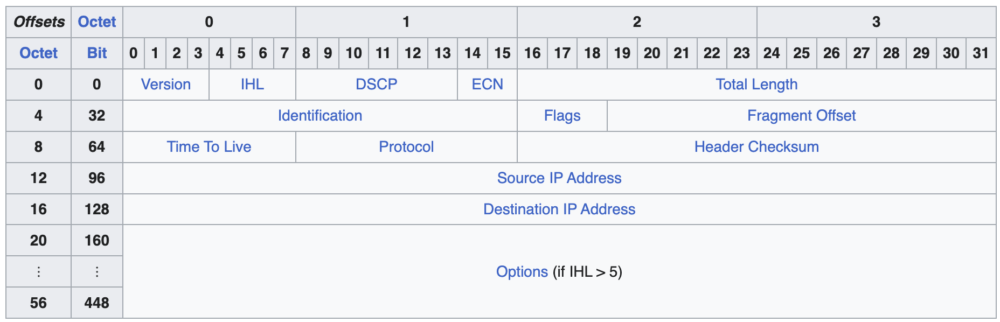

# IP 协议

Internet Protocol（IP）协议是一个 **网络层** 的 **通信协议**。

包的封装：

## IPv4

> 参考 维基百科-Internet Protocol version 4[^1]

### 1. 地址

TODO

### 2. 包结构

每一个 IP 包由两部分组成：报头（Header）和 数据（Data）。

#### 1> 报头

- **Version**：

    协议版本。

    对于 IPv4，值为 `4`。

- **Internet Header Length（IHL）**：

    报头的大小，以 32-bit 字作为单位。

    IPv4 的头的大小是可变的（取决于 **Options** 字段），如果 **Options** 字段为空，那么 **IHL** 即为 $160\ \text{bits}\ /\ 32\ \text{bits} = 5$。

- **Differentiated Services Code Point（DSCP）**：

    服务类型，实时数据流（例如 **Voice over IP（VoIP）**）会使用这个字段。

    > Originally defined as the [type of service](https://en.wikipedia.org/wiki/Type_of_service) (ToS), this field specifies [differentiated services](https://en.wikipedia.org/wiki/Differentiated_services) (DiffServ).[[33\]](https://en.wikipedia.org/wiki/Internet_Protocol_version_4#cite_note-rfc2474-33) Real-time data streaming makes use of the DSCP field. An example is [Voice over IP](https://en.wikipedia.org/wiki/Voice_over_IP) (VoIP), which is used for interactive voice services.

- **Explicit Congestion Notification（ESN）**：

    什么什么，端到端的网络协商？

    > This field allows end-to-end notification of [network congestion](https://en.wikipedia.org/wiki/Network_congestion) without [dropping packets](https://en.wikipedia.org/wiki/Packet_loss).[[34\]](https://en.wikipedia.org/wiki/Internet_Protocol_version_4#cite_note-rfc3168-34) ECN is an optional feature available when both endpoints support it and effective when also supported by the underlying network.

- **Total Length**：

    16-bit 整数，表示整个包的大小（包含报头和数据），以 Byte 为单位。

- **Identification**：

    标识符，同一个 IP datagram 的一组 Fragments 此字段值相同。

- **Flags**：

    三个 1-bit 标志位

    - bit 0：保留位，无意义，必须为 0

    - bit 1：Don't Fragment（DF）

        如果此位为 1，而当前包的大小在某个路由处超出 MTU，需要分包，就会直接被丢弃。

        会被用于目标无法将包重组的情况，或者用于 **Path MTU Descovery（PMTUD）** 来获取路径上的 MTU 信息。

    - bit 2：More Fragment（MF）

        用于表示后面还有没有更多的 fragment。

- **Fragment offset**：

    用来标识此 fragment 位于完整数据中的位置（自开始起），单位为 8 Bytes（也正因此，fragment 的大小必须是 8 的倍数）。

- **Time to live（TTL）**：

    也叫做最大跳数，没经过一跳，这个值就会被减一，到 0 时，包就会被丢弃。

- **Protocol**：

    用来标识内部的数据使用的协议，[数字与协议对应关系](https://en.wikipedia.org/wiki/List_of_IP_protocol_numbers)。

- **Header checksum**：

    用于头的错误检测。

    路由器收到一个包后会核验 checksum 是否一致，如果不一致就会丢弃掉。

- **Source address** / **Destination address**：

    源地址和目标地址。

- **Options**：

    一些可选的数据，带有一些特定的标志位和字段位。

#### 2> 数据

就是数据，由其他协议（如 ICMP、TCP、UDP 等）打的包。

### 3. 分段与重组

在网络中，不同的设备除了传输速度不同，同时 **最大传输单元（Maximum Transmittion Unit，MTU）**可能也不同，当传输的数据长度大于 MTU 时，就会需要将其分段。

在 IPv4 中，此功能的实现被放在网络层，并由路由器完成；而在 IPv6 中，不允许路由器进行分段，主机必须通过在发送数据前进行 PMTUD，并直接分割出合适的大小发送。

#### 1> 分段

当一个路由器收到一个包时，它会调查目标地址并决定输出接口以及对应接口的 MTU。

如果包大小大于 MTU：

- DF 为 1：直接丢弃
- DF 为 0：执行分段

在分段时，每一段的大小将会是 MTU 减去 IP 报头大小（20～60 字节，一般为 20），然后路由器会将每一个分段封入单独的包，重新计算并设置对应包的 MF、Fragment offset、Header checksum。

有可能存在数据在一个路由器被分段，而到达下一个路由器的时候又被更进一步的分段的情况。

#### 2> 重组

接收者可以通过一下方式来判断某一个包是否是一个分段：

- MF 为 1（对于非最后一个分段）
- Fragment offset 非 0（对于非第一个分段）

接收者会依据 Src and Dst address、Protocol、Identification 来识别多个分段是否属于同一个包，收到最后一个包时（MF 为 0）就可以计算原数据包的整体大小（最后一个分段的 offset 乘 8 再加上最后一个分段的数据的大小），然后将包按照正确的序列（根据 offset 得到）进行拼接。

## IPv6

TODO

---

## 参考

[^1]: https://en.wikipedia.org/wiki/Internet_Protocol_version_4