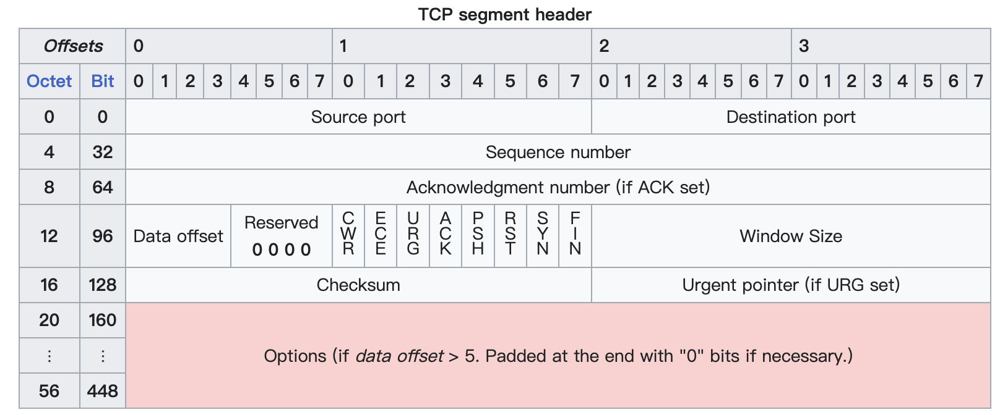

# Transmission Control Protocol

## 一、Header

> 上图来源于 Wikipedia[^1]

### 1. Sequence number

TCP 连接中发送的每字节数据都会有一个序列号，因此任何一个字节都可以被「确认」（Acknowledge, ACK）。

TCP 使用 Cumulative Acknowledgment 机制：$ack=X$ 表示 $seq<X$ 的所有字节都被 ACK 了。

> 这种机制可以使得在重传的情况下能够直接进行重复检测

在实际情况下，序列号是有限的（见 Header 格式），其空间只有 4 字节，也就是说取值范围是 $0 \sim 2^{32}-1$。因此，所有对序列号的操作需要对 $2^{32}$ 取模（即 $2^{32}-1$ 的下一个编号从 $0$ 再次循环）。

## 二、拥塞控制（Congestion Control）

TCP 的拥塞控制主要包含四个算法：「Slow Start」、「Congrstion Avoidance」、「Fast Retransmit」、「Fast Recovery」，他们首次于 1997 年 1 月由 RFC2001[^2]提出。

其中经常将前两个一起讨论，后两个一起讨论。

### 1. Slow Start 与 Congestion Avoidance

最开始的 TCP 实现中，发送者会发送多个 Segment 直至达到接收者在建立连接阶段传递过来的 Window Size。这种方式在两个主机位于同一个局域网中时并不会产生什么问题，但是如果他们之间存在其他的中继路由器，或者存在较慢的链接，就会产生拥塞问题。由于中继路由的转发速度小于发送者发送的速度，于是就会导致中继路由的缓冲区被快速消耗，进而产生丢包。

Slow Start 与 Congestion Avoidance 引入了一种机制来灵活控制发送 Segment 的数量（或者说发送数据的大小），在网络状态距离拥塞较远时使用 Slow Start 来从 1 倍增式地增加窗口大小，而快要到达拥塞状态时使用 Congestion Avoidance 线性地增加窗口大小，并在发生丢包时削减窗口大小。

这种机制通过两个状态变量的动态调整来实现：

- Congestion Window（cwnd）
- Slow Start Threshold（ssthreshold）

cwnd 用于调节发送窗口的大小，swnd = min(cwnd, rwnd)，初始值为 1 MSS。

ssthreshold 则作为 cwnd 的阈值，在阈值之下使用 Slow Start，在阈值之上使用 Congestion Control，初始值为 65536。

#### 1> Slow Start

此算法内容是：每收到一个 ACK 则对 cwnd 增长 1。

这种方式等效 cwnd 每 RTT 增长一倍：

- 最开始 cwnd = 1, 发送端发送一个 segment。
- 收到 ACK 后，cwnd + 1 变为 2，发送端发送两个 Segment。
- 当这两个 segment 都被 ACK 后，cwnd 将会增长到 4。

> 看上去每 RTT 指数增长，不过也并不一定，规则是每收到一个 ACK 便增长 1，而两个 segment 可能会仅一个 ACK 来回复。

当某时刻到达了网络的容量时，中继路由开始忽略一些包，这也就表明 cwnd 过大。

#### 2> Congestion Avoidance

在 Congestion Avoidance 算法下，削弱了 cwnd 的增长速度，要求等效每 RTT 增长 1。

> 在实际的实现中有几种方式：
>
> - 一种常用的方式是每收到一个新的 ACK 增长 SMSS*SMSS/cwnd
>
>     这是一种近似，与每 RTT 增长 1 相比稍微缓和一点，且由于 TCP 实现使用整数计算可能会得到 0，为了避免，最小会是 1 byte。
>
> - 另一种就是计算新的 ACK所确认的数据的字节数（不过可能需要一个额外的状态变量），当达到 cwnd 大小时，增长 SMSS bytes。
>
>     有些实现会以字节为单位维护 cwnd，而其他的一些会以 SMSS 为单位维护。后者会导致前一种方式较难应用。

此外，还要在发生拥塞时削减窗口大小。在此算法中，做了一个假设：由于损坏导致的丢包占比极小（<< 1%）。于是一旦产生「丢包」便意味着着源和终点之间某处发生了拥塞。

所以只需要对丢包做出响应即可响应拥塞。

当丢包发生时 ssthresh 会被设置为当前窗口大小的一半（但是最小为 2 MSS），同时 cwnd 大小会被削减。

在老的 TCP 版本中 cwnd 会被直接重制为 1。

然而，丢包有两种表现：

- Timeout
- 收到 duplicate ACKs

这两种情况的严重性是不同的，前者要更为严重些，因此在新的版本中，如果丢包是 Timeout 导致的，cwnd 会被重置为 1 MSS，而如果是收到 duplicatie ACKs，则会将 cwnd 削减一半。

也就是说，发生丢包时，一般情况下 ssthresh 和 cwnd 都会被设为当前 cwnd 的一半，而如果是 Timeout，则 cwnd 会被重置为 1。

## 参考

[^1]: https://en.wikipedia.org/wiki/Transmission_Control_Protocol
[^2]: https://www.rfc-editor.org/rfc/rfc2001.txt