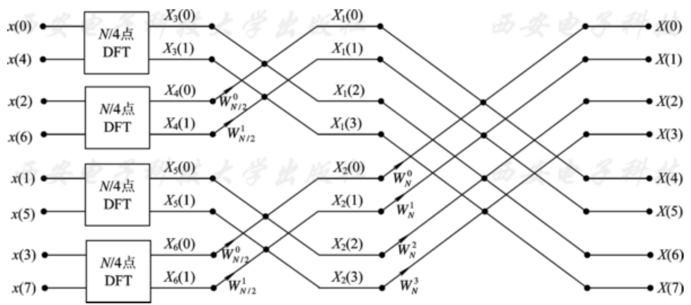

# 傅立叶变换

## 一、傅立叶变换

设 $f(t)$ 为关于时间 $t$ 的函数，它描述了一个信号。

设 $F(w)$ 为关于频率 $w$ 的函数，它也可以描述同一个信号。

傅立叶变换与逆变换即知道其中一者求另一者的魔法：

$$
F(w) = \mathbb{F}[f(t)] = \int_{-\infty}^\infty f(t) e^{i\omega t} dt\\
f(t) = \mathbb{F}^{-1}[F(\omega)] = \frac{1}{2\pi}\int_{-\infty}^\infty F(\omega) e^{i\omega t} d\omega
$$

## 二、离散傅立叶变换

即离散形式，频率为 $\omega = \frac{2\pi k}{n}$。

设 $\{x_k\}_{k=0}^{n-1}$ 为某一满足有限性条件的序列，其 DFT 为：
$$
X_k = \sum_{t=0}^{n-1} x_te^{-i\frac{2\pi k}{n}t}
$$

使用 $w_{n}$ 表示 $n$ 次单位根，即 $w_n = e^{-i\frac{2\pi}{n}}$ 则原式可以写作：
$$
X_k = \sum_{t=0}^{n-1}x_t(w_n^{k})^t
$$
这里还有另一种表示方式，有没有发现上面的形式和一个多项式很像：
$$
X_k = \sum_{t=0}^{n-1}x_t\square^t
$$
没错，我们可以假设存在一个函数 $f(x)$，其 $n$ 次项的系数为 $x_n$，那么就可以这么表示傅立叶变换：
$$
X_k = f(w_n^k)
$$
所以我们要求傅立叶变换，也就是要计算 $n$ 个 $n$ 次多项式在某处的取值，朴素算法的复杂度也就是 $O(n^2)$ 的。

我们也可以列出来所有 $X_k$ 的计算过程来看看：
$$
\begin{align}
X_0 &= x_0 + x_1 + x_2 + \cdots + x_{N-1}\\
X_1 &= x_0 + x_1w_n^1 + x_2w_n^2 + \cdots + x_{N-1}w_n^{n-1}\\
\cdots\\
X_{n-1} &= x_0 + x_1w_n^{n-1} + x_2w_n^{2(n-1)} + \cdots + x_{N-1}w_n^{(n-1)\cdot(n-1)}
\end{align}
$$
写成矩阵即：
$$
\begin{bmatrix}
X_0\\
X_1\\
X_2\\
\cdots\\
X_{n-1}
\end{bmatrix} = \begin{bmatrix}
1 & 1 & 1 & \cdots & 1\\
1 & w_n^1 & w_n^2 & \cdots & w_n^{n-1}\\
1 & w_n^2 & w_n^4 & \cdots & w_n^{2(n-1)}\\
\cdots\\
1 & w_n^{(n-1)} & w_n^{(n-1)\cdot2} & \cdots & w_n^{(n-1)(n-1)}\\
\end{bmatrix} \begin{bmatrix}
x_0\\
x_1\\
\cdots\\
x_{n-1}
\end{bmatrix}
$$
其中包含 $n^2$ 次乘法。

### 快速傅立叶变换

假设 $n$ 为 $2$ 的幂，采用分治思想，将多项式按照奇次项和偶次项分为两部分：
$$
\begin{align}
f(x)
&= a_0 + a_1x + a_2x^2 + \cdots + a_{n-1}x^{n-1}\\
&= (a_0 + a_2x^2 + \cdots + a_{n - 2}x^{n - 2}) + (a_1x + a_3x^3 + \cdots + a_{n - 1}x^{n - 1})\\
&= (a_0 + a_2x^2 + \cdots + a_{n - 2}x^{n - 2}) + x(a_1 + a_3x^2 + \cdots + a_{n - 1}x^{n - 2})
\end{align}
$$
那么它其实可以用两个新的多项式 $G$ 和 $H$ 来表示：
$$
f(x) = G(x^2) + x H(x^2)
$$
而 $n$ 次单位根：$w_n^0, w_n^1, \cdots, w_n^{n-1}$ 有几个很不错的性质：

- 性质 1：$w_{2n}^{2k} = w_n^k$

- 性质 2：$w_n^{k + \frac{n}{2}} = -w_n^k$​
- 性质 3：$w_n^{k + n} = w_n^k$

利用它们，我们可以得到：
$$
\begin{align}
X_k
&= f(w_n^k)\\
&= G(w_n^{2k}) + w_n^kH(w_n^{2k})\\
&= G(w_{n/2}^k) + w_n^kH(w_{n/2}^k)\\
\end{align}
$$

$$
\begin{align}
X_{k+n/2}
&= f(w_n^{k+n/2})\\
&= G(w_n^{2k + n}) + w_n^{k+n/2}H(w_n^{2k+n})\\
&= G(w_{n/2}^k) - w_n^kH(w_{n/2}^k)
\end{align}
$$

也就是说，一旦我们求出 $G(w_{n/2}^k)$ 和 $H(w_{n/2}^k)$ 我们就可以得到 $f(w_n^k)$ 和 $f(w_n^{k + n/2})$。

这个过程也被称作「蝶形运算」，可以画成下面的图：

