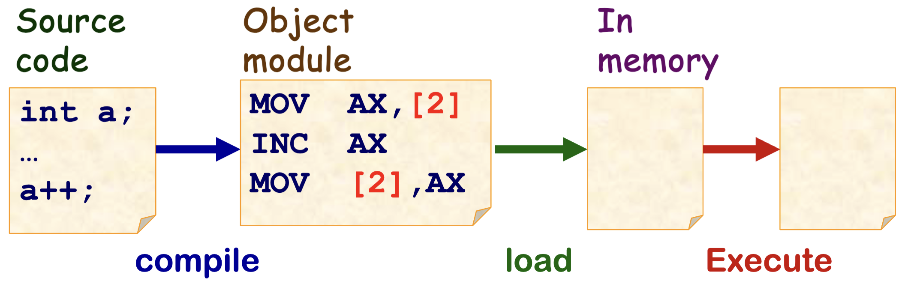
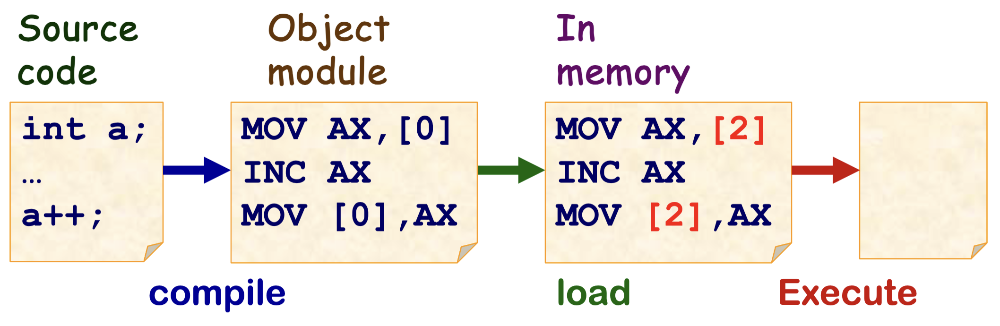
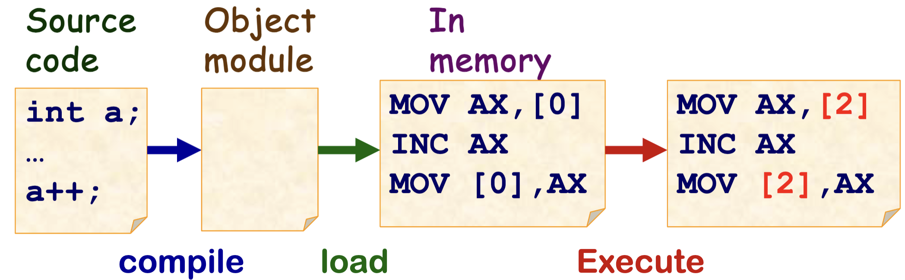
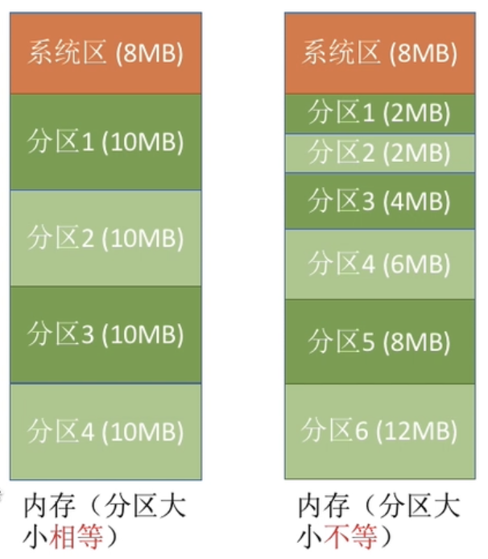
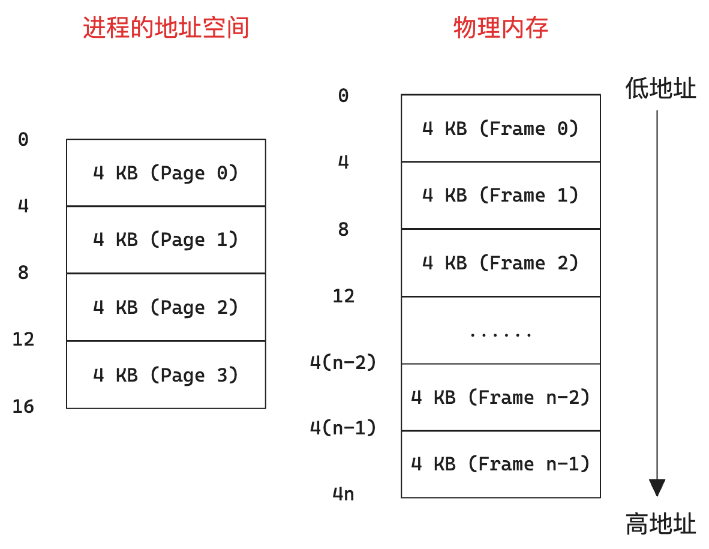
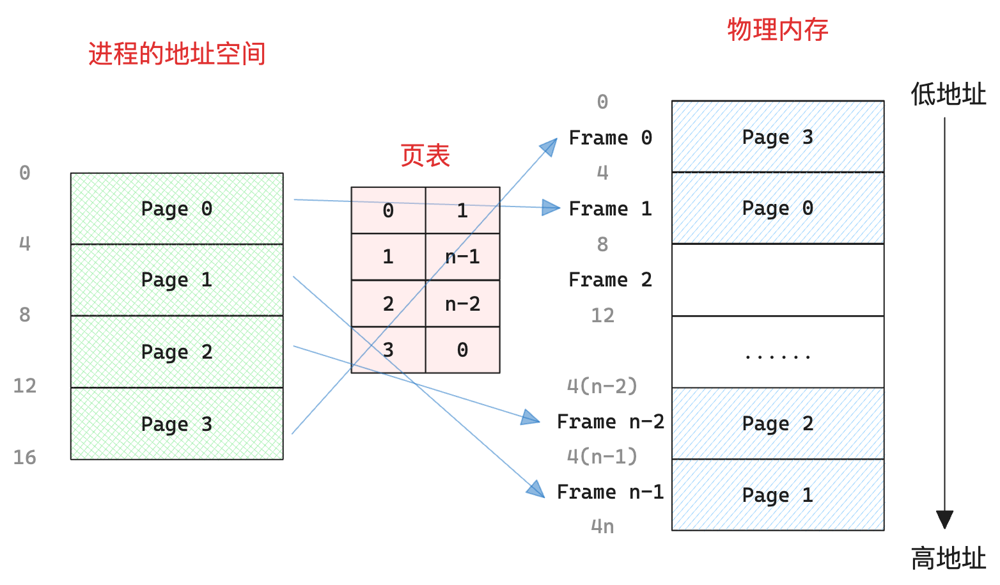
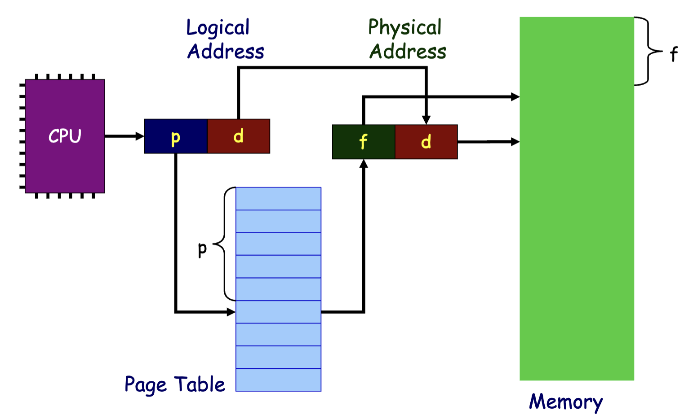
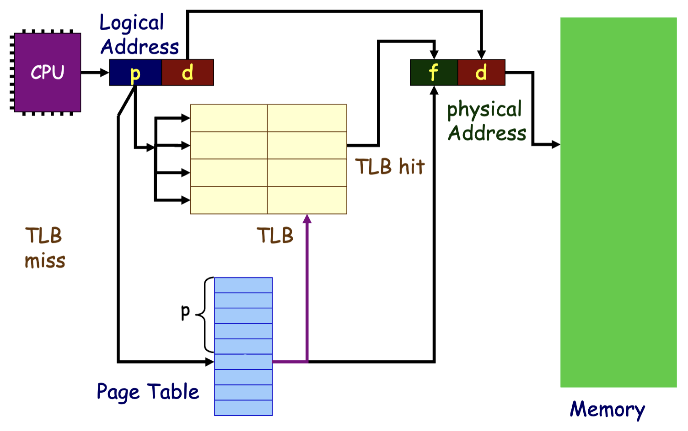
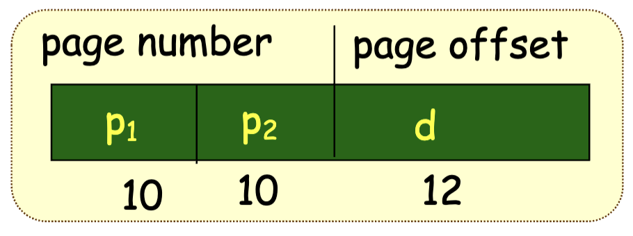
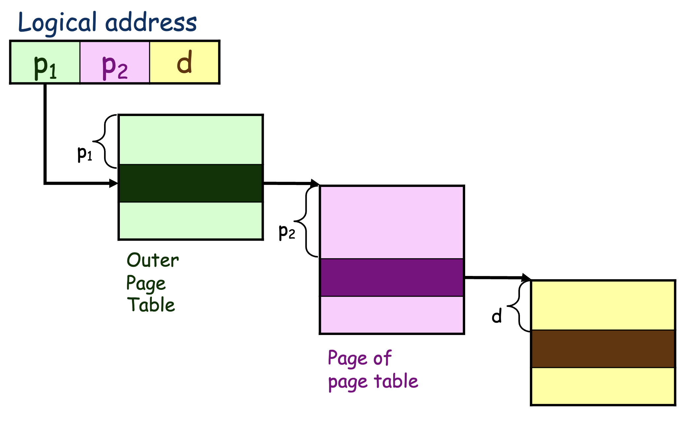

# 主存

首先对计算机组成原理中的 **逻辑地址**、**物理地址** 以及 **MMU** 进行简单的回顾：

- **逻辑地址**：CPU 访存时使用的地址

- **物理地址**：内存单元中使用的地址
- **MMU**：负责逻辑地址到物理地址的转换

## 地址空间

> 参考：
>
> - https://www.baeldung.com/cs/address-binding-in-operating-systems
> - https://www.bilibili.com/video/BV1YE411D7nH/?p=42&vd_source=b89f32f1706e5d008ebee234af40c76d

**地址空间** 可以被看作一块内存，但并不真实存在。每个应用程序都会被分配一个范围受限、独占的连续地址空间。

### 1. 地址空间的产生及三种地址绑定

- **单道程序系统/批处理程序系统的时代**

    整硬件资源只用来执行单个裸机应用时，物理内存的一部分用来保存操作系统的代码和数据，余下的部分交给应用来使用。

    

    在这个阶段，程序的开发者提前知道应用要被加载到内存的物理地址，所以在编译阶段就可以直接生成固定的地址。

    我们称这种地址绑定方式为 **编译时绑定**。

    **此时 逻辑地址 = 物理地址。**

- **多道程序时代**

    多道程序产生后，产生了将多个应用同时加载到内存中的需求，而这会导致每个应用被加载到物理内存的位置不同。

    如果依旧在编译阶段直接生成固定的地址，就会导致开发者负担加重，需要手动为每个应用决定内存地址。而且容易产生会难以管理内存权限的问题，一个程序可能访问到其他程序所在的内存位置。

    

    因此产生了 **地址空间**，在编译时不再生成最终的地址，而是生成一个程序所处内存位置的 **相对地址**（这个地址是 **虚拟** 的，也称作 **符号地址**），在被加载程序加载到内存中时再被替换为真实的 **物理地址**。

    我们称这种地址绑定方式为 **加载时绑定**。

    **此时 逻辑地址 依旧 = 物理地址，不过地址空间和虚拟地址的雏形产生了。**

- **现代操作系统时代**

    那么如何去维护「地址空间」呢？

    一个办法就是通过在操作系统中设计巧妙的数据结构来对地址空间进行表示，但是如果所有的转换都要由操作系统来进行，这样的开销是很大的。

    之后内存分配方式也更加多元，在连续内存分配之外又诞生了分段和分页等方式，不同地址空间中的虚拟地址到物理地址之间的映射关系也变得复杂了起来，在这样的情况下上述问题更为严重。

    于是引入了一个硬件 —— MMU，它专门用来实现逻辑地址到物理地址的转换，这时 CPU 访存时就不必使用真实的物理地址。

    

    我们称这种地址绑定方式为 **运行时绑定**。

    **此时 逻辑地址 = 内存空间中的虚拟地址**。

### 2. MMU

当使用虚拟地址作为逻辑地址时 会需要 MMU 来对其进行转换，变为真实的物理地址。

由于不同的应用的相同虚拟地址可能被转换为不同的物理地址，那么就需要硬件提供一些寄存器，由操作系统对寄存器进行设置来控制 MMU 按照哪个应用的映射关系来进行地址转换。

## 连续内存分配

### 1. 固定分区分配

一种原始的做法如上：每个应用的地址空间大小为一个固定的常数 `bound`，操作系统将物理内存分为相同长度的多个插槽来分配给不同的应用。

假设应用的地址空间对应插槽的起点为 `base`，那么虚拟地址加上 `base` 也就是对应的物理地址（可能还需要进行越界判断）。因此，这种方式的实现十分简单，MMU 只需要 `base` 和 `bound` 两个寄存器，在地址转换时进行加法、比较运算即可。

内核只需要在切换任务时修改 `base` 寄存器的值即可，在内存管理方面只需要维护一个 bitmap 来表示插槽的占用状态即可。

然而显而易见的是，插槽大小是由最大应用大小决定的，这种方式会导致占用空间较小的应用会在其所占用的插槽内部浪费大量的内存资源，即 **内部碎片**。

一种改进方法就是使分区大小不相等（多个小分区、适量中分区、少量大分区），这样会有更高的灵活性，提供了为小内存应用分配小分区，为大内存应用分配大分区的可能。

### 2. 动态分区分配

前述固定分区分配总会产生内部碎片，不论一个进程占用多大空间，它总会占据一整个分区。

因而产生了另一种方式，根据应用大小动态寻找位置加载，这种方式虽然避免了内部碎片，但是会产生外部碎片。

有几种动态分配空间的策略：

- First-fit：遍历整个内存找到第一个足够放下的空间
- Best-fit：找到能够放下的最小的空间
- Worst-fit：找到能够放下的最大的空间

（详细略）

## 非连续内存分配

### 1. 分页

> 相当于将进程地址空间切碎，一块一块地分散地到物理内存中。

物理内存会被分为固定大小的块，被称作 **帧（Frame）**，满足：

- 大小为 2 的幂
- 一般较小（1K - 16K）

进程的地址空间也会被分为同样固定大小的块，被称作 **页（Page）**。

以帧、页大小为 4KB，进程占用 16KB 为例：

然后需要一个 **页表（Page Table）** 来存储对应关系：

**这种方式避免了外部碎片，但是有可能产生内部碎片**

以上是简单的概述，下面来详细分析一下具体的实现。

首先是帧、页的划分，可以简单地令地址的高位作为帧、页号，地址的低位作为帧、页内偏移（Offset）。

那么，CPU 访存所使用的地址依旧直接是地址空间的地址，不过可以分为两部分：

而由于页内偏移与帧内偏移一致，因此 MMU 只需要将页号转换为帧号即可：

而需要一个链表来维护空闲的帧。

#### > TLB

由于访问的地址有连续性，也就是说 CPU 多次访存指令可能位于同一个 Page 中，如果每一次访存都需要访问页表就会浪费掉一定的性能，因此可以设置一个 cache 来缓存页表项，这个 cache 就是 TLB（translation look-aside buffer）：

> **访问时间/有效访问时间（Effective Access Time, EAT）**
>
> 设 TLB 命中率为 $\alpha$，则有效访问时间为：
> $$
> EAT = (t_{tlb} + t_{memory})\alpha + (t_{tlb} + 2t_{memory})(1-\alpha)
> $$
>

#### > 多级页表

更进一步还可以做多级页表

## 分段

（TODO）

## 参考

