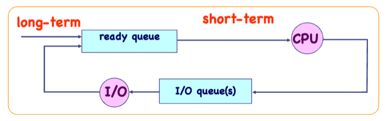

# 进程

## 一、概述

**「进程」**是一个正在进行中的程序，也可以说是一个程序的实例，可以被一个或多个线程执行。

### 1. 内存布局

一个进程在内存中的模型基本上如下所示，从上到下为高地址到低地址：

- 栈区（stack）包含调用栈，用于存放临时数据（函数参数、返回地址、局部变量）。
- 堆区（heap）包含动态分配的内存。
- 数据段（data）包含初始化后的静态变量信息
- BSS段（bss）包含未初始化的静态变量信息
- 代码段（text）包含机器指令，即程序二进制代码。

下面是一个 C 语言程序代码和其对应的内存布局的示例：

### 2. 进程状态

一个进程在运行的过程中并不是无间断地一路执行到结束的，当一个进程在等待 IO 结果的时候，操作系统可能会令 CPU 切换到其他进程执行来充分利用 CPU 资源。因此需要一个状态变量来描述当前进程的执行状态。

一个进程有如下五种状态：

- new：进程刚被创建
- running：进程正在被执行
- waiting：进程正在等待某些事件（比如 IO 操作）才能狗继续执行
- ready：进程已经准备好执行，正在等待被执行。
- terminated：进程执行完毕。

### 3. 进程控制块（Process Control Block, PCB）

PCB 中存储了进程的当前状态，可以说是进程执行状态及所处环境的一个“快照”，同一时刻只有一个 PCB 是激活的（即只有一个进程在运行），由操作系统创建、管理。

它通常包含以下信息：

- 进程状态
- 进程结构信息（用于维护子进程这样的关系）
- 进程间通信信息
- 进程权限信息
- 进程编号(PID)
- 程序计数器(PC)，指向当前进程的下一条要执行的指令
- CPU 寄存器
- CPU 调度信息
- 内存管理信息，页表、内存限制等。
- I/O 状态信息
- ......

简单来说，当进程被创建时，其实就是创建了一个 PCB，PCB 包含进程的一切运行状态信息。发生进程切换时就是保存当前进程 PCB 后加载另一个进程的 PCB 的过程（也就是上下文切换）。

### 4. 进程调度

进程可以分为大概两种：

- I/O 密集型进程：I/O 花费的时间大于计算花费的时间
- CPU 密集型进程：计算花费的时间大于 I/O 花费的时间

对于一个单处理器系统，同时只能有一个进程在运行，这也正是进程调度的意义所在。

进程会在不同的调度队列之间来回迁移：

- Job queue：所有进程
- Ready queue：已经加载到主存，等待被执行的进程
- Device queue：正在等待 I/O 的进程

##### 调度器

- 长期调度器（Long-term scheduler/Job Scheduler）来将进程放入 Ready Queue。

    执行频率较低（几分钟一次）

- 短期调度器（Short-term scheduler/CPU scheduler）来决定接下来要执行的进程并分配 CPU。

    执行频率较高（例如每 100ms 一次）

    必须很快（不然会消耗大量时间在调度上）

- 中期调度器（Medium-term Scheduler（交换））来将内存放入交换分区/从交换分区加载

### 5. 进程间通信（Interprocess Communication, IPC）

主要有两种方式：

- 共享内存
- 消息队列

### 6. 进程同步

阻塞 —— 同步，非阻塞 —— 异步

