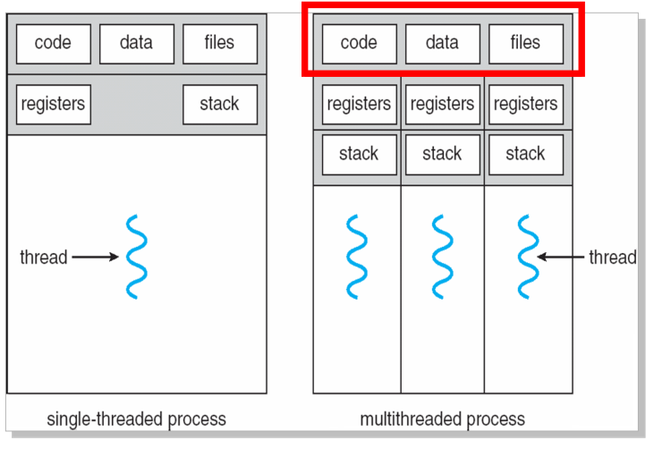

**线程** 是现代操作系统对进程概念的扩展，一个进程允许拥有多个线程，线程间没有保护。

线程状态图同进程。

每个线程都有一个线程 ID、程序计数器、寄存器、栈。

同一个进程的多个线程共享同一个地址空间

创建/销毁线程或线程间切换耗时比进程低很多。

## 线程类型

用户线程由程序库支持（比如 Java），chep and fast

（如果内核是单线程的，那么一个用户线程阻塞会导致其他线程也阻塞）

内核线程由内核支持

也许一个内核线程对应多个用户线程

User - Kernel

Many-to-One

One-to-One

Many-to-Many