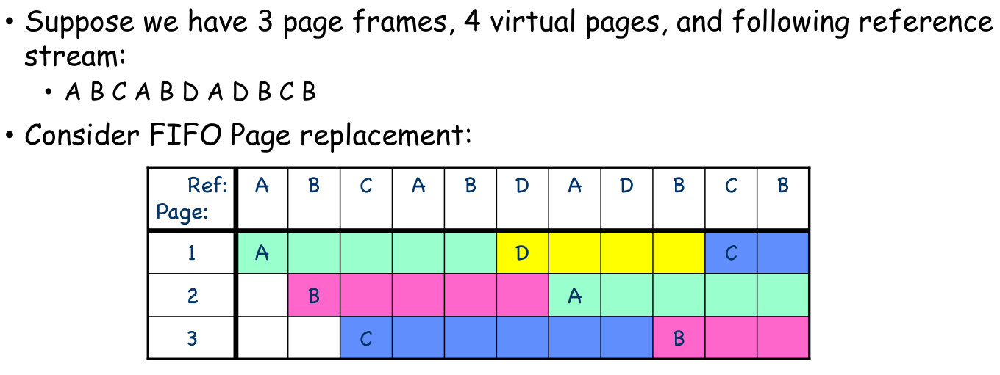

$$
\text{Average Access time} = (\text{Hit Rate} \times \text{Hit Time}) + (\text{Miss Rate} \times \text{Miss Time})
$$

## Demand Paging

Only when a page is needed, Bring it into the memory. (**Lazy swapper**)

当对某一个页的引用是 `invalid` 时（即不再内存中），会引发 **page fault** Trap：

找到空的物理帧，将 Page 存入物理帧，更新页表并设置为 `v`，重新执行指令。

而这一部分操作，存在极大的 Overhead

### Page Replacement Algorithm

##### 1. FIFO

Throw out the oldest page.

Causes 7 page faults.

---

**Belady’s Anomaly**：more frames causes more page faults

Normally, more frame causes less page faults, But there maybe exception:

#### 2. Min/Opt

Throw the page that won't be used for the longest time.

But we cannot see the future

#### 3. LRU

Throw the page that hasn't been used for the longest time

But maybe bad

