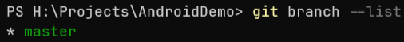
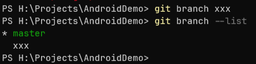
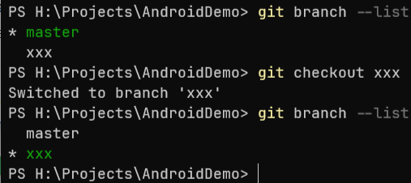
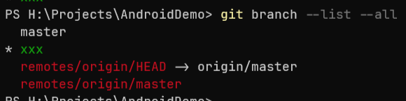

# _分支

Azur冰弦:
首先，你会经常用一个 git pull 命令来从远端仓库拉取更新合并到本地

益达:
草

益达:
感觉他已经嚼烂了喂我嘴里了

益达:
但是我还是不会

Azur冰弦:
它其实是两步的结合：git fetch 和 git merge

益达:
git merge是干什么用的

Azur冰弦:
这个 merge 是干啥的呢，就是合并分支用的

Azur冰弦:
嗯~

Azur冰弦:
然后分支是啥呢，就是个分支

益达:
就是别人提交的代码？

Azur冰弦:
额

Azur冰弦:
就是，相当于是，我shitting到某一刻，然后我可以兵分两路，分两个分支，在上面做不同的事情

益达:
草

Azur冰弦:
比如，默认的话仓库只有一个分支，通常是master，有的时候是main

Azur冰弦:

Azur冰弦:
这个可以显示当前的分支

益达:
这玩意是在哪搞出来的

Azur冰弦:
然后呢，可以用 git branch xxx来创建一个名为 xxx的分支

Azur冰弦:
额就是终端运行（

益达:
命令行？

Azur冰弦:
嗯

Azur冰弦:
命令行

Azur冰弦:
在 git 仓库下面

Azur冰弦:

Azur冰弦:
比如这样就创建了个叫做 xxx 的分支

Azur冰弦:
这个分支里的内容会和当前你在的分支一样

益达:
哦~

Azur冰弦:
然后有个命令叫做 git checkout xxx，就是用来切换分支的

Azur冰弦:

Azur冰弦:
你看这样我就在另一个分支上了

益达:
嗯~

Azur冰弦:
我可以在这里改东西，写commit，然后可以用 git checkout master再切回来

Azur冰弦:
他会把你工作区的东西全部保存起来，加载另一个分支的内容替换掉

Azur冰弦:
然后，假如我在 master 上 git merge xxx

Azur冰弦:
就会试图把 xxx 上的内容合并到 master 上

益达:
哦，两个就和一块了

Azur冰弦:
嗯~

益达:
就相当于文件夹合并？

Azur冰弦:
并且会自动多一个 commit

Azur冰弦:
嗯差不多

Azur冰弦:
不过改动的文件是按照内容加进去的，而不是直接替换

Azur冰弦:
比如我在 master 上改了一个文件上半部分，我在 xxx 上改了文件的下半部分，我可以把 xxx merge 到 master，如果不产生冲突的话，最终得到的就是上下都改了的文件

Azur冰弦:
如果中间有冲突部分，就会停下来告诉你让你去处理

益达:
哦~

Azur冰弦:
嗯~

Azur冰弦:
然后这个 fetch 又是干啥的呢

Azur冰弦:
就是其实，git 里不止有本地分支，还有远程分支

Azur冰弦:
如果你在 git branch --list 后面再加上 --all

Azur冰弦:

Azur冰弦:
还会有其他的，这俩 remotes/origin/xxx 都是远程分支

Azur冰弦:
git fetch 就是获取远程分支的新的信息

益达:

Azur冰弦:
嗯~

Azur冰弦:
所以，你 git pull 的时候其实就是 git fetch，然后把远程分支的内容 merge 到本地分支

Azur冰弦:
然后，pull request 它其实是 github 内置的远程的分支

Azur冰弦:
然后这句话 git fetch origin pull/ID/head:BRANCH_NAME

Azur冰弦:

Azur冰弦:
就是这么个意思

Azur冰弦:
如果你执行一下，在 git branch --list --all 应该会发现多了一个分支