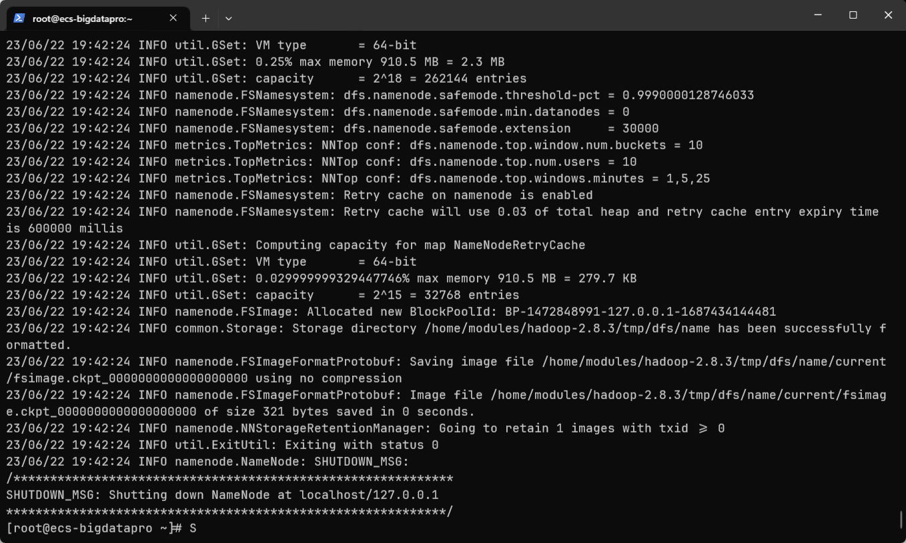
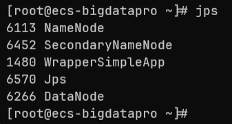
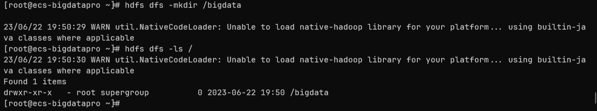
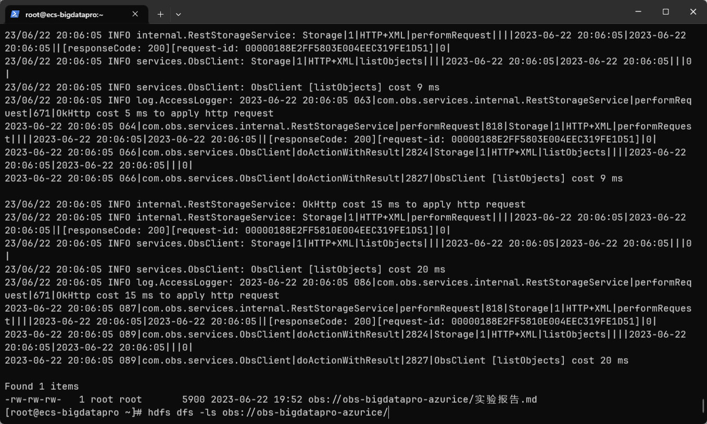
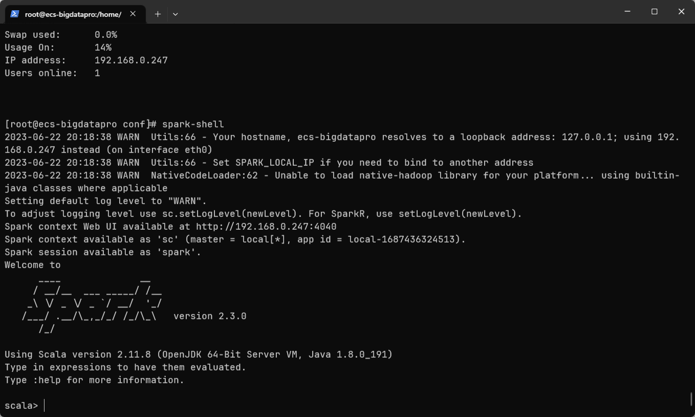
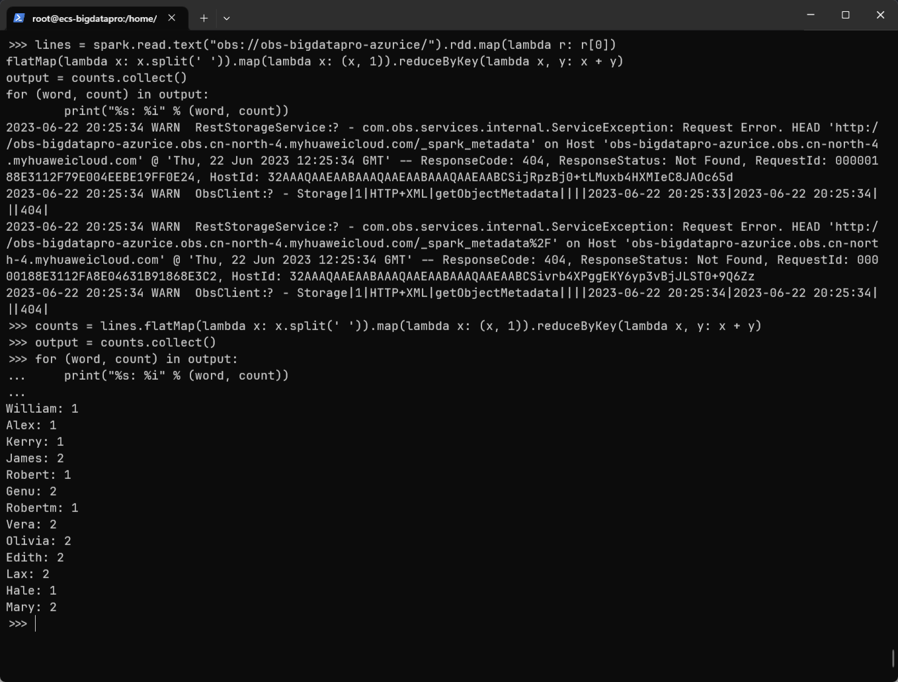

# 大数据华为云实践作业踩坑记录（实验报告

略去华为云资源准备。

## 修正 JDK 安装部分文档

官方文档中安装 JDK 部分有误，修改部分已在下面代码块中以 diff 格式展示（绿色部分）

> 其实正文中有设置 `PATH` 添加 `$JAVA_HOME/bin`，但是这文档说实话组织的真是一言难尽，代码块也不用等宽字体（

1. 安装 OpenJDK
   执行如下命令，将 jdk 安装包拷贝到安装目录下：

   ```diff
   cd /root
   wget https://bigdata-tools-hw.obs.cn-north-1.myhuaweicloud.com/OpenJDK8U-jdk_aarch64_linux_hotspot_8u191b12.tar.gz
   + mkdir /usr/lib/jvm
   cp OpenJDK8U-jdk_aarch64_linux_hotspot_8u191b12.tar.gz /usr/lib/jvm/
   ```

2. 步骤 2

   进入安装目录解压安装包：

   ```shell
   cd /usr/lib/jvm/
   tar zxvf OpenJDK8U-jdk_aarch64_linux_hotspot_8u191b12.tar.gz
   ```

3. 步骤 3

   在/etc/profile 增加如下的配置：

   ```diff
   export JAVA_HOME=/usr/lib/jvm/jdk8u191-b12
   + export PATH=$PATH:$JAVA_HOME/bin
   ```

4. 步骤 4

   执行 source 命令使环境变量生效：

   ```shell
   source /etc/profile
   ```

5. 步骤 5

   查看 java 安装版本：

   ```shell
   java -version
   ```

   > 输出：
   >
   > ```
   > [root@ecs-bigdatapro ~]# java -version
   > openjdk version "1.8.0_191"
   > OpenJDK Runtime Environment (AdoptOpenJDK)(build 1.8.0_191-b12)
   > ```

## 搭建 Hadoop 伪分布式集群

### 1. Hadoop 安装

创建以下两个目录：

- `/home/modules` 作为 hadoop 的安装目录
- `/home/nm/localdir` 作为 NodeManager 的数据目录

```bash
mkdir -p /home/modules
mkdir -p /home/nm/localdir
```

然后下载 hadoop 并解压到 `/home/modules`：

```bash
cd /root
wget https://bigdata-tools-hw.obs.cn-north-1.myhuaweicloud.com/hadoop-2.8.3.tar.gz
tar -zxvf hadoop-2.8.3.tar.gz -C /home/modules
```

编辑 `/etc/profile` 添加以下内容：

```
export HADOOP_HOME=/home/modules/hadoop-2.8.3
export PATH=$HADOOP_HOME/bin:$HADOOP_HOME/sbin:$PATH
export HADOOP_CLASSPATH=/home/modules/hadoop-2.8.3/share/hadoop/tools/lib/*:$HADOOP_CLASSPATH
```

重新加载 profile 使更改生效：

```bash
source /etc/profile
```

### 2. 伪分布式配置

编辑 `/home/modules/hadoop-2.8.3/etc/hadoop/core-site.xml`，在 `configuration` 标签之间添加以下内容：

```
<property>
    <name>fs.defaultFS</name>
    <value>hdfs://ecs-bigdatapro:8020</value>
</property>
<property>
    <name>hadoop.tmp.dir</name>
    <value>/home/modules/hadoop-2.8.3/tmp</value>
</property>
```

编辑 `/home/modules/hadoop-2.8.3/etc/hadoop/hdfs-site.xml`，在 `configuration` 标签之间添加以下内容：

```
<property>
    <name>dfs.replication</name>
    <value>1</value>
</property>
<property>
    <name>dfs.namenode.secondary.http-address</name>
    <value>ecs-bigdatapro:50090</value>
</property>
<property>
    <name>dfs.namenode.secondary.https-address</name>
    <value>ecs-bigdatapro:50091</value>
</property>
```

编辑 `/home/modules/hadoop-2.8.3/etc/hadoop/yarn-site.xml`，在 `configuration` 标签之间添加以下内容：

```
<property>
    <name>yarn.nodemanager.local-dirs</name>
    <value>/home/nm/localdir</value>
</property>
<property>
    <name>yarn.nodemanager.aux-services</name>
    <value>mapreduce_shuffle</value>
</property>
<property>
    <name>yarn.resourcemanager.hostname</name>
    <value>ecs-bigdatapro</value>
</property>
<property>
    <name>yarn.resourcemanager.scheduler.class</name>
    <value>org.apache.hadoop.yarn.server.resourcemanager.scheduler.fair.FairScheduler</value>
</property>
<property>
    <name>yarn.log-aggregation-enable</name>
    <value>true</value>
</property>
<property>
    <name>yarn.log.server.url</name>
    <value>http://ecs-bigdatapro:19888/jobhistory/logs</value>
</property>
```

编辑 `/home/modules/hadoop-2.8.3/etc/hadoop/mapred-site.xml`，在 `configuration` 标签之间添加以下内容：

> 这一步如果不存在 `mapred-site.xml` 可以先将 `mapred-site.xml.template` 复制一份为 `mapred-site.xml`
>
> ```bash
> cp /home/modules/hadoop-2.8.3/etc/hadoop/mapred-site.xml.template /home/modules/hadoop-2.8.3/etc/hadoop/mapred-site.xml
> ```

```
<property>
    <name>mapreduce.framework.name</name>
    <value>yarn</value>
</property>
<property>
    <name>mapreduce.jobhistory.address</name>
    <value>ecs-bigdatapro:10020</value>
</property>
<property>
    <name>mapreduce.jobhistory.webapp.address</name>
    <value>ecs-bigdatapro:19888</value>
</property>
<property>
    <name>mapred.task.timeout</name>
    <value>1800000</value>
</property>
```

配置 `slaves`，编辑 `/home/modules/hadoop-2.8.3/etc/hadoop/slaves` 内容为主机名：

```
ecs-bigdatapro
```

编辑 `/home/modules/hadoop-2.8.3/etc/hadoop/hadoop-env.sh`，修改其中的 JAVA_HOME 为安装 JDK 时设置的 JAVA_HOME。

初始化名节点：

```bash
hdfs namenode -format
```

> 这一步可能会报错 `lineNumber: 1; columnNumber: 20; XML version "2.0" is not supported, only XML 1.0 is supported.`
>
> 把上面几个配置文件开头的 `<?xml version="2.0" encoding="UTF-8"?>` 中的 `2.0` 改成 `1.0` 即可。（说实话，这文档。。。



启动 HDFS：

```bash
start-dfs.sh
```

使用 `jps` 查看启动的进程：



测试 HDFS 命令：

```bash
hdfs dfs -mkdir /bigdata
hdfs dfs -ls /
```



### 3. 与 OBS 互联

在 OBS 上上传了一份正在写的实验报告


建立 OBS 缓存目录：

```bash
mkdir -p /home/modules/data/buf
```

编辑 `/home/modules/hadoop-2.8.3/etc/hadoop/core-site.xml`，在 `configuration` 标签中继续添加以下内容：

```
<property>
    <name>fs.obs.readahead.inputstream.enabled</name>
    <value>true</value>
</property>
<property>
    <name>fs.obs.access.key</name>
    <value>华为云 AK</value>
</property>
<property>
    <name>fs.obs.secret.key</name>
    <value>华为云 SK</value>
</property>
<property>
    <name>fs.obs.endpoint</name>
    <value>OBS 的 endpoint</value>
</property>
<property>
    <name>fs.obs.buffer.dir</name>
    <value>/home/modules/data/buf</value>
</property>
<property>
    <name>fs.obs.impl</name>
    <value>org.apache.hadoop.fs.obs.OBSFileSystem</value>
</property>
<property>
    <name>fs.obs.connection.ssl.enabled</name>
    <value>false</value>
</property>
<property>
    <name>fs.obs.fast.upload</name>
    <value>true</value>
</property>
```

添加 jar 包：

```bash
cd /root
wget https://bigdata-tools-hw.obs.cn-north-1.myhuaweicloud.com/hadoop-huaweicloud-2.8.3-hw-39.jar
cp hadoop-huaweicloud-2.8.3-hw-39.jar /home/modules/hadoop-2.8.3/share/hadoop/common/lib/
cp hadoop-huaweicloud-2.8.3-hw-39.jar /home/modules/hadoop-2.8.3/share/hadoop/tools/lib
cp hadoop-huaweicloud-2.8.3-hw-39.jar /home/modules/hadoop-2.8.3/share/hadoop/httpfs/tomcat/webapps/webhdfs/WEB-INF/lib/
cp hadoop-huaweicloud-2.8.3-hw-39.jar /home/modules/hadoop-2.8.3/share/hadoop/hdfs/lib/
```

测试（查看 OBS 文件）：

```bash
hdfs dfs -ls obs://obs-bigdatapro-azurice/
```

> 这里又是两个坑，
>
> 一个是要先 `start-dfs.sh` 再 `start-dfs.sh` 重启 HDFS 使配置文件生效
>
> 一个是访问的 obs URL 中要与创建 OBS 中填写的名称相同。



## 搭建 Spark 集群

### 1. Spark 安装配置

安装：

```bash
cd /root
wget https://bigdata-tools-hw.obs.cn-north-1.myhuaweicloud.com/spark-2.3.0-bin-without-hadoop.tgz
tar -zxvf spark-2.3.0-bin-without-hadoop.tgz
mv spark-2.3.0-bin-without-hadoop/ /home/modules/spark-2.3.0
cp /root/hadoop-huaweicloud-2.8.3-hw-39.jar /home/modules/spark-2.3.0/jars/
cp /home/modules/hadoop-2.8.3/share/hadoop/common/lib/snappy-java-1.0.4.1.jar /home/modules/spark-2.3.0/jars/
```

配置：

```bash
cd /home/modules/spark-2.3.0/conf/
cp spark-env.sh.template spark-env.sh
```

编辑 `spark-env.sh`，在末尾添加以下内容：

```123456789
export JAVA_HOME=/usr/lib/jvm/jdk8u191-b12
export SCALA_HOME=/home/modules/spark-2.3.0/examples/src/main/scala
export HADOOP_HOME=/home/modules/hadoop-2.8.3
export HADOOP_CONF_DIR=/home/modules/hadoop-2.8.3/etc/hadoop
export SPARK_HOME=/home/modules/spark-2.3.0
export SPARK_DIST_CLASSPATH=$(/home/modules/hadoop-2.8.3/bin/hadoop classpath)
```

编辑 `/etc/profile`，添加 spark 环境变量：

```
export SPARK_HOME=/home/modules/spark-2.3.0
export PATH=${SPARK_HOME}/bin:${SPARK_HOME}/sbin:$PATH
```

重新加载 `/etc/profile` 使更改生效：

```
source /etc/profile
```

使用 `spark-shell` 进入 spark shell：



### 2. 验证存算分离

向 OBS 上再传一份 `playerinfo.txt`，内容如下：

```
Alex James Lax Genu
Kerry Mary Olivia William
Hale Edith Vera Robert
Mary Olivia James Lax
Edith Vera Robertm Genu
```

（然后把我之前传的实验报告删了

启动 pyspark：

```
pyspark
```

测试用 python 语句以及结果如下所示：

```python
lines = spark.read.text("obs://obs-bigdatapro-azurice/").rdd.map(lambda r: r[0])
counts = lines.flatMap(lambda x: x.split(' ')).map(lambda x: (x, 1)).reduceByKey(lambda x, y: x + y)
output = counts.collect()
for (word, count) in output:
	print("%s: %i" % (word, count))
```

