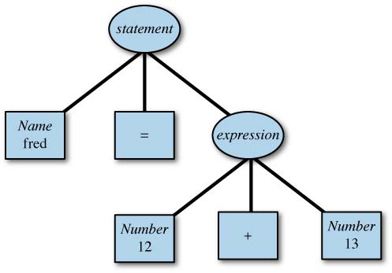

# 编译原理 2. 语法分析 - bison

flex 匹配正则表达式，bison 识别整个文法（grammar），将从 flex 中得到的记号组织成树形结构。

## 一、概述

比如对于一个计算器来说，可能会有如下的文法：

```yacc
statement: NAME '=' expression
expression: NUMBER '+' NUMBER
          | NUMBER '-' NUMBER
```

`|` 表示有两种可能性，对于 `:` 左侧相同的规则可以用这种方式简写。

比如对于这个表达式：

```
fred = 12 + 13
```

它被 flex 解析完毕后大概可以得到如下 记号：

```
<NAME, fred> '=' <NUMBER, 12> '+' <NUMBER, 13>
```

它进而会被 bison 转化为如下的解析树：

<!-- more -->



bison 并不会自动创建这样的树形结构，但是我们可以很简单地实现。

比如，借助 nvim-treesitter，可以得到一篇 Markdown 文章的词法树：


## 二、原理

就用上面的表达式为例：

```
fred = 12 + 13
```

Bison 会将一个个 Token 插入一个栈，每当栈中内容满足某一个规则的 RHS，就将其弹出，并以 LHS 替代 RHS 再插入栈：

```
fred
fred =
fred = 12
fred = 12 +
fred = 12 + 13
fred = expression
statement
```

## 三、例子

### 1. 逆波兰表达式（RPN）计算器

第一个例子是一个简单的双精度逆波兰表达式（RPN）计算器，即输入后缀表达式，输出计算结果。

在这个例子中我们不需要考虑符号结合性和优先级的问题。

#### > 词法分析

首先，空白可以被忽略：

```
[ \t] ;
```

对于数字分为小数和整数：

```
[0-9]+"."?      { return INTEGER; }
[0-9]*"."[0-9]+ { return FLOAT; }
```


### 有关 %prec 和 %nonassoc UMINUS

https://blog.csdn.net/skywuuu/article/details/112069830


http://aquamentus.com/flex_bison.html

