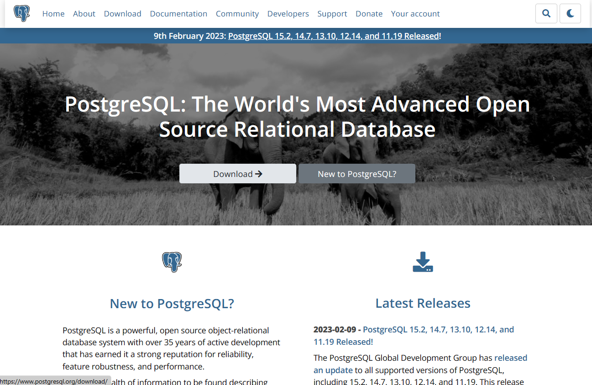
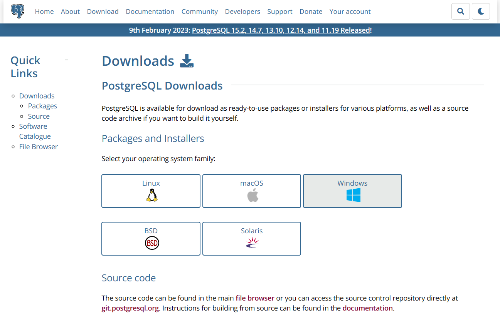
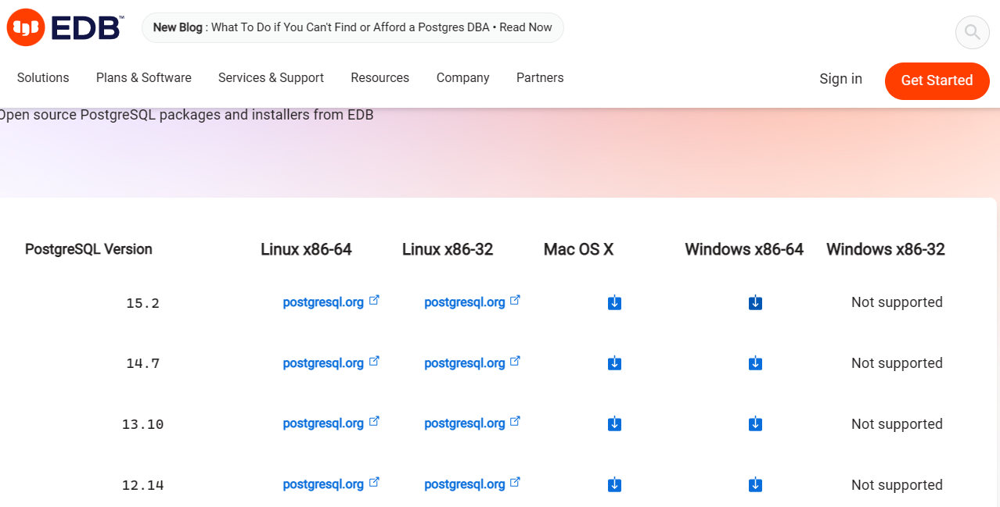
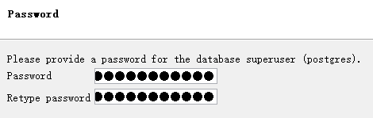
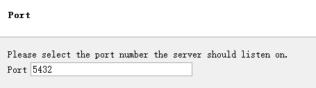

# PostgreSQL安装

T13:53:00+08:00

> 官网：[PostgreSQL: The world's most advanced open source database](https://www.postgresql.org/)

> 相关信息：
>
> [PostgreSQL 与 MySQL 相比，优势何在？ - 知乎 (zhihu.com)](https://www.zhihu.com/question/20010554)

## 一、下载

进入 Download 页面，选择你的系统：

## 二、安装

一路下一步。

配置访问数据库需要的密码：

配置访问数据库使用的端口（一般不用改）：

然后继续一路下一步，最后不用选择在退出时打开 Stack Builder。

