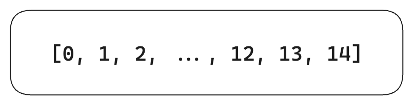

# 决策树

决策树其实有两种类型：

- 分类树：输出为离散的类别标签
- 回归树：输出为具体的数值（例如房价）

以下的「决策树」均表示分类树

---

下图为一个描述泰坦尼克号上乘客幸存情况的决策树模型：

决策树学习算法的训练数据是一系列形如 $(\vec{x}, Y) = (x_1, x_2, \dots, x_k, Y)$ 的输入，$\vec{x}$ 为特征向量，$Y$ 为算法要学习的分类标签。

目标是构建出一颗如上图的决策树，即依据新的 $\vec{x}$ 能够预测其所属类别 $Y$。

---

决策树的构建过程其实就是集合的划分过程。

以下面的数据为例：

|      | 年龄 | 有工作 | 有房子 | 信用   | 类别 |
| ---- | ---- | ------ | ------ | ------ | ---- |
| 0    | 青年 | 否     | 否     | 一般   | 否   |
| 1    | 青年 | 否     | 否     | 好     | 否   |
| 2    | 青年 | 否     | 是     | 好     | 是   |
| 3    | 青年 | 是     | 是     | 一般   | 是   |
| 4    | 青年 | 否     | 否     | 一般   | 否   |
| 5    | 中年 | 否     | 否     | 一般   | 否   |
| 6    | 中年 | 否     | 否     | 好     | 否   |
| 7    | 中年 | 是     | 是     | 好     | 是   |
| 8    | 中年 | 是     | 否     | 非常好 | 是   |
| 9    | 中年 | 是     | 是     | 非常好 | 是   |
| 10   | 老年 | 否     | 是     | 非常好 | 是   |
| 11   | 老年 | 否     | 是     | 好     | 是   |
| 12   | 老年 | 是     | 否     | 好     | 是   |
| 13   | 老年 | 是     | 否     | 非常好 | 是   |
| 14   | 老年 | 否     | 否     | 一般   | 否   |

 最开始，整颗决策树仅有一个结点即根结点：

通过将根结点划分为子集，可以细化决策树：

继续划分，直至某一个节点中只包含一个类别的样本（下面这一步带颜色的节点即不可再分）：

继续划分直至不可再分，得到最终的决策树：

> The [recursion](https://en.wikipedia.org/wiki/Recursion) is completed when the subset at a node has all the same values of the target variable, or when splitting no longer adds value to the predictions.

上述过程即 CLS 算法。

---

## ID3 算法[^1]

不过很显然对于 CLS 算法，其产生的决策树的层数可能过多，其选择的特征可能对于「决策」“没有任何帮助”。

于是引入一个 **信息增益（Information gain）**[^2] 的概念，它是信息学中的概念，表示了选择某一个特征能够获取的“信息量”。

在信息学中存在一个概念来衡量“信息量”，即 **信息熵**，它表示着“不确定度”，某一事件 $a_i$ 的信息熵定义如下：
$$
H(a_i) = - p(a_i) \log_2{p(a_i)}
$$
而对于某一随机变量 $X$，若 $P(X = x_i) = p_i$，则此随机变量的信息熵定义如下：
$$
H(X) = -\sum_{i}^{n}p_i\log_2{p_i}
$$
选取某一特征 $A$ 产生的 **信息增益** 即 $D$ 的信息熵在“得知 $A$ 的各个取值情况下的信息”的条件下，其信息熵减少了多少：
$$
g(D, A) = H(D) - H(D | A)
$$
此处引入 **条件熵** 的概念，设 $A$ 有 $m$ 种取值 $a_1, a_2, \dots, a_m$，那么上式中的 **条件熵** $H(D|A)$ 即为：
$$
H(D|A) = \sum_{i}^m P(A=a_i) \cdot H(D|A=a_i)
$$
ID3 算法通过每次选取 **信息增益** 最大的特征来构建决策节点，来优化决策树的层数。

但是它存在一个问题，它会倾向于挑选取值可能更多的特征，试想某一特征为一种“编号”，它的信息增益极大，但基于这样的信息构建出的决策树其实泛化能力并不强。

进而产生了 C4.5 算法对其进行了改善。

## C4.5 算法[^3]

### 信息增益率

与 ID3 算法相比，依据 **信息增益率** 而非 **信息增益** 来进行特征选取。

**信息增益率** 即 **信息增益** 与此特征本身 **信息熵** 的比值，即正则化后的 **信息增益**，对 ID3 算法的问题进行了矫正：
$$
g_R(D, A) = \frac{g(D, A)}{H(A)}
$$

## 参考

[^1]: https://en.wikipedia.org/wiki/ID3_algorithm
[^2]: https://en.wikipedia.org/wiki/Information_gain_(decision_tree)
[^3]: https://en.wikipedia.org/wiki/C4.5_algorithm