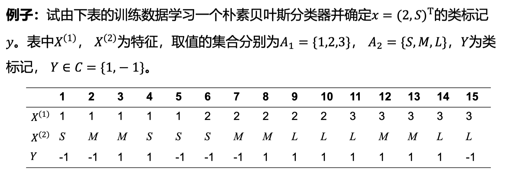

# 贝叶斯分类

对于一个多分类任务，假设有 $K$ 种可能的类别标记：$y = \{c_1, c_2, \cdots, c_K\}$。

输入为 $N$ 个样本 $D=\{(x_1, y_1), (x_2, y_2), \cdots, (x_N, y_N)\}$

其中 $x_i = (x_i^{(1)}, x_i^{(2)}, \cdots, x_i^{(n)})$，即样本有 $n$ 维特征，

第 $j$ 维特征可能的取值有 $S_j$ 种，为：$x^{(j)} \in \{a_{j1}, a_{j2}, \cdots, a_{jS_j}\}$。

## 计算方式：

首先计算所有的 $P(Y=c_i)$，

再对于每个 $c_i$ 计算所有的条件概率 $P(X^{j}=a_{jk} | Y = c_i)$。

对于一个给定的样本 $x=(x^{(1)}, x^{(2)}, \cdots, x^{(n)})$，对每一个 $c_i$ 计算：

$$
P(Y=c_i)P(X^{(1)}=x^{(1)}|Y=c_i)P(X^{(2)}=x^{(2)}|Y=c_i) \cdots P(X^{(n)} = x^{(n)} | Y=c_i)
$$

选取最大的那一个的 $c_i$ 即为最终分类。

## 例

