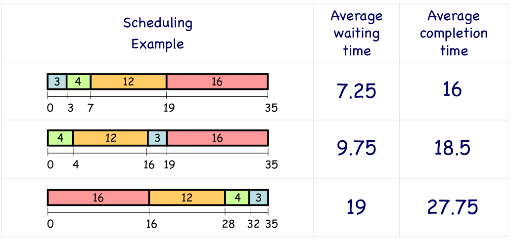
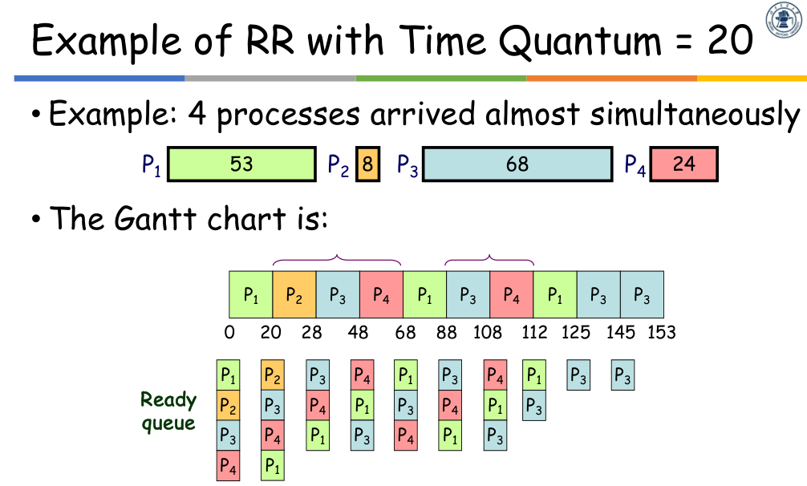

# CPU 调度

## 调度准则

- 最小化响应时间

  响应时间 = 提交 到 第一次响应

- 最大化吞吐量

  单位时间内完成的工作数量

- 公平性

  对 CPU 使用时间期望相同

- 最大化 CPU 利用率

  理论上 0% 到 100%

  实际 40% 到 100%

- Turnaround time（Completion time）轮转时间（对于一个进程）

  提交 到 完成

- Waiting time 等待时间（对于一个进程）

  总等待时间

## 调度算法

### 1. First-Come-First-Served（FCFS）

最简单，非抢占（preemptive）平均等待时间可能较长

对于 CPU 密集型进程要好一些（进程结束前一直占用会导致浪费等待 I/O 的时间）

由于取决于提交顺序，如果后面有一个短任务，需要等待前面的所有任务完成。

### 2. Round-Robin（RR）

每个进程运行一定的时间片（一般 10~100 毫秒），然后被抢占，置于就绪队列尾部。

等待时间短

对短任务好一些，公平性好，但是会需要上下文切换时间

### 3. Shortest-Job-First（SJF）

### 4. Shortest-Remaining-Time-First（SRTF）

SJF 的抢占式版本，如果某一个任务到达时更短，则抢占当前的任务。

几乎最优，但不公平，难以预测未来

如果很多短任务会导致饥饿

### 5. Priority Scheduling

可能导致低优先级进程永远不会被执行，解决方法：aging（随时间增长，减小优先级）

### 6. Multilevel Queue Scheduling

### 7. Multilevel Feedback Queue Scheduling

