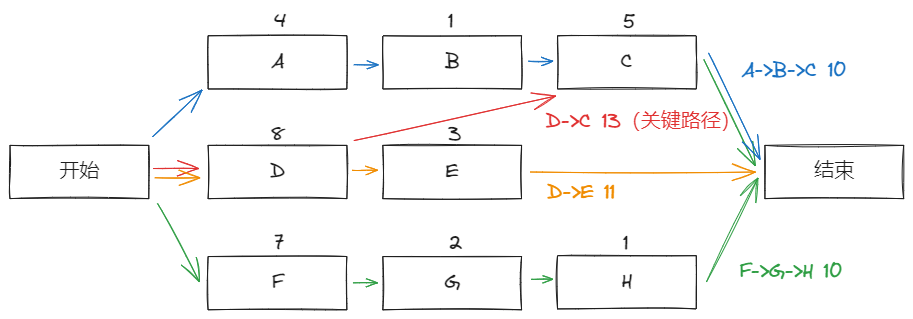
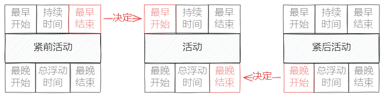
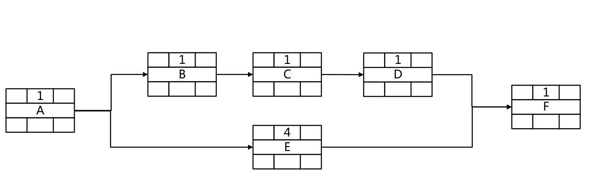
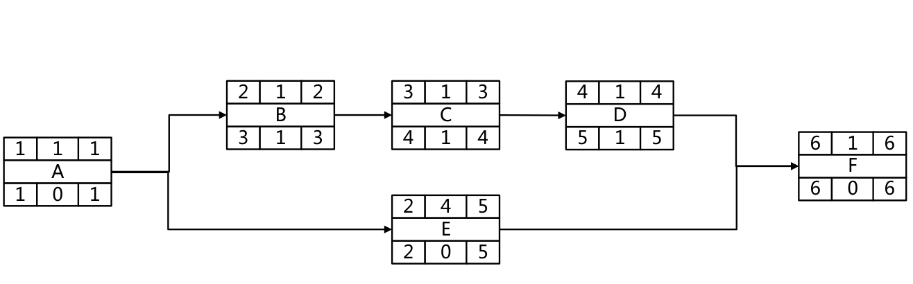
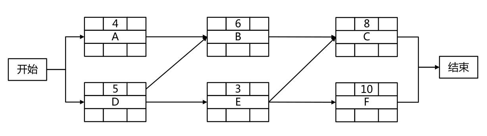
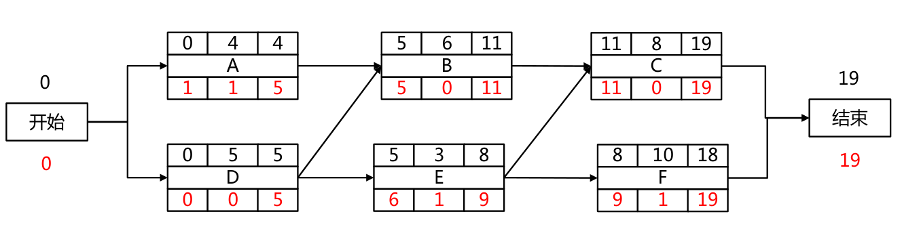

# 关键路径法

一种 **进度网络分析技术**，用于在 **不考虑任何资源限制** 的情况下，计算出所有活动的 **最早开始**、最早**结**束、**最晚开始** 和 **最晚结束** 时间，进而估算 **最短工期**。

## 一、紧前关系绘图法（Precedence Diagramming Method, PDM）

首先，对于任何一个 **活动**，其首尾分别是开始（Start）和结束（Finish）两个端点。

那么很自然的，活动之间的连接方式便有 4 种：

- FS：紧前活动完成，紧后活动才能开始（最常见，“串行”）
- FF：紧前活动完成，紧后活动才能完成
- SS：紧前活动开始，紧后活动才能开始
- SF：紧前活动开始，紧后活动才能完成

## 二、关键路径

这其实是 **数据结构** 中的概念，对于一个活动网络，只要缩短关键路径上的时间，就能够缩短总体的时间。

一种比较无脑的办法就是枚举出每一条从开始到结束的路径，其中最长的路径即为关键路径，其上的活动即为关键路径活动：

然而有时候我们还要对每个活动计算其活动时间：

- 总浮动时间：活动延期但不耽误项目完工时间的时间余量
- 自由浮动时间：活动延期但不耽误任何紧后活动最早开始时间

将每个节点换做下面的表示方式：

首先很显然，最早开始 + 持续 = 最早结束，同理最晚开始 + 持续 = 最晚结束。

然后很显然，对于最开始的活动，其最早开始为 1，那么顺水推舟，便得到所有任务的最早开始/结束。

其次很显然，对于最后的活动，其最晚结束 = 最早结束，那么反着顺水推舟，便得到所有任务的最晚开始/结束。

那么 **总浮动时间** 也就是 最晚（开始/结束）- 最早（开始/结束）。

## 三、几个例题

### 例 1

??? 答案

    

### 例 2

??? 答案

    开始时间为 1（时间为时间块闭区间）
    
    开始时间为 0（时间为时间点）
    

