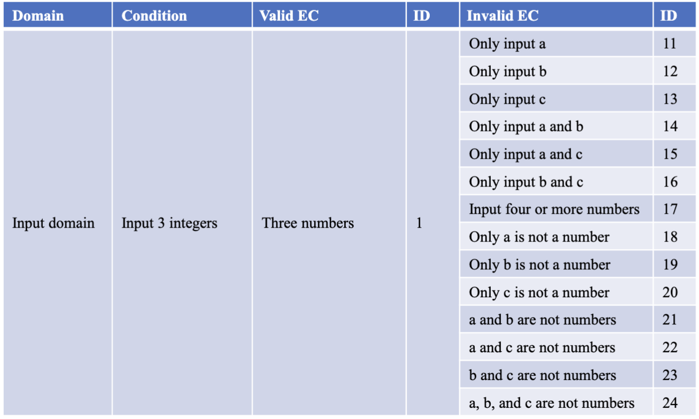
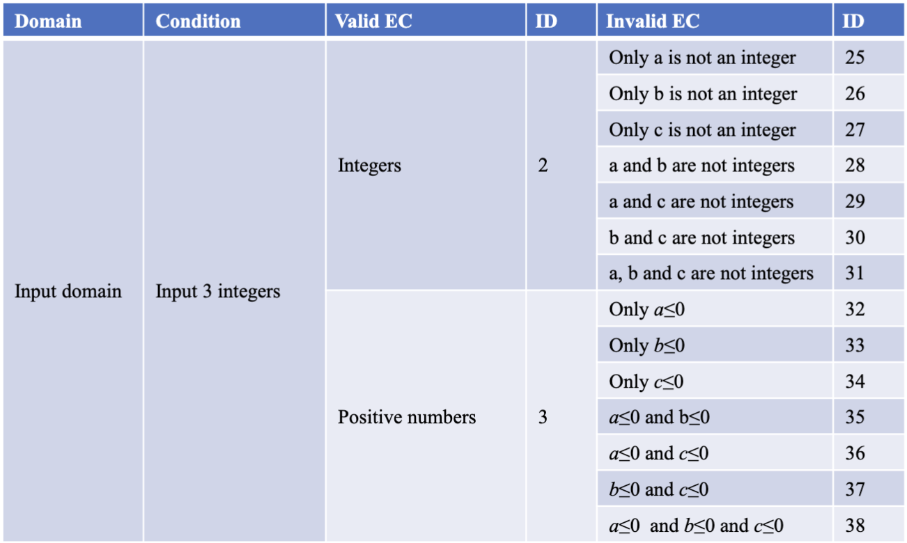
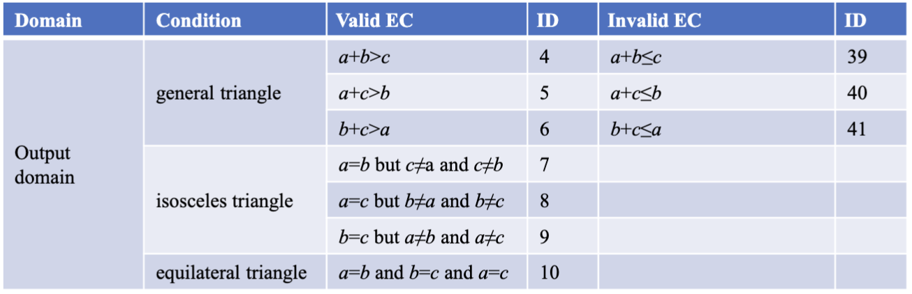
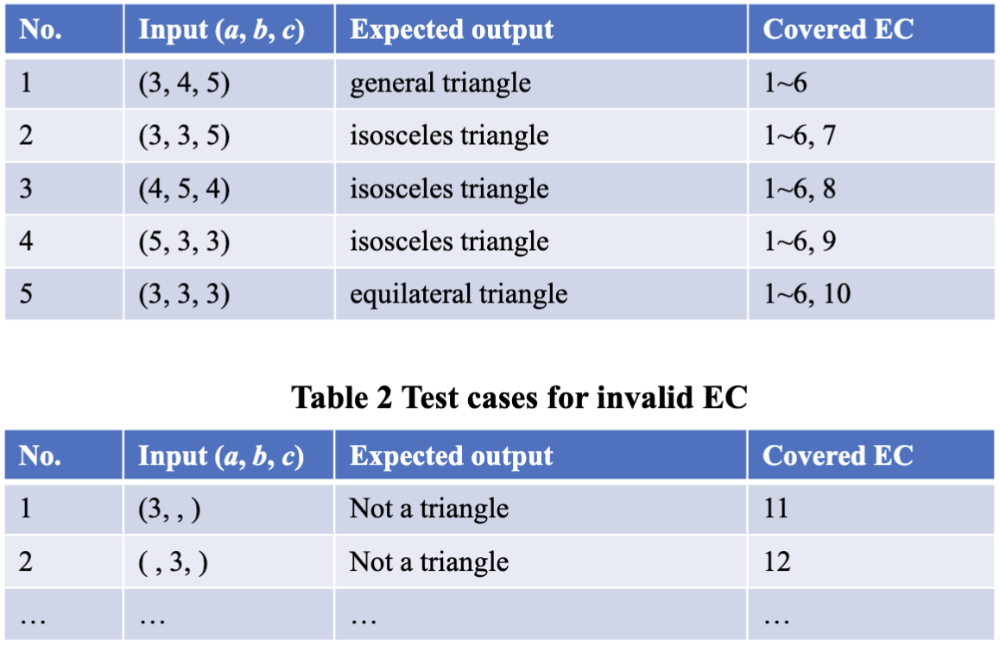
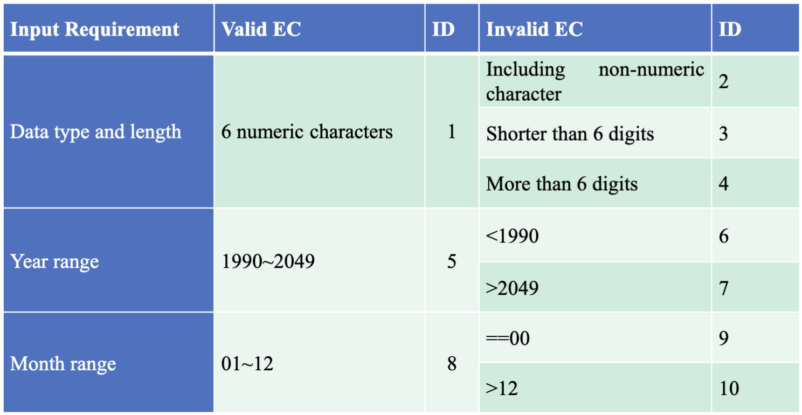
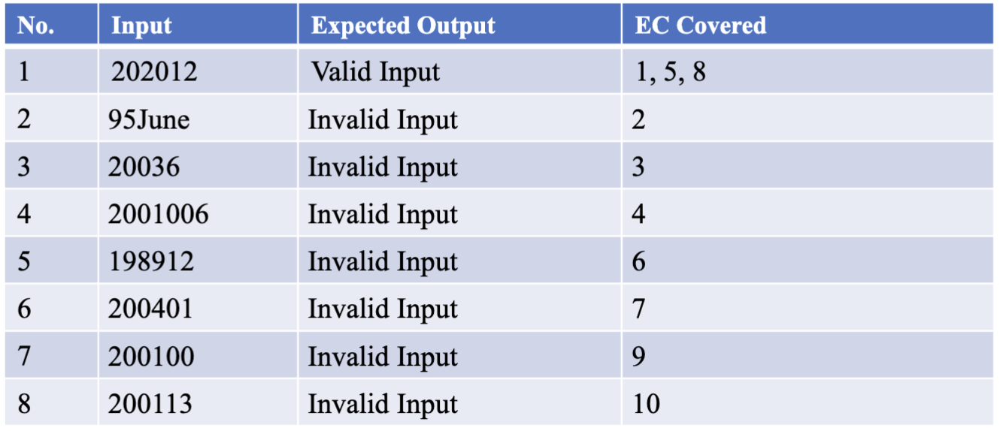
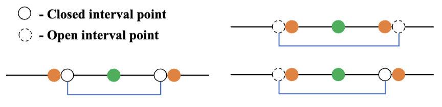
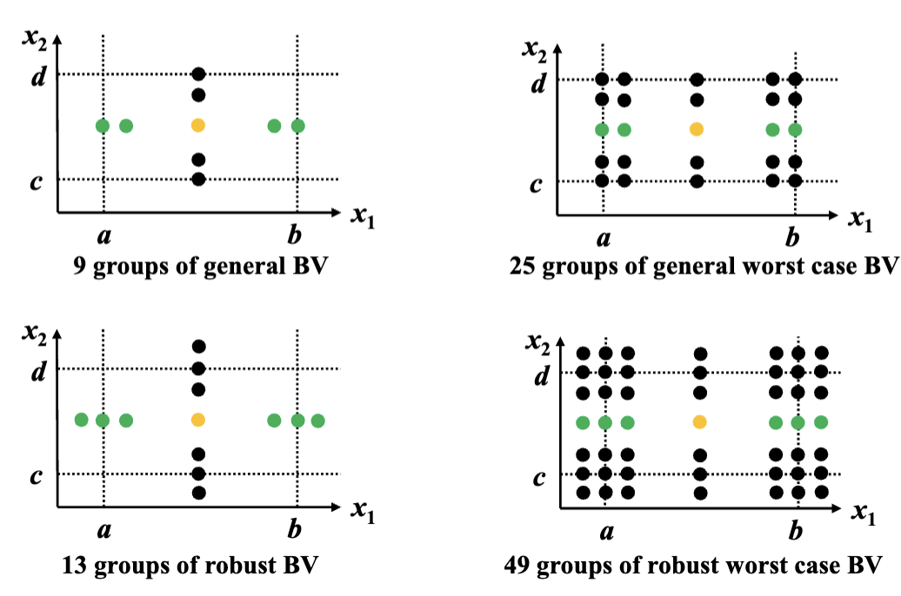
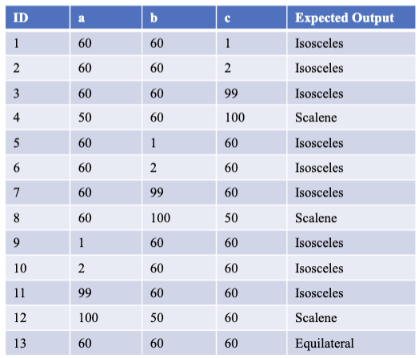
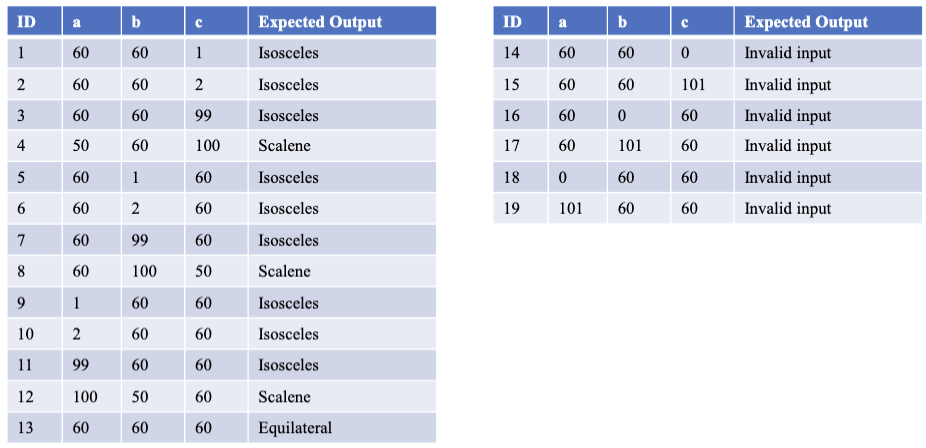

# 黑盒测试

## 一、等价类划分

> Equivalence Class Partitioning (ECP)

有三个步骤：

1. 根据输入需求划分等价类
2. 建立等价类表
3. 设计测试用例

### 例1：判断三角形类型

输入三个整数 $a, b, c$，判断三角形是等边、等腰，还是一般的三角形。

首先划分等价类：







然后设计测试用例：



### 例2：归档管理

输入由六个数字组成的日期，前四个为年份，最后两位为月份。





## 二、边界值分析

### 1. 三种选点方法

#### > 四点法

- 最小值（min）
- 稍大于最小值（min+）
- 稍小于最大值（max-）
- 最大值（max）

例如对于 $1 \leq x \leq 10$ 整数，可令 `min` 为 1，`min+` 为 2，`max-` 为 99，`max` 为 10。

对于 $0 \leq x \leq 1$ 非负浮点数，可令 `min` 为 0，`min+` 为 0.001，`max-` 为 0.999，`max` 为 1。

#### > 六点法

相较四点法多了两个：

- 稍小于最小值（min-）
- 稍大于最大值（max+）

同理

#### > 内外点法（On-Off-Inner）

- On-point：在边界值上

- Off-Point：接近边界值

  

  - 如果是闭区间，要在边界值之外
  - 如果是开区间，要在边界值之内

- Inner-point：边界值之内

例如对于 $1 \leq x \leq 10$ 整数：

- On-point：1，10
- Off-point：0，11
- Inner-point：可取 6

对于 $1 < x \leq 10$ 整数：

- On-point：1，10
- Off-point：2，11
- Inner-point：可取 6

### 2. 测试用例



#### > 一般边界值（General Boundary Values）

$4n + 1$

对于 $1 \leq x_1 \leq 10$ 和 $20 \leq x_2 \leq 30$ 两个整数：

```
x1: (min, min+, max-, max) → (1, 2, 9, 10) nom = 6;
x2: (min, min+, max-, max) → (20, 21, 29, 30) nom = 23;
9 test cases: 
(1, 23), (2, 23), (9, 23), (10, 23)
(6, 20), (6, 21), (6, 29), (6, 30)
(6, 23)
```

例如三角形问题：



#### > 最坏情况边界值（General Worst Case Boundary Values）

全体的组合，$5^n$

#### > Robust Boundary Values

额外带有 max+ 和 max- 的 General Boundary Values

$6n + 1$

例如三角形问题：



#### > Robust Worst Case Boundary Values

额外带有 max+ 和 max- 的 General Worst Case Boundary Values

$7^n$

## 三、决策表

