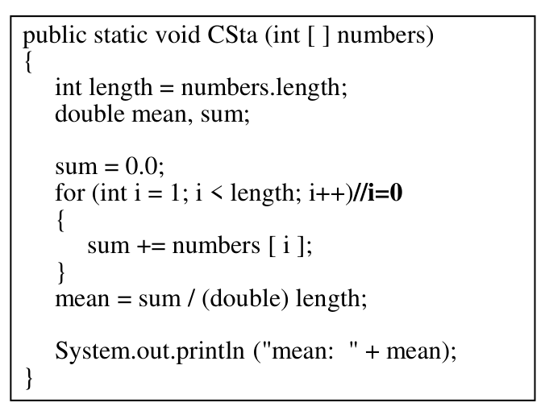
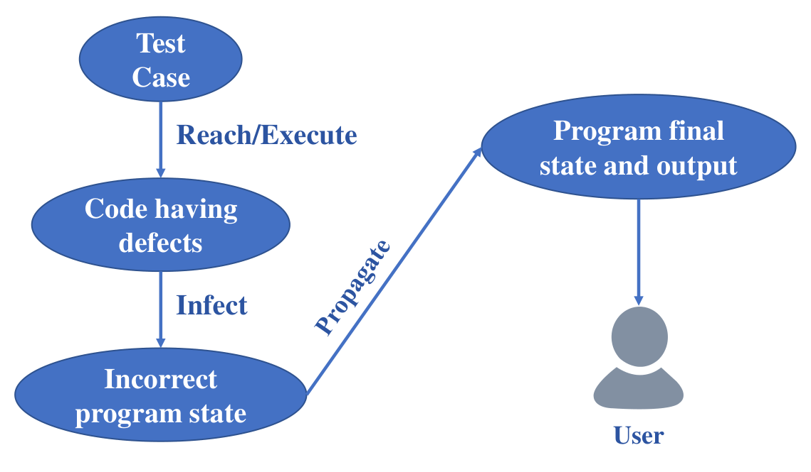

# 软件测试与质量保证

# §1 Fundamentals of Software Testing

## §1.1 Defination of Software Defect

IEEE (1983) 729：

- From an **internal** perspective, software defects refer to **various problems such as**
  **errors and defects** that exist during the **development or maintenance** process of
  software products;
- From an **external** perspective, software defects refer to the **failure or violation** of **a certain function** that a system needs to implement.

ISO 29119：

- **A flaw（缺陷）** in a component or system that can cause it to **fail to perform its required function**.
- **Any condition** that **deviates（偏离）** from expectation based on requirements specifications, design documents.

**Defects** may be found during, but not limited to, reviewing, testing, analysis,
compilation, or use of software products or applicable documentation

### 1.1 RIP/PIE Model

- Software Fault: A **static defect** in the software (i.e., defect)

  > 

- Software Error: An **incorrect internal state** that is the manifestation（表现） of some defect

  > With Test Input: [3, 4, 5]
  >
  > Expected: sum = 3 + 4 + 5
  >
  > Actual: sum = 4 + 5

- Software Failure: **External, incorrect behavior** with respect to the requirements or other description of the expected behavior

  > Expected mean = 4
  >
  > Actual: mean = 3

#### > Three Conditions

- Reachability/Execution: The location or locations in the program that contain the defect must be reached
- Infection: The state of the program must be incorrect
- Propagation: The infected state must propagate（传播） to cause some output of
  the program to be incorrect

---

**Does a software defect necessarily cause software errors?**

- Not necessarily. A defect may or may not result in an error. A defect in an unused or rarely executed part of the code may not manifest as an error during normal usage. However, defects in critical areas or frequently used features are more likely to cause errors.

**Does a software error necessarily cause software failure?**

- Again, not necessarily. An error in a system may or may not lead to a failure. Some errors might be handled gracefully by the software, causing it to recover and continue functioning correctly. However, certain errors can propagate and eventually lead to a failure if they are not properly handled or if they affect critical aspects of the system

## §1.2 Occurrence & Distribution of Defects

# §2 Fundamentals of Software Testing