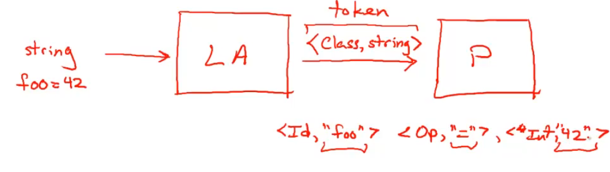
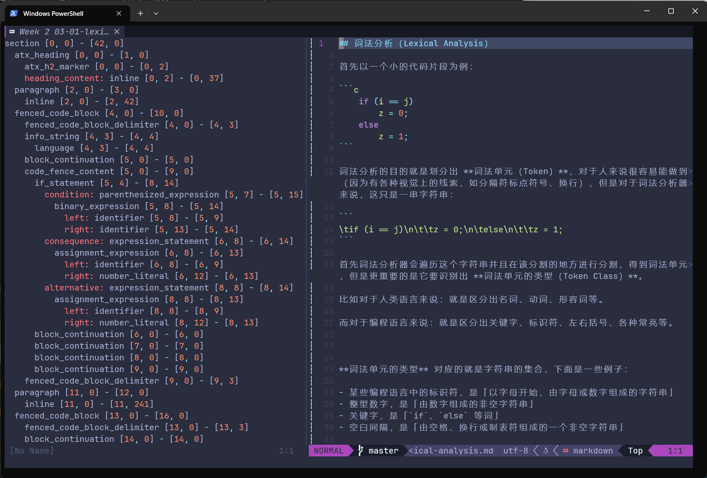
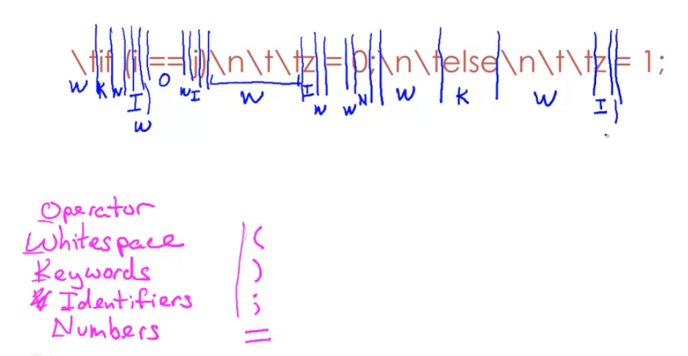

## 词法分析（Lexical Analysis）

首先以一个小的代码片段为例：

```c
    if (i == j)
        z = 0;
    else
        z = 1;
```

词法分析的目的就是划分出 **词素（Lexemes)**，对于人来说很容易能做到（因为有各种视觉上的线索，如分隔符标点符号、换行），但是对于词法分析器来说，这只是一串字符串：

```
\tif (i == j)\n\t\tz = 0;\n\telse\n\t\tz = 1;
```

首先词法分析器会遍历这个字符串并且在该分割的地方进行分割，得到词法单元，但是更重要的是它要识别出 **词法单元的类型（Token Class）**。

比如对于人类语言来说：就是区分出名词、动词、形容词等。

而对于编程语言来说：就是区分出关键字、标识符、左右括号、各种常亮等。


**词法单元的类型（Token Class）** 对应的就是字符串的集合，下面是一些例子：

- 某些编程语言中的标识符，是「以字母开始，由字母或数字组成的字符串」
- 整型数字，是「由数字组成的非空字符串」
- 关键字，是「`if`、`else` 等词」
- 空白间隔，是「由空格、换行或制表符组成的一个非空字符串」


进而得到 **词法单元（Token）**：

Token = <Token Class, Lexeme>


词法分析器与解析器之间的关系：




比如，借助 nvim-treesitter，可以得到本文章的词法树，其显示出来形如 `类型 [字符串起始位置] - [字符串结束位置]` 其实就是一个个 Token：




比如，上面的代码例子，经过词法分析应当得到形如下图的信息，即哪一部分字符串为属于哪一 Token Class：




