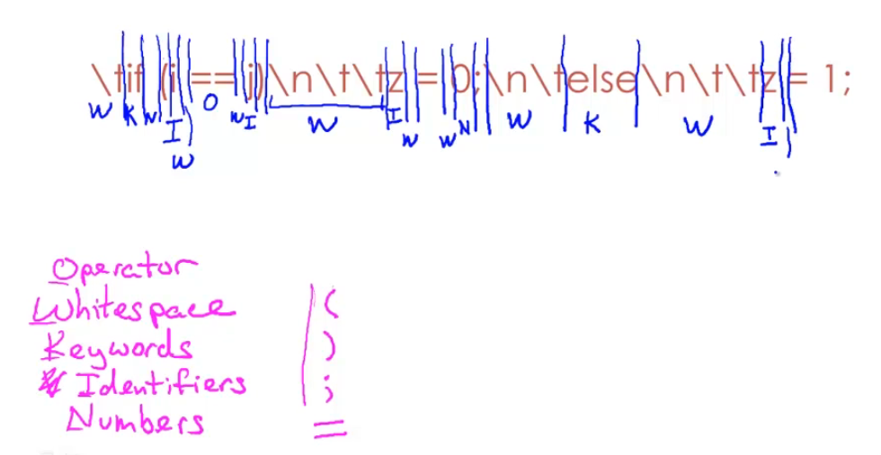
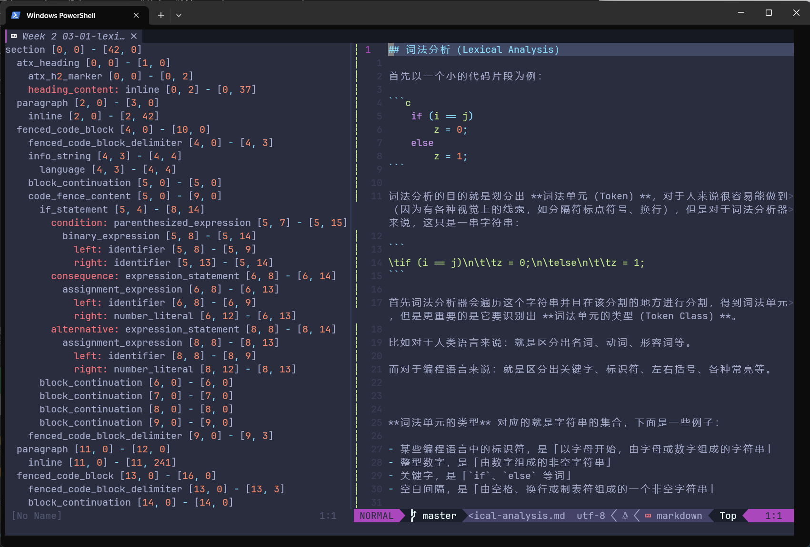

# 编译原理 0. 概述

忽略掉预处理以及链接的部分，C/C++ 语言的完整编译过程可以用下图表示：


编译原理中的“编译”二字与此处的“编译”二字并不是一个意思，此处的编译是具体的过程，从源代码到最终的可执行程序，而编译原理中的“编译”更加广泛，一切与解析某一种语言并转化为其他“语言”有关的过程都离不开此原理。

比如 python 的解释器（解释 python 代码并转化为具体指令运行），Markdown的解析渲染（解析 Markdown 并转化为 HTML 进行渲染），以及 SQL 的解析执行（解析 SQL 语句为具体的操作并执行）等等。

而这些过程都可以大致抽象为两大部分：

- 前端部分（Frontend）

  负责将源代码经过一步步分析转化为一个抽象的树形结构 —— 抽象语法树（AST）

- 后端部分（Backend）

  可能是个代码生成器，依照抽象的树形结构生成具体实际的转化目标的指令或语言等

  或许还会包含优化器等部分

> 这里的 前端后端 与 WEB 中的 前端后端不同。

---

**编译器（compiler）**的前端部分的主要工作流程如下：

- **词法分析（lexical analysis）**

  将 **字符序列** 转换为 **记号（token）序列**

- **语法分析（syntactic analysis，也叫 parsing）**

  根据某种给定的 **文法** 由 **记号（token）序列** 得到其对应语法结构（语法分析树、抽象语法树等）

- **语义分析（semnatic analysis）**

  筛选出需要根据上下文来找出的错误，比如是否有在使用前未定义的变量、赋值语句类型是否匹配等等

经过这三步筛选与解析，只有合法的程序才能够通过并传递到代码生成器（后端部分）。

## 一、词法分析（lexical analysis）

### 1. 概述

首先以一个小的代码片段为例：

```c
    if (i == j)
        z = 0;
    else
        z = 1;
```

词法分析的目的就是划分出 **词素（Lexemes)**，对于人来说很容易能做到（因为有各种视觉上的线索，如分隔符标点符号、换行），但是对于词法分析器来说，这只是一串字符串：

```
\tif (i == j)\n\t\tz = 0;\n\telse\n\t\tz = 1;
```

首先词法分析器会遍历这个字符串并且在该分割的地方进行分割，得到词法单元，但是更重要的是它要识别出 **记号的类型（Token Class）**。

比如对于人类语言来说：就是区分出名词、动词、形容词等。

而对于编程语言来说：就是区分出关键字、标识符、左右括号、各种常亮等。


**记号的类型（Token Class）** 对应的就是字符串的集合，下面是在某些编程语言中的一些例子：

- 标识符，是「以字母开始，由字母或数字组成的字符串」
- 整型数字，是「由数字组成的非空字符串」
- 关键字，是「`if`、`else` 等词」
- 空白间隔，是「由空格、换行或制表符组成的一个非空字符串」

对应的可以用以下 **正则表达式** 来描述它们：

```lex
identifier   [a-zA-Z][a-zA-Z0-9]*
integer      [0-9]+
keyword_if   if
keyword_else else
space        [ \n\t]+
```

详细见下一篇文章。


进而得到 **记号（Token）**：

Token = <Token Class, Lexeme>


词法分析器与解析器之间的关系：


比如，上面的代码例子，经过词法分析应当得到形如下图的信息，即哪一部分字符串为属于哪一 Token Class：





比如，借助 nvim-treesitter，可以得到本文章的词法树，其显示出来形如 `类型 [字符串起始位置] - [字符串结束位置]` 其实就是一个个 Token：



但是你会注意到图中是树形的结构，这是下一步 语法分析 完成的。

### 2. 一些例子

下面我会展示一些词法分析中可能会遇到的一些问题。

#### Fortran

对于 FORTRAN 语言来说，有一个性质/规则：空白是没有影响的。

比如 `VAR1` 与 `VA R1` 是等价的，也就是说，一个 FORTRAN 程序可以不包含任何空白。

看下面这个例子：

```fortran
DO 5 I = 1,25
DO 5 I = 1.25
```

第一行为循环，其中 `DO` 为循环关键字，`5` 为循环的标签，`I` 为循环迭代变量，范围为 `1` 到 `25`。

第二行为变量赋值，其中 `DO 5 I` 整体是一个变量名，也就是 `DO5I = 1.25`。

当我们对这两行分别做词法分析时，从左到右扫描字符串，到 `DO` 后面时，是无法确定这个 `DO` 是循环的关键字还是变量名的一部分，这时候我们需要更多的信息，直到后面的 `,` 与 `.` 的区别才能够得出结果，这被称作是 look ahead。

你也会注意到如果存在过多的 look ahead 会对词法分析系统的实现变得复杂，因此词法系统的设计目标之一就是最小化 lookahead 的数量。

> Fortran 如此设计的原因是早期在穿孔卡片机上编写程序时很容易多出一些空格

对字符串进行分割，从左到右扫描，一次识别一个 token。

#### PL/1

对于 PL/1 语言来说，有一个性质：关键字并不是保留的。

也就是说，一个关键字也有可能是用户定义的变量名：

```pl/1
IF ELSE THEN THEN = ELSE; ELSE ELSE = THEN
```

另一个例子：

```pl/1
DECLARE(ARG1, ..., ARGN)
```

难以区分 `DECLARE` 是关键字还是一个数组引用。

需要一路扫描经过整个 N 个 ARG，来得到后面是否为 `=` 来判断，这被称作 unbounded lookahead。

#### C++

在 C++ 中的流运算符和嵌套模板：

```c++
vector<vector<int>>
```

```c++
cin >> var;
```

在老的编译器中对于嵌套模板的右侧的两个 `>` 需要写作 `> >`，不过目前大多数编译器都支持识别了。

## 二、语法分析（syntactic analysis 或 parse）

如果说词法分析的核心是分析检验组成程序的每个最小单元的话，那么语法分析就是分析并组织这些单元之间的关系。

比如对于 `if ... else ...` 结构与 `... = ...` 结构，他们显然是不同的，前面提到的树形结构其实就是在这一步生成的。

