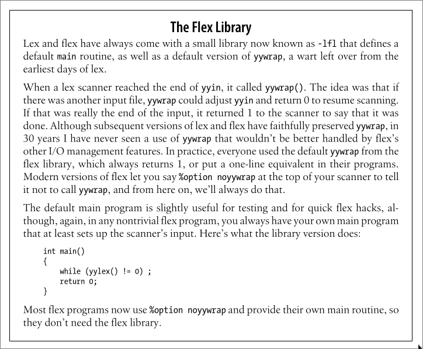

# 编译原理 1. 词法分析 - flex

## 一、概述

> flex 手册：[Lexical Analysis With Flex, for Flex 2.6.2: Top (westes.github.io)](http://westes.github.io/flex/manual/index.html)

**flex** 是一个用于生成基于 C/C++ 的词法分析器的程序。

它的输入是一个 `.flex` 文件，其中包含着一对对由 **正则表达式** 和 **C 语言代码** 组成的 **规则**。

它的输出是一个 C 语言源文件，其中会包含一个 `yylex()` 函数，该函数会对输入的字符序列进行扫描，根据 **规则** 中的一个个 **正则表达式** 进行匹配并执行其对应的 **C 语言代码**。

`.flex` 文件的结构大致如下：

```lex
definitions
%%
rules
%%
user code
```

其中：

- **definitions** 部分用来设置选项、做一些相关的定义
- **rules** 部分用来编写一条条 **规则**
- **user code** 部分用来编写一些 C 代码，会被直接复制到 `lex.yy.cc` 中。

下面是一个简单的例子：

```lex
%option noyywrap

DIGIT    [0-9]
%%
{DIGIT}             printf("Digit");
{DIGIT}+            printf("Integer");
{DIGIT}+"."{DIGIT}+ printf("Decimal");
%%
int main() {
    yylex();
}
```

- **definition** 部分：

  通过 `%option` 设定了选项 `noyywrap`，（具体含义先暂时忽略）

  定义了 `DIGIT` 为 `[0-9]`，此后可以通过 `{DIGIT}` 来使用，会被展开为 `([0-9])`

- **rules** 部分：

  定义了三条规则，分别匹配单个数字、整数和小数。

  如果有多个规则可以匹配，flex 会有限匹配最后一个规则。

  若规则成功匹配则执行其对应的 C 代码，若无规则成功匹配，则直接复制到输出。

  > 每条规则形如：`pattern action`
  >
  > 详细的有关 Pattern 的内容见 [Lexical Analysis With Flex, for Flex 2.6.2: Patterns (westes.github.io)](http://westes.github.io/flex/manual/Patterns.html#Patterns)
  >
  > 有一些特殊的 action，比如：`ECHO` 直接复制到输出，详细的有关 Action 的内容见 [Lexical Analysis With Flex, for Flex 2.6.2: Actions (westes.github.io)](http://westes.github.io/flex/manual/Actions.html#Actions)

- **user code** 部分：

  编写了主函数，简单地直接调用 `yylex()`

使用 flex 生成 `lex.yy.c` 并编译运行：

```terminal
PS F:\__Syncthing__\Notes\03 啃\CS143 斯坦福大学编译原理\playground> flex hello.flex
PS F:\__Syncthing__\Notes\03 啃\CS143 斯坦福大学编译原理\playground> g++ lex.yy.c
PS F:\__Syncthing__\Notes\03 啃\CS143 斯坦福大学编译原理\playground> ./a
asdasd 123 213 2.0 1
asdasd Integer Integer Decimal Digit
```

---

除了 `yylex()` 外，flex 还会生成很多其他的变量或函数，并会在进行词法分析的时候使用。

比如有一个关键的变量叫做 `yyin`，它的类型是 `FILE *`，它规定词法分析其从何处读入内容，若没有进行定义则会被设置为 `stdin` 也就是标准输入。

所以我们可以这样子来接受参数使其从一个文件读入：

```diff
%option noyywrap

DIGIT    [0-9]
%%
{DIGIT}             printf("Digit");
{DIGIT}+            printf("Integer");
{DIGIT}+"."{DIGIT}+ printf("Decimal");
%%
int main(int argc, char** argv) {
    if(argc > 1) {
        if(!(yyin = fopen(argv[1], "r"))) {
            perror(argv[1]);
            return (1);
        }
    }
    yylex();
}
```

> `perror()` 是 C 语言标准库 `<stdio.h>` 中的函数，用于向标准错误 stderr 输出描述性错误信息

---

> 有关 `noyywrap`：
>
> 
>
> 当 `yylex()` 被调用的时候，它会从全局输入文件 `yyin`（默认是 `stdin`）中扫描词法单元，直到触及 EOF 或者其中某一个 Action 执行了 `return`。当扫描器从 YY_INPUT 接收到了一个 EOF 指示，它就会调用 `yywrap()` 函数，如果它返回 false，则认为 `yyin` 已经被设置为另一个输入文件并继续扫描，如果返回 true，则会终止，并向调用者返回 0。
>
> 而 `yywrap()` 这个函数需要我们进行编写，如果我们不提供该函数的话在编译 `lex.yy.c` 时会提示 `undefined reference to 'yywrap'` 。
>
> 当然不设置这个选项也可以写一个最简单的 `yywrap()`（注意返回值规定是 `int` 型）：
>
> ```c
> int yywrap() { return true; }
> ```

## 二、正则表达式

之前讲到 **记号的类型（Token Class）**就是若干字符串组成的集合。而 **正则表达式（Regular Expression）**就是用于表达这些集合的工具。

具体内容见书（有空再整理

## 三、一些例子

...
