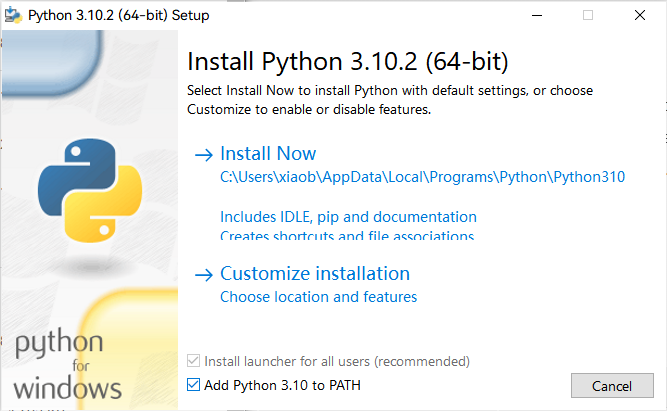
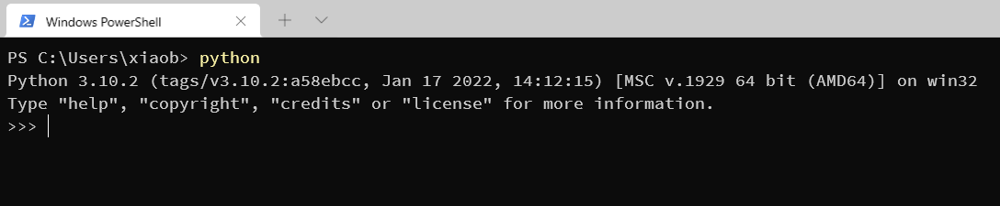
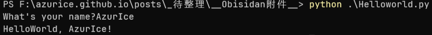

## 一、理解 Python

能被计算机识别的语言，是 1010的二进制码，所以任何编程语言最终都要转换为二进制码才能够被计算机执行。

这里就产生了两个概念，**编译型语言** 和 **解释型语言**：

- **编译型语言** 一次性地将代码全部翻译为二进制码，如 C/C++ 等。
- **解释型语言** 一边运行一边一句句地翻译。

Python 是一门解释型语言，正如 **编译型语言** 需要 **编译器程序** 来完成翻译的任务，**解释型语言** 则需要 **解释器程序** 来完成翻译的任务。

## 二、安装 Python解释器

Python官网：**[Welcome to Python.org](https://www.python.org/)**

有两个主要的版本，Python2 和 Python3 他们之间有一些较大的语法上的无法兼容的不同，我们安装Python3。

在Downloads - Windows中可以找到发布的不同版本，现在最新的版本是3.10.2：[Latest Python 3 Release - Python 3.10.2](https://www.python.org/downloads/release/python-3102/)，在Files中找到 Windows installer (64-bit) 下载并安装。



勾选上 **Add Python 3.10 to PATH** ，这会将Python所在的位置添加到环境变量的PATH中，然后一路下一步就好啦。

> 环境变量：当使用命令运行程序时会在当前目录以及环境变量中寻找。

然后打开 cmd 或 PowerShell 或使用 Windows Terminal，输入 `python`，应该会出现以下输出：



按 Ctrl + Z 再按回车来退出

## 三、写个 Helloworld 吧

找个地方，新建一个 `Helloworld.py`，输入以下内容：

```python
x = input("What's your name?")
print("HelloWorld, " + x + "!")
```

在文件所在位置打开命令行，输入 `python Helloworld.py` 即可使用解释器执行这个 `.py` 文件：



其中 `x` 是一个变量，`input()` 会以括号里的内容为提示（如果没有则没有提示）获取输入，`=` 会将右侧的值赋给左侧的变量，`print()` 会将括号中的内容打印出来，顺便加一个回车。

用 `""` 包裹的内容被称为一个字符串，`+` 可以将多个字符串拼接，当然也可以使用 `''` 来包裹字符串。

但是你会发现将第一行这样写会有问题，最左侧的 `'` 与 `What's` 中的 `'` 匹配了，我们可以在 `'` 前插入一个 `\` 来 ”转义“这个 `'`，告诉 python 这个 `'` 是个字符而不是用来包裹字符串的。

```python
# Error
x = input('What's your name?')
print("HelloWorld, " + x + "!")
```

```python
# Solved
x = input('What\'s your name?')
print("HelloWorld, " + x + "!")
```

一行中 `#` 后的内容不会被执行，它被称作 **注释**，用以在代码中做一些批注，方便人阅读。


> 自 python3.8 起，第二行也可以这么写，更加方便：
>
> ```python
> print(f"HelloWorld, {x}!")
> ```
>
> 在字符串前加一个f，字符串中以 `{}` 包括的内容则会被当作python语句处理，将得到的值转换为字符串放在对应位置。

---

你已经踏入 Python 的大门啦~