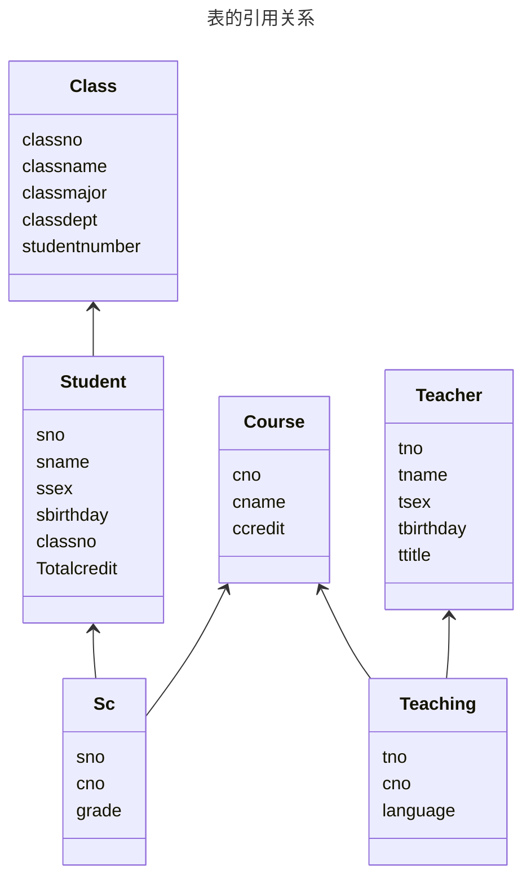

## 一、创建数据库和数据表

> md这呆B文档，字段类型不用标准类型，命名规范不统一，同样是 xno，有的用字符串有的用数字我服了。
>
> 有空我改一改改得统一一些。

利用 `CREATE` 命令 创建6张表（表结构如下）：

1. 学生基本信息表 student

| 字段名      | 字段类型   | 约束条件     | 字段含义说明   |
| ----------- | ---------- | ------------ | -------------- |
| sno         | varchar(8) | Primary key  | 学号           |
| sname       | varchar(8) | Not null     | 姓名           |
| ssex        | varchar(2) | '男' 或 '女' | 性别           |
| sbirthday   | date       |              | 出生日期       |
| classno     | varchar(6) | Foreign key  | 班级号         |
| totalcredit | smallint   | 初值为 0     | 已选修的总学分 |

2. 班级信息表 class

| 字段名        | 字段类型    | 约束条件    | 字段含义说明 |
| ------------- | ----------- | ----------- | ------------ |
| classno       | varchar(6)  | Primary key | 班级号       |
| classname     | varchar(20) | Not null    | 班级名称     |
| classmajor    | varchar(20) |             | 所属专业     |
| classdept     | varchar(20) |             | 所属系别     |
| studentnumber | smallint    | [20..40]    | 学生数       |

3. 课程信息表 course

| 字段名  | 字段类型    | 约束条件    | 字段含义说明 |
| ------- | ----------- | ----------- | ------------ |
| cno     | varchar(6)  | Primary key | 课程号       |
| cname   | varchar(30) | Not null    | 课程名称     |
| ccredit | smallint    | [1..4]      | 学分         |

4. 选修课程信息表 sc

| 字段名 | 字段类型   | 约束条件    | 字段含义说明 |
| ------ | ---------- | ----------- | ------------ |
| sno    | varchar(8) | Foreign key | 学号         |
| cno    | varchar(6) | Foreign key | 课程号       |
| grade  | integer    | [0..100]    | 成绩         |

5. 教师信息表 teacher

| 字段名    | 字段类型    | 约束条件     | 字段含义说明 |
| --------- | ----------- | ------------ | ------------ |
| tno       | integer     | Primary key  | 教师号       |
| tname     | varchar(8)  | Not null     | 教师姓名     |
| tsex      | varchar(2)  | '男' 或 '女' | 性别         |
| tbirthday | date        |              | 出生日期     |
| ttitle    | varchar(20) |              | 职称         |

6. 教师任课情况表 teaching

| 字段名   | 字段类型     | 约束条件                            | 字段含义说明 |
| -------- | ------------ | ----------------------------------- | ------------ |
| tno      | integer      | Foreign key                         | 教师号       |
| cno      | varchar(6)   | Foreign key                         | 课程号       |
| language | varchar(10） | 'Chinese' 或 'Bilingual' 或 English | 授课语言     |

---

可以得到表的引用关系，如下图：



按照顺序依次创建六张表：

```postgresql
CREATE TABLE class (
	classno          varchar(6)   PRIMARY KEY,
    classname        varchar(20)  NOT NULL,
    classmajor       varchar(20),
    classdept        varchar(20),
    studentnumber    smallint     CHECK (studentnumber BETWEEN 20 AND 40)
);
```

```postgresql
CREATE TABLE student (
	sno            varchar(8)  PRIMARY KEY,
    sname          varchar(8)  NOT NULL,
    ssex           varchar(2)  CHECK (ssex in ('男', '女')),
    sbirthday      date,
    classno        varchar(6)  REFERENCES class,
    totalcredit    smallint    DEFAULT 0
);
```

```postgresql
CREATE TABLE teacher (
	tno          varchar(6)    PRIMARY KEY,
    tname        varchar(8)    NOT NULL,
    tsex         varchar(2)    CHECK (tsex in ('男', '女')),
    tbirthday    date,
    ttitle       varchar(20)
);
```

```postgresql
CREATE TABLE course (
	cno        varchar(6)     PRIMARY KEY,
    cname      varchar(30)    NOT NULL,
    ccredit    smallint       CHECK (ccredit BETWEEN 1 AND 4)
);
```

```postgresql
CREATE TABLE sc (
	sno      varchar(8)    REFERENCES student,
    cno      varchar(6)    REFERENCES course,
    grade    integer       CHECK (grade BETWEEN 0 AND 100)
);
```

```postgresql
CREATE TABLE teaching (
	tno         varchar(6)     REFERENCES teacher,
    cno         varchar(6)     REFERENCES course,
    language    varchar(10)    CHECK (language in ('Chinese', 'Bilingual', 'English'))
);
```

## 二、利用 INSERT 命令向六张表中插入数据

1. class 表内容

   | classno | classname | classmajor | classdept | studentnumber |
   | ------- | --------- | ---------- | --------- | ------------- |
   | 'Rj0801'  | '软件 0801' | '软件工程'   | '软件开发'  | 24            |
   | 'Rj0802'  | '软件 0802' | '软件工程'   | '软件开发'  | 26            |
   | 'Rj0803'  | '软件 0803' | '软件工程'   | '数字媒体'  | 25            |
   | 'Rj0804'  | '软件 0804' | '软件工程'   | '软件开发'  | 25            |
   | 'Rj0805'  | '软件 0805' | '软件工程'   | '数字媒体'  | 24            |
   | 'Rj0806'  | '软件 0806' | '软件工程'   | '软件开发'  | 24            |

   ```postgresql
   INSERT INTO class (classno, classname, classmajor, classdept, studentnumber) VALUES
   	('Rj0801', '软件 0801', '软件工程', '软件开发', 24),
   	('Rj0802', '软件 0802', '软件工程', '软件开发', 26),
   	('Rj0803', '软件 0803', '软件工程', '数字媒体', 25),
   	('Rj0804', '软件 0804', '软件工程', '软件开发', 25),
   	('Rj0805', '软件 0805', '软件工程', '数字媒体', 24),
   	('Rj0806', '软件 0806', '软件工程', '软件开发', 24);
   ```

2. student 表内容

   | sno  | sname | ssex | sbirthday | classno |
   | ---- | ----- | ---- | --------- | ------- |
   |'08300010'| '李在'| '男'| '1991-10-1'| 'Rj0801'|
   |'08300012'| '葛畅'| '男'| '1990-8-8'| 'Rj0801'|
   |'08300015'| '刘晶'| '女'| '1990-5-22'| 'Rj0801'|
   |'08300020'| '杨敏'| '女'| '1989-1-8'| 'Rj0801'|
   |'08300030'| '胡贤斌'| '男'| '1990-10-8'| 'Rj0801'|
   |'08300048'| '赵鸿泽'| '男'| '1989-6-6'| 'Rj0802'|
   |'08300050'| '王威'| '男'| '1990-6-10'| 'Rj0802'|
   |'08300067'| '赵玮'| '女'| '1990-8-21'| 'Rj0803'|
   |'08300075'| '王娜娜'| '女'| '1991-9-23'| 'Rj0803'|
   |'08300088'| '秦键'| '男'| '1989-3-1'| 'Rj0803'|
   |'08300100'| '田邦仪'| '女'| '1990-2-26'| 'Rj0804'|
   |'08300148'| '赵心砚'| '男'| '1991-4-25'| 'Rj0805'|
   |'08300150'| '杨青'| '女'| '1989-11-15'| 'Rj0805'|
   |'08300160'| '杨玲玲'| '女'| '1990-12-12'| 'Rj0806'|

   ```postgresql
   INSERT INTO student (sno, sname, ssex, sbirthday, classno) VALUES
   	('08300010', '李在',   '男', '1991-10-1',  'Rj0801'),
   	('08300012', '葛畅',   '男', '1990-8-8',   'Rj0801'),
   	('08300015', '刘晶',   '女', '1990-5-22',  'Rj0801'),
   	('08300020', '杨敏',   '女', '1989-1-8',   'Rj0801'),
   	('08300030', '胡贤斌', '男', '1990-10-8',  'Rj0801'),
   	('08300048', '赵鸿泽', '男', '1989-6-6',   'Rj0802'),
   	('08300050', '王威',   '男', '1990-6-10',  'Rj0802'),
   	('08300067', '赵玮',   '女', '1990-8-21',  'Rj0803'),
   	('08300075', '王娜娜', '女', '1991-9-23',  'Rj0803'),
   	('08300088', '秦键',   '男', '1989-3-1',   'Rj0803'),
   	('08300100', '田邦仪', '女', '1990-2-26',  'Rj0804'),
   	('08300148', '赵心砚', '男', '1991-4-25',  'Rj0805'),
   	('08300150', '杨青',   '女', '1989-11-15', 'Rj0805'),
   	('08300160', '杨玲玲', '女', '1990-12-12', 'Rj0806');
   ```

3. course 表内容

   | cno      | cname            | ccredit |
   | -------- | ---------------- | ------- |
   | '800001' | '计算机基础'     | 4       |
   | '800002' | '程序设计语言'   | 4       |
   | '800003' | '数据结构'       | 4       |
   | '810011' | '数据库系统'     | 4       |
   | '810013' | '计算机网络'     | 3       |
   | '810015' | '微机原理与应用' | 4       |

   ```postgresql
   INSERT INTO course (cno, cname, ccredit) VALUES
       ('800001', '计算机基础',     4),
       ('800002', '程序设计语言',   4),
       ('800003', '数据结构',       4),
       ('810011', '数据库系统',     4),
       ('810013', '计算机网络',     3),
       ('810015', '微机原理与应用', 4);
   ```

4. sc 表内容

   | sno        | cno      | grade |
   | ---------- | -------- | ----- |
   | '08300012' | '800003' | 88    |
   | '08300015' | '800003' |       |
   | '08300020' | '800003' | 81    |
   | '08300030' | '800003' | 78    |
   | '08300048' | '800003' | 95    |
   | '08300100' | '810011' | 67    |
   | '08300148' | '810011' | 58    |
   | '08300150' | '810011' | 89    |
   | '08300160' | '810011' | 71    |

   ```postgresql
   INSERT INTO sc (sno, cno, grade) VALUES
      ('08300012', '800003', 88),
      ('08300015', '800003', NULL),
      ('08300020', '800003', 81),
      ('08300030', '800003', 78),
      ('08300048', '800003', 95),
      ('08300100', '810011', 67),
      ('08300148', '810011', 58),
      ('08300150', '810011', 89),
      ('08300160', '810011', 71);
   ```

5. teacher 表内容

   |tno|tname|tsex| tbirthday| ttitle|
   |-|-|-|-|-|
   |'000001'| '李英' | '女'| '1975-11-3'|'讲师'|
   |'000002'| '王大山'| '男'| '1969-3-2' |'副教授'|
   |'000003'| '张朋' | '男'| '1970-2-13'|'讲师'|
   |'000004'| '陈为军'| '男'| '1985-8-14'|'助教'|
   |'000005'| '宋浩然'| '男'| '1976-4-23'|'讲师'|
   |'000006'| '许红霞'| '女'| '1966-2-12'|'副教授'|
   |'000007'| '徐永军'| '男'| '1962-1-24'|'教授'|
   |'000008'| '李桂菁'| '女'| '1960-12-15| '教授'|
   |'000009'| '王一凡'| '女'| '1974-12-8'|'讲师'|
   |'000010'| '田峰' | '男'| '1988-1-18'|'助教'|

   ```postgresql
   INSERT INTO teacher(tno, tname, tsex, tbirthday, ttitle) VALUES
   	('000001', '李英', '女', '1975-11-3', '讲师'),
   	('000002', '王大山', '男', '1969-3-2', '副教授'),
   	('000003', '张朋', '男', '1970-2-13', '讲师'),
   	('000004', '陈为军', '男', '1985-8-14', '助教'),
   	('000005', '宋浩然', '男', '1976-4-23', '讲师'),
   	('000006', '许红霞', '女', '1966-2-12', '副教授'),
   	('000007', '徐永军', '男', '1962-1-24', '教授'),
   	('000008', '李桂菁', '女', '1960-12-15', '教授'),
   	('000009', '王一凡', '女', '1974-12-8', '讲师'),
   	('000010', '田峰', '男', '1988-1-18', '助教');
   ```


6. teaching 表内容

   |cno| tno| language|
   |-|-|-|
   |'800001'| '000001' | 'English' |
   |'800002'| '000002' | 'Chinese' |
   |'800003'| '000002' | 'Bilingual' |
   |'810011'| '000003' | 'Chinese' |
   |'810013'| '000004' | 'English' |
   |'800001'| '000005' | 'Chinese' |
   |'800002'| '000006' | 'Chinese' |
   |'800003'| '000007' | 'English' |
   |'810011'| '000007' | 'English' |
   |'810013'| '000008' | 'Bilingual' |
   
   ```postgresql
   INSERT INTO teaching (cno, tno, language) VALUES
   	('800001', '000001', 'English'),
   	('800002', '000002', 'Chinese'),
   	('800003', '000002', 'Bilingual'),
   	('810011', '000003', 'Chinese'),
   	('810013', '000004', 'English'),
   	('800001', '000005', 'Chinese'),
   	('800002', '000006', 'Chinese'),
   	('800003', '000007', 'English'),
   	('810011', '000007', 'English'),
   	('810013', '000008', 'Bilingual');
   ```

## 三、简单的数据操作 24 条

1. 查询所有同学的所有基本信息。

   ```postgresql
   SELECT * FROM student;
   ```

   查询结果：

   ```
      sno    | sname  | ssex | sbirthday  | classno | totalcredit
   ----------+--------+------+------------+---------+-------------
    08300010 | 李在   | 男   | 1991-10-01 | Rj0801  |           0
    08300012 | 葛畅   | 男   | 1990-08-08 | Rj0801  |           0
    08300015 | 刘晶   | 女   | 1990-05-22 | Rj0801  |           0
    08300020 | 杨敏   | 女   | 1989-01-08 | Rj0801  |           0
    08300030 | 胡贤斌 | 男   | 1990-10-08 | Rj0801  |           0
    08300048 | 赵鸿泽 | 男   | 1989-06-06 | Rj0802  |           0
    08300050 | 王威   | 男   | 1990-06-10 | Rj0802  |           0
    08300067 | 赵玮   | 女   | 1990-08-21 | Rj0803  |           0
    08300075 | 王娜娜 | 女   | 1991-09-23 | Rj0803  |           0
    08300088 | 秦键   | 男   | 1989-03-01 | Rj0803  |           0
    08300100 | 田邦仪 | 女   | 1990-02-26 | Rj0804  |           0
    08300148 | 赵心砚 | 男   | 1991-04-25 | Rj0805  |           0
    08300150 | 杨青   | 女   | 1989-11-15 | Rj0805  |           0
    08300160 | 杨玲玲 | 女   | 1990-12-12 | Rj0806  |           0
   (14 行记录)
   ```

2. 查询所有男同学的学号、姓名、出生日期

   ```postgresql
   SELECT (sno, sname, sbirthday) FROM student WHERE ssex LIKE '男';
   ```

   查询结果：

   ```
                row
   ------------------------------
    (08300010,李在,1991-10-01)
    (08300012,葛畅,1990-08-08)
    (08300030,胡贤斌,1990-10-08)
    (08300048,赵鸿泽,1989-06-06)
    (08300050,王威,1990-06-10)
    (08300088,秦键,1989-03-01)
    (08300148,赵心砚,1991-04-25)
   (7 行记录)
   ```

3. 在基本表 student 中增加 addr：varchar(20)列，然后将其长度由 20 改为 25

   ```postgresql
   ALTER TABLE student ADD COLUMN addr varchar(20);
   ```

   ```postgresql
   ALTER TABLE student ALTER COLUMN addr type varchar(25);
   ```

4. 在基本表 student 中增加 register_date：date 列，并为其设置默认值为当前系统时间，再删除该列

   ```postgresql
   ALTER TABLE student ADD COLUMN register_date date DEFAULT CURRENT_TIMESTAMP;
   ```

   ```postgresql
   ALTER TABLE student DROP COLUMN register_date;
   ```

5. 在基本表 student 中为 age: integer 列，增加默认值为 18

   ```postgresql
   ALTER TABLE student ADD COLUMN age integer DEFAULT 18;
   ```

6. 在基本表 <s>sc</s> student 中将 sname 设置为唯一值（unique）

   <s>你妈的 sc 表哪来的 sname</s>

   ```postgresql
   ALTER TABLE student ADD CONSTRAINT unique_sname UNIQUE (sname);
   ```

7. 基本表 <s>course</s> sc 中创建索引：（sno，cno DESC）

   <s>你妈的 course 表哪来的 sno</s>

   ```postgresql
   CREATE INDEX course_index ON sc (sno, cno DESC);
   ```

8. 在基本表 student 中增加约束条件：男生年龄小于 23 岁，女生年龄小于 21 岁。

   ```postgresql
   ALTER TABLE student ADD CONSTRAINT age_constraint CHECK(ssex LIKE '男' AND age < 23 OR ssex LIKE '女' AND age < 21 );
   ```

9. 创建视图 View_80，存放成绩高于 80 分的选课信息, 显示学号、课程号和成绩，使用 with check option 选项。

   ```postgresql
   CREATE VIEW View_80 AS SELECT sno, cno, grade FROM sc WHERE grade > 80 WITH CHECK OPTION;
   ```

10. 在视图 View_80 中查询成绩高于 90 的选课信息。

    ```postgresql
    SELECT * FROM View_80 WHERE grade > 90;
    ```

11. 在视图 View_80 中依次插入如下元组：

    08301168，810011，87（可插入成功）<font color="red">会违反外键约束，hai shi</font>

    08301167，810011，78（插入不成功）

    ```postgresql
    INSERT INTO View_80 VALUES ('08301168', '810011', 87);
    INSERT INTO View_80 VALUES ('08301167', '810011', 78);
    ```

12. 在视图 View_80 中依次修改如下元组：

    将（08301168，810011）所对应的成绩改为 90；（可修改成功）

    将（08301168，810011）所对应的成绩改为 70；（修改不成功）

    ```postgresql
    UPDATE View_80 SET grade=90 WHERE sno='08301168' AND cno='810011';
    UPDATE View_80 SET grade=70 WHERE sno='08301168' AND cno='810011';
    ```

13. 在视图 View_80 中删除如下元组：sno=08301168，cno=810011

    ```postgresql
    DELETE FROM View_80 WHERE sno='08301168' AND cno='810011';
    ```

14. 查询所有在“1980-01-01”之前出生的女同学的学号、姓名、性别、出生日期

    

15. 查询所有姓“李”的男同学的学号、姓名、性别、出生日期

16. 查询所有用英文授课的教师号、姓名及英语授课的门数

17. 查询所有职称不是“讲师”的教师号、姓名、职称

18. 查询虽然选修了课程，但未参加考试的所有同学的学号

19. 查询所有考试不及格的同学的学号、成绩，并按成绩降序排列

20. 查询在 1970 年出生的教师号、姓名、出生日期

21. 查询各个课程号的选课人数

22. 查询讲授 2 门课以上的教师号

23. 查询选修了 800001 课程的学生平均分数、最低分数和最高分数

24. 查询 1960 年以后出生的，职称为讲师的教师的姓名、出生日期，并按出生日期升序排列。

## 四、复杂数据查询 30条

## 五、用数据操作语言 DML 完成对表的更新操作 7条

## 六、存储过程 6条

1. 创 建 一 个 能 向 学 生 表 student 中 插 入 一 条 记 录 的 存 储 过 程 insert_student，该过程需要 5 个参数，分别用来传递学号、姓名、性
   别、出生日期、班级号。
   写出调用存储过程 insert_student 的 SQL 语句，向数据表 student 中插
   入一个新同学，并提供相应的实参值。

   ```postgresql
   CREATE OR REPLACE PROCEDURE insert_student(sno text, sname text, ssex text, sbirthday date, classno text) AS
   $$
   BEGIN
   	INSERT INTO student(sno, sname, ssex, sbirthday, classno) VALUES (sno, sname, ssex, sbirthday, classno);
   END;
   $$
   LANGUAGE plpgsql;
   ```

   ```postgresql
   CALL insert_student('123123', 'sb', '男', '2023-05-30', 'Rj0801');
   ```

2. 创 建 一 个 向 课 程 表 course 中 插 入 一 门 新 课 程 的 存 储 过 程
   insert_course，该存储过程需要三个参数，分别用来传递课程号、课程名、学分，但允许参数“学分”的默认值为 4，即当调用存储过程 insert_course 时，未给第三个参数“学分”提供实参值时，存储过程将按默认值 4 进行运算。调用存储过程 insert_course，向课程表 course 中插入一门新课程。分两种情况（给出第三个参数和未给出第三个参数）写出相应的 SQL 命令，并比较结果。

   ```postgresql
   CREATE OR REPLACE PROCEDURE insert_course(cno text, cname text, ccredit smallint DEFAULT 4) AS
   $$
   BEGIN
   	INSERT INTO course(cno, cname, ccredit) VALUES (cno, cname, ccredit);
   END;
   $$
   LANGUAGE plpgsql;
   ```

   ```postgresql
   CALL insert_course('321', '123', cast(3 as smallint));
   ```

3. 创建一个名称为 query_student 的存储过程，该存储过程的功能是从
   数据表 student 中根据学号查询某一同学的姓名、性别、出生日期、班级号。
   调用存储过程 query_student，查询学号为“08301050”的姓名、性别、
   出生日期、班级号，并写出完成此功能的 SQL 命令。

   ```postgresql
   CREATE OR REPLACE PROCEDURE query_student(qsno text) AS
   $$
   DECLARE
   	_sname text;
   	_ssex text;
   	_sbirthday date;
   	_classno text;
   BEGIN
   	SELECT sname, ssex, sbirthday, classno INTO _sname, _ssex, _sbirthday, _classno FROM student WHERE sno=qsno;
   	RAISE NOTICE 'sname: %, ssex: %, sbirthday: %, classno: %', _sname, _ssex, _sbirthday, _classno;
   END;
   $$
   LANGUAGE plpgsql;
   ```

   ```postgresql
   CALL query_student('08300010');
   ```

4. 建立存储过程，输出平均成绩大于 80 分的学生的姓名、性别、年龄和平均成绩。调用该存储过程，并输出相应的结果。

   ```postgresql
   CREATE OR REPLACE PROCEDURE proc4() AS
   $$
   DECLARE
   	curs CURSOR FOR SELECT sname, ssex, age, avg(grade) AS avg_grade FROM (student NATURAL JOIN sc) GROUP BY sname, ssex, age HAVING avg(grade) > 80;
   BEGIN
   	FOR record IN curs LOOP
       	RAISE NOTICE 'sname: %, ssex: %, age: %, avg_grade: %', record.sname, record.ssex, record.age, record.avg_grade;
   	END LOOP;
   END;
   $$
   LANGUAGE plpgsql;
   ```

5. 写存储过程显示所有选择了给定学生姓名选择的全部课程的学生的学号、姓名、选课数、平均成绩、总学分

   ```postgresql
   CREATE OR REPLACE PROCEDURE proc5(qsname text) AS
   $$
   BEGIN
   	SELECT sno, sname, count(cno), avg(grade), totalcredit
   	FROM student NATURAL JOIN sc GROUP BY sno, sname
   	WHERE exists SELECT * FROM;
   END;
   $$
   LANGUAGE plpgssql;
   ```


## 七、触发器 8条

1. 创建一个当向学生表 student 中插入一新同学时能自动列出全部同学信
   息的触发器 display_trigger。
   执行存储过程 insert_student，向学生表中插入一个新同学，看触发器
   display_trigger 是否被触发。

   ```postgresql
   CREATE OR REPLACE FUNCTION display_student() RETURNS trigger AS
   $$
   DECLARE
   	curs CURSOR FOR SELECT * FROM student;
   BEGIN
   	FOR record IN curs LOOP
   		RAISE NOTICE '%', record;
   	END LOOP;
   	RETURN NULL;
   END;
   $$
   LANGUAGE plpgsql;
   ```

   ```postgresql
   CREATE TRIGGER display_trigger AFTER INSERT
   	ON student
   	EXECUTE FUNCTION display_student();
   ```

   ```postgresql
   CALL insert_student('123', '23232', '女', '1000-01-02', 'Rj0801');
   ```

2. 创建一个触发器，当向学生表 student 中插入一新同学时能自动更新（增
   加 1）class 班级表中该生所在班级的总人数。

   ```postgresql
   CREATE OR REPLACE FUNCTION update_class_student_cnt() RETURNS trigger AS
   $$
   DECLARE
   	cnt integer;
   BEGIN
   	-- RAISE NOTICE '%', NEW;
   	SELECT count(*) FROM student INTO cnt WHERE classno = NEW.classno;
   	RAISE NOTICE '%', cnt;
   	UPDATE class SET studentnumber = cnt WHERE classno = NEW.classno;
   	RETURN NULL;
   END;
   $$
   LANGUAGE plpgsql;
   ```

   <font color="red">不对，nmd 是增加一，不是根据 student 表更新</font>

   ```postgresql
   CREATE OR REPLACE FUNCTION update_class_student_cnt() RETURNS trigger AS
   $$
   DECLARE
   	cnt integer;
   BEGIN
   	-- RAISE NOTICE '%', NEW;
   	-- SELECT count(*) FROM student INTO cnt WHERE classno = NEW.classno;
   	-- RAISE NOTICE '%', cnt;
   	UPDATE class SET studentnumber = studentnumber + 1 WHERE classno = NEW.classno;
   	RETURN NULL;
   END;
   $$
   LANGUAGE plpgsql;
   ```

   

   ```postgresql
   CREATE TRIGGER update_class_student_cnt_trigger AFTER INSERT
   	ON student FOR EACH ROW
   	EXECUTE FUNCTION update_class_student_cnt();
   ```

3. 略

4. 略

5. 略

6. 写一个触发器阻止将学生成绩降低

   RAISE EXCEPTION 'xxx' 即可

   来自 New Bing：

   ```postgresql
   -- 创建触发器函数
   CREATE OR REPLACE FUNCTION check_update_trigger_func() RETURNS TRIGGER AS $$
   BEGIN
     -- 假设 score 表有 id 和 grade 两个字段
     IF NEW.grade < OLD.grade THEN
       RAISE EXCEPTION 'Cannot decrease the grade';
     END IF;
     RETURN NEW;
   END;
   $$ LANGUAGE plpgsql;
   
   -- 创建触发器
   CREATE TRIGGER check_update_trigger BEFORE UPDATE ON score FOR EACH ROW EXECUTE PROCEDURE check_update_trigger_func();
   ```

   
