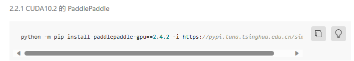

# 配置 paddlepaddle-gpu

> [Windows 下的 PIP 安装-使用文档-PaddlePaddle深度学习平台](https://www.paddlepaddle.org.cn/documentation/docs/zh/install/pip/windows-pip.html#shouxianqingninxuanzenindebanben)
>
> [Windows 下的 Conda 安装-使用文档-PaddlePaddle深度学习平台](https://www.paddlepaddle.org.cn/documentation/docs/zh/install/conda/windows-conda.html#gpu-paddlepaddle)

目前 paddlepaddle-gpu 只支持到 python3.10，如果使用 python3.11，pip 会无法匹配到包。

此处（[附录-使用文档-PaddlePaddle深度学习平台](https://www.paddlepaddle.org.cn/documentation/docs/zh/install/Tables.html#nvidia-gpu)）有GPU 及其对应架构和推荐 CUDA 版本的列表，按照对应版本安装对应的 paddlepaddle-gpu。


比如我笔记本的 GTX1660Ti 是 Turing 架构，可以使用 CUDA10 和 CUDA11，不过 paddlepaddle 推荐对于安培以前的架构使用 CUDA10.2，性能会更优，因此选择

「CUDA 工具包 10.2 配合 cuDNN v7.6.5」

首先安装对应的 paddlepaddle-gpu包：



```terminal
python -m pip install paddlepaddle-gpu==2.4.2 -i https://pypi.tuna.tsinghua.edu.cn/simple
```

然后安装 CUDA 和 cuDNN


[CUDA Installation Guide for Microsoft Windows (nvidia.com)](https://docs.nvidia.com/cuda/cuda-installation-guide-microsoft-windows/index.html)

[CUDA Toolkit 12.1 Update 1 Downloads | NVIDIA Developer](https://developer.nvidia.com/cuda-downloads)

> 这个网站下方 Archive of Previous CUDA Release 中有以前的版本

[Installation Guide - NVIDIA Docs](https://docs.nvidia.com/deeplearning/cudnn/install-guide/index.html#install-windows)

[cuDNN Download | NVIDIA Developer](https://developer.nvidia.com/rdp/cudnn-download)

> 一切同理

跟着文档走，下载 Zlib 配置环境变量添加 `zlibwapi.dll` 所在路径到 `PATH`，

然后下载 cuDNN 解压并复制内容到 CUDA 安装路径下。

然后理论上就O
