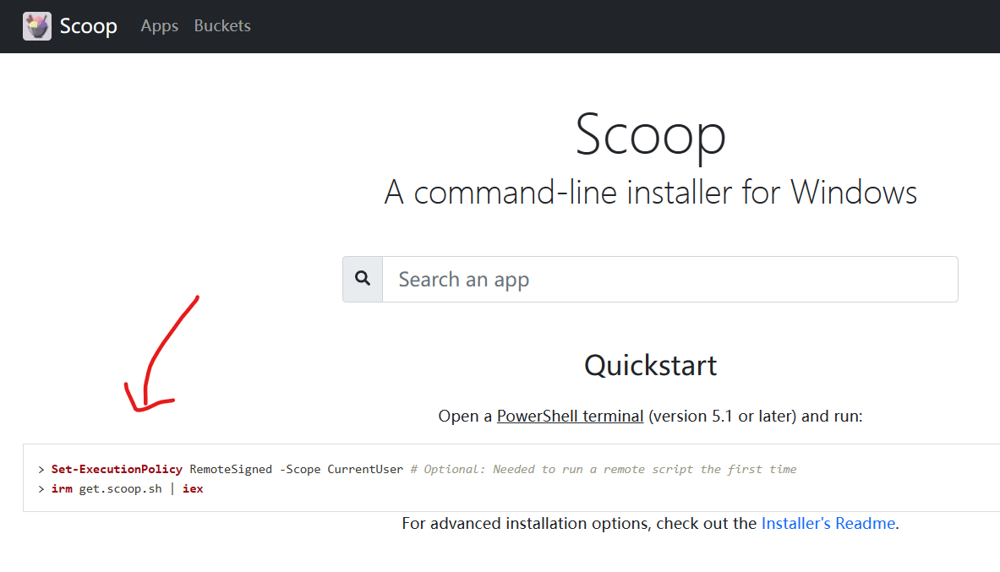
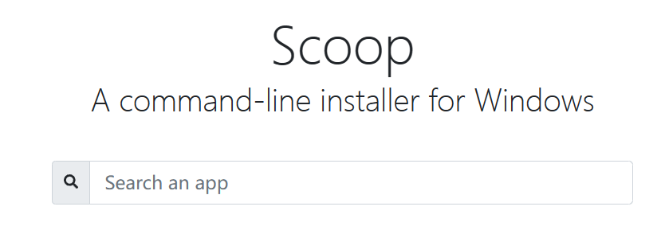
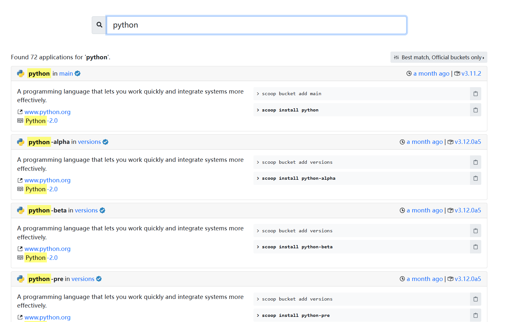
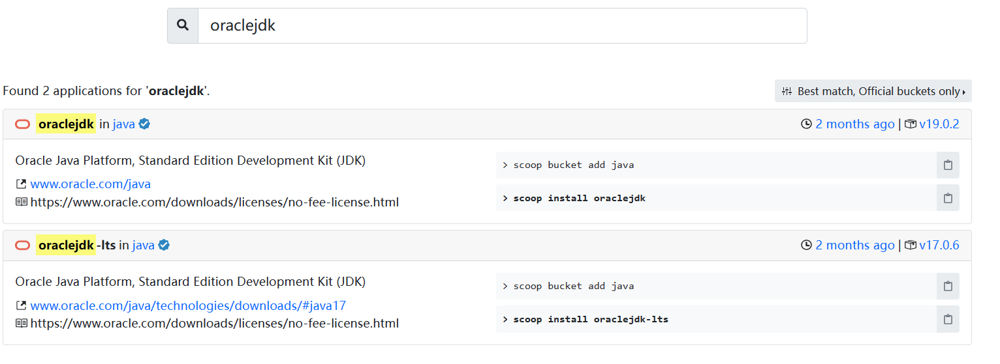
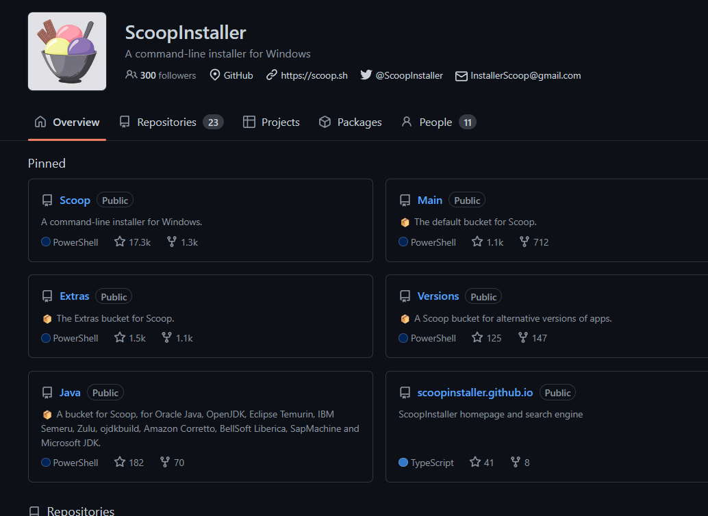

写这篇文章的起因是一位舍友问我怎么配置 Python 环境，我想了想虽然普通的方式也不算复杂环境变量会被安装器自己加上，但是想了想曾经他们配置 Java 环境时的费劲程度，我想起了假期遇见的能让人从这一系列繁琐配置过程中解脱出来的软件 —— Scoop。所以这篇文章将以安装 Python 为引，介绍一下 Scoop 的基本使用。

## 一、什么是 Scoop

> 官网：[Scoop](https://scoop.sh/)
>
> Github：[ScoopInstaller/Scoop: A command-line installer for Windows. (github.com)](https://github.com/ScoopInstaller/Scoop)

它可以被看作是 Windows 下的 **包管理器**，而 **包管理器** 一般是 Linux 系统中的概念。在 Linux 的各种发行版中通常都会包括一个特殊的软件（包管理器），使得可以通过这个软件方便的管理所有其他的包（软件、字体等等）。

下面为了直观感受，举几个例子，在 Ubuntu 下使用 apt-get：

```
apt-get install python
```

在 Archlinux 下使用 Pacman：

```shel
pacman -S python
```

诸如此类。

而说 Scoop 是 Windows 下的包管理器也就不难理解了，其实就像官网的副标题一样，它是一个「用于 Windows 的命令行安装程序」。它会将 GUI 式的安装引导、权限请求窗口隐藏起来，自动安装依赖，同时能够避免 PATH 环境变量污染以及由于安装与卸载导致的意外的副作用。

它的工作方式就是将安装源文件内的所有文件按照仓库中的指定方式配置到你的系统中，默认它会将应用安装到 `~/scoop/`（即 `C:\Users\<YOURUSERNAME>\scoop`）

## 二、安装 Scoop

要学会看官网、看 Github 的 README：




总而言之就是在 PowerShell 中运行下面一行简单的命令：

```powershell
iwr -useb get.scoop.sh | iex
```

如果你获得了一坨报错，那是因为 Windows 默认不允许运行远程的未签名的脚本，需要在 设置>隐私和安全性>开发者选项>PowerShell 中将「更改运行策略，以允许……」选项打开。

如果还报错，就是网络问题，毕竟 Github 在国外（），要么多试几次没准玄学就出来了，要么相信你也会科学上网。

## 三、基本使用

### 1. 基础的使用

安装完毕后回到正题，怎么安装 Python？很简单，一行命令：

```powershell
scoop install python
```

结束。

如果你想更新：

```powershell
scoop update python
```

或者使用 `scoop update *` 来更新所有使用 Scoop 管理的软件

如果你想卸载：

```powershell
scoop uninstall python
```

如果你想查看 Scoop 都安装了什么软件：

```powershell
scoop list
```

---

我怎么知道我可以用 Scoop 安装什么软件呢？可以到官网（[Scoop](https://scoop.sh/)）去查：



在这里搜软件的名字。

比如可以查到刚才安装的 Python：



比如我们还想安装 jdk，就搜 jdk。

不过你会发现它有很多很多 jdk，有 `corretto-jdk` 有 `liberica-jdk` 甚至还有 `microsoft-jdk` 等等，而我们以前从官网下载的就是 `oraclejdk`。他们都是遵循着 Java 的规范做的不同实现，在性能以及选项上会有一定的差异，而且他们的开闭源性也不同，开源的协议也不同。

这里搜索 `oraclejdk` 为例：



这里又会发现，名字后面的 `in xxx` 和刚才有区别，刚才是 `python in main`，现在是 `oraclejdk in java`，这里就引入 Scoop 中 Bucket 的概念。

### 2. Bucket

Scoop 将各种软件分门别类的放在了不同的仓库中，每一个仓库就是一个 Bucket。你可以在 ScoopInstaller 的 Github 中看到每个 Buckets 的仓库：



当然在官网你还可以方便地找到一些非官方的 Buckets。


Scoop 默认是只包含 main Bucket 中的内容的，要想使用其他 Bucket 需要将其他的 Bucket 添加进来：

```powershell
scoop bucket add java
```

如果你没有安装过 git 他会提示你需要 git，而 git 其实在 main Bucket 中，那你也可以直接使用 Scoop 安装 git：

```powershell
scoop install git
```

然后再添加 Bucket。

添加过后就可以安装 `oraclejdk` 了：

```powershell
scoop install oraclejdk
```

## 三、装到哪去了？它是怎么搞定环境变量的？
