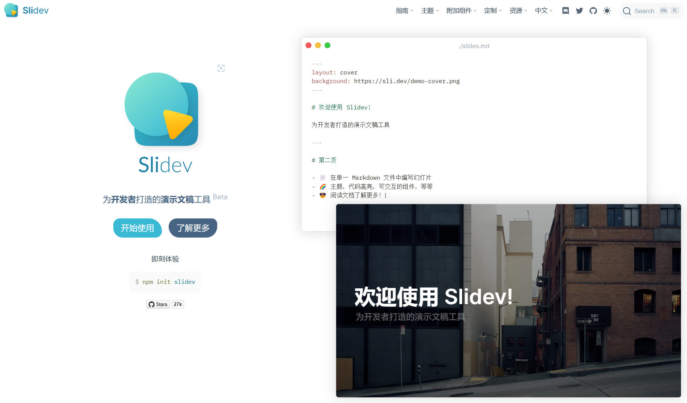

## 一、概述

Slidev 是一款基于 Web 的幻灯片制作和演示工具。它旨在让开发者专注在 Markdown 中编写内容，同时拥有支持 HTML 和 Vue 组件的能力，并且能够呈现像素级完美的布局，还在你的演讲稿中内置了互动的演示样例。

它使用了功能丰富的 markdown 文件来生成精美的幻灯片，具有即时重载的体验。它还拥有很多内置的集成功能，如实时编码、导出 PDF、演讲录制等。由于 Slidev 是由 web 驱动的，因此你可以使用它进行任何操作 —— 具有无限的可能性。

详细可以逛一逛官网的文档。

## 二、创建项目

```shell
pnpm create slidev
```

> 使用任何一个 nodejs 包管理器都可以，这里我选择 `pnpm`

