# Object Detection in 20 Years: A Survey[^1]

**VOC07**：[The PASCAL Visual Object Classes Challenge 2007](http://host.robots.ox.ac.uk/pascal/VOC/voc2007/)

## 一、目标检测数据集 & 指标

### 1. 数据集

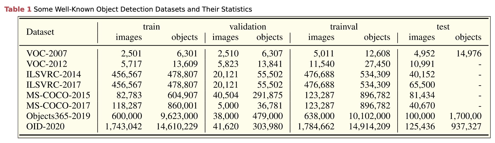

- **Pascal VOC**（2005～2012）：The PASCAL Visual Object Classes（VOCs）

    早期计算机视觉社区中最重要的比赛之一，有两个广泛使用的版本：

    - VOC07（2007）：5k 训练图像 + 12k 标注的目标
    - VOC12（2012）：11k 训练图像 + 27k 标注的目标

    有 20 类生活中常见的的目标（如：人，猫，自行车，沙发......）

- **ILSVRC**（2010～2017）：The ImageNet Large Scale Visual Recognition Challenge

    包含 200 类目标，图像、目标的实例数量比 VOC 大两个数量级。

- **MS-COCO**（2015～）：Microsoft Common Object in Context（[COCO - Common Objects in Context](https://cocodataset.org/#home)）

    类标比 ILSVRC 少，但目标实例多。

    - MS-COCO-17：164k 图像 + 897k 标注的目标，80 个类别

    Compared with VOC and ILSVRC, the biggest progress of MS-COCO is that apart from the bounding box annotations; each object is further labeled using per-instance segmentation to aid in precise localization.

    包含更多小目标（目标区域小于图像的 1%）以及密集目标

- **OpenImages（OID）**（2018）：Open Image Detection challenge

    有两类任务：

    - 标准目标检测：1910k 图像 + 15440k 标注的目标，600 个类别
    - 视觉关系检测，检测在某种关系下的成对目标

### 2. 指标

早期时并无被广泛接受的指标。

如 miss rate versus false positives per window（FPPW），对于每个窗口的测量可能存在缺陷，并不能反映对整张图片的性能。

2009，Caltech pedestrain detection benchmark 被提出，FPPW 被 flase positives per-image（FPPI）取代。

近年来，最常用的是 average precision（AP），最初于 VOC2007 被引入。

AP 定义为不同召回率下的平均检测精度，通常以类别为单位进行评估。通常以所有类别的平均 mAP 作为最终的性能指标。

目标位置的准确度由 intersection over union（IoU）衡量，大于某一值为 Detected，否则为 Missed。

2014，MS-COCO 数据集引入，目标位置的准确度受到了更多的关注，MS-COCO AP 由 0.5 到 0.95 之间不同 IoU 阈值平均得到。

## 二、基于深度学习的目标检测

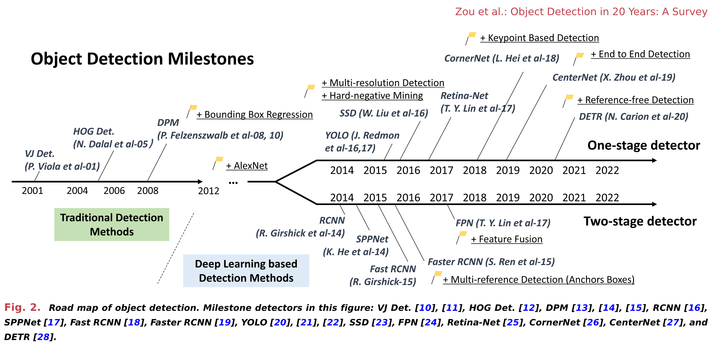

传统目标检测基于人工设计、提取的特征，缺乏有效的图像表示，人工设计特征的性能逐渐饱和，目标检测的发展与 2010～2012 进入瓶颈期。

2012 见证了卷积神经网络的重生：AlexNet[^2]，它证明了深度卷积网络可以学习具有鲁棒性且高层次的图像特征表示。

### 1. 基于 CNN 的 Two-Stage 检测器[^3-9]

#### 2014 | R-CNN[^3]

2014 年 Girshick 提出 Regions with CNN features（RCNNs），打破了僵局。

**过程**：

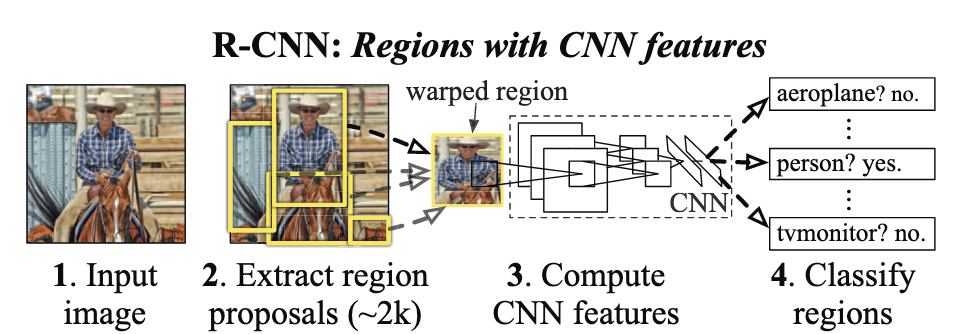

1. 首先通过 Selective Search[^4] 生成与分类无关的 Proposals（大致 2000 个）。

    > Selective Search：
    >
    > 1. 首先用 Efficient Graph-Based Image Segmentation[^5] 得到初始的图像分割区域。
    >
    > 2. 然后使用贪心算法迭代式地对分区进行合并（在这个过程中也就捕捉了所有尺度的目标）
    >
    >     1. 计算相邻区域的相似度，然后合并两个最相似的区域，并加入 Proposal 列表。
    >
    >     2. 对合并后的区域的相邻区域计算新的相似度......
    >
    >     3. 重复 1～2 直至整张图片被合并为一个区域
    >
    >     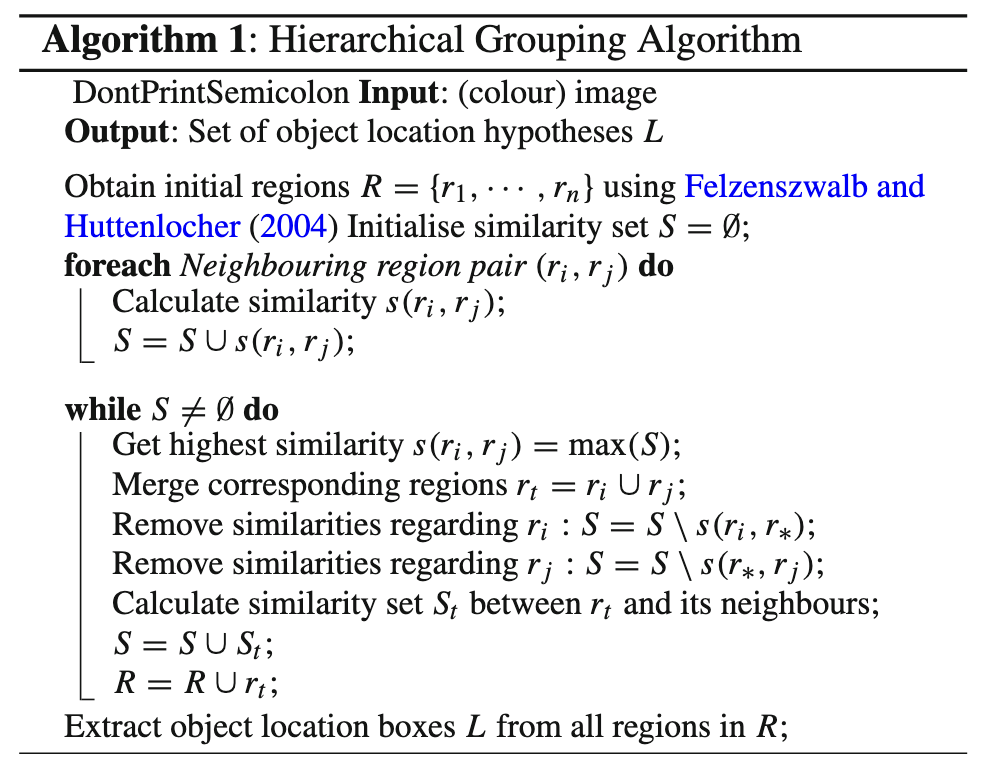

2. 将这些区域通过 仿射变形 变换为固定大小的图片，并输入到使用 ImageNet 预训练的 CNN 模型中（比如 AlexNet），从而提取出固定长度（4096）的特征向量。

3. 在每个区域中使用线性 SVM 分类器来得到目标分类

在 VOC07 上有显著的性能提升：

- mean Average Precision：从 DPM-v5 的 33.7% 提升到了 58.5%

**训练**：

有监督预训练：用 ILDSVRC 2012 对 CNN 进行图像级的训练（无边界框）

特定域微调：在预训练模型基础上，用处理后的 VOC 图像以及随机梯度下降进行微调

**缺点**：

在大量重叠的区域中进行的冗余的特征计算导致检测速度的降低（后续被 SPPNet 解决）

#### 2014 | SPPNet[^6]

2014 年 He 等人提出空间金字塔池化网络（SPPNet）

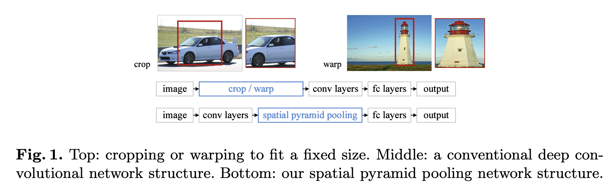

之前的 CNN 模型要求一个固定大小的输入（比如 AlexNet 是 224 x 224），而实现方式往往是切割或变形，而 SPP 可以使得 CNN 可以在不缩放 图像/ROI 的条件下生成一个固定大小的表示。

使用 SPP 时，特征图可以仅从整张图片计算一次。

比 R-CNN 快 20 倍，VOC07 mAP = 59.2%。

**缺点**：

训练仍旧是多级的，PPNet only fine-tunes its fully connected layers while simply ignoring all previous layers.

#### 2015 ｜ Fast R-CNN[^7]

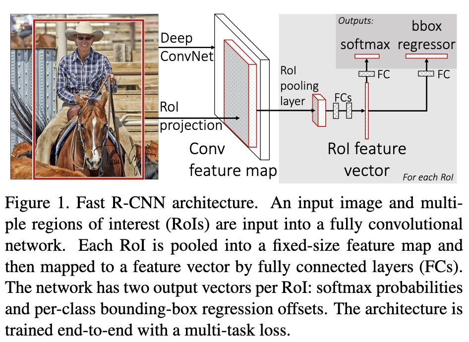

2015：Girshick 提出 Fast R-CNN

> https://github.com/rbgirshick/fast-rcnn

可以在同一个网络配置下同时训练检测器和边界框回归器

Fast R-CNN 接受整个图像以及一系列 Proposals 作为输入：

1. 网络首先用一系列卷积层和池化层来产生一个卷积特征图
2. 然后对于每一个 Proposal，RoI 池化层从特征图中提取一个固定大小的特征向量
3. 将这个特征向量输入一系列全连接层，最终在两个分支分别得到：
    - Softmax 分类可能性（分类）
    - 四个实数数字作为边界框（位置）

VOC07 mAP = 70%

**缺点**：

检测速度依旧受到候选框的检测速度限制

#### 2015 | Faster R-CNN[^8]

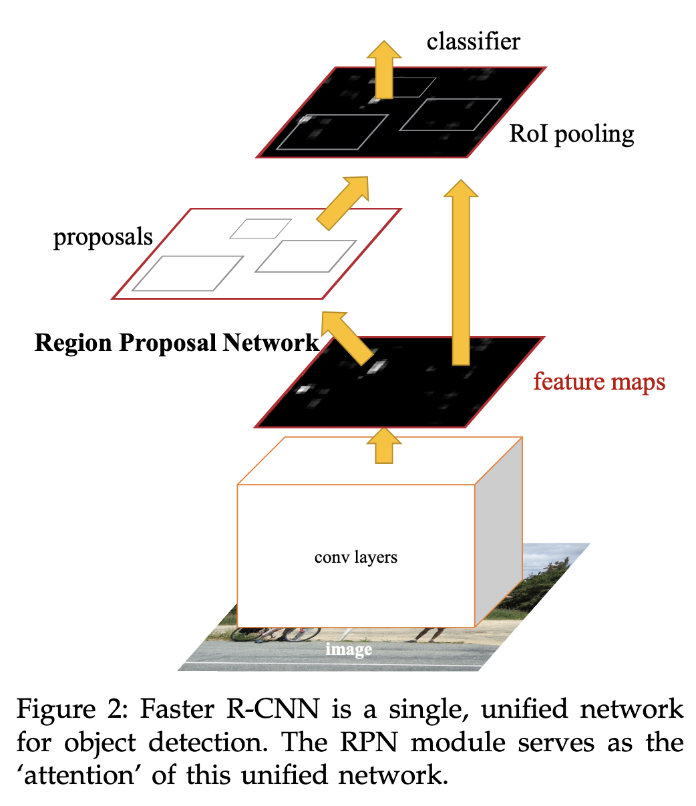

2015 年 Ren 等人提出 Faster RCNN。

第一个接近实时的深度学习检测器（COCO mAP@.5 = 42.7%, VOC07 mAP = 73.2%, 17 fps with ZF-Net）

引入了 Region Proposal Network（RPN），与目标检测网络共享卷积层，使得几乎无消耗的 Region Proposal 成为可能。

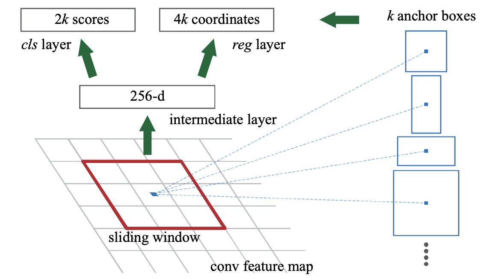

在每一个滑动窗口的位置，用不同的 Anchor 同时预测多个 Proposals：

Anchor 是一个特定大小、长宽比的窗口，被置于滑动窗口中间。每一个 Anchor 会得到两个表示是目标/不是目标的可能性的数，以及四个表示边界框坐标的数。

**缺点**：

仍旧存在冗余计算（subsequent detection stage）

#### 2017 | FPN[^9]

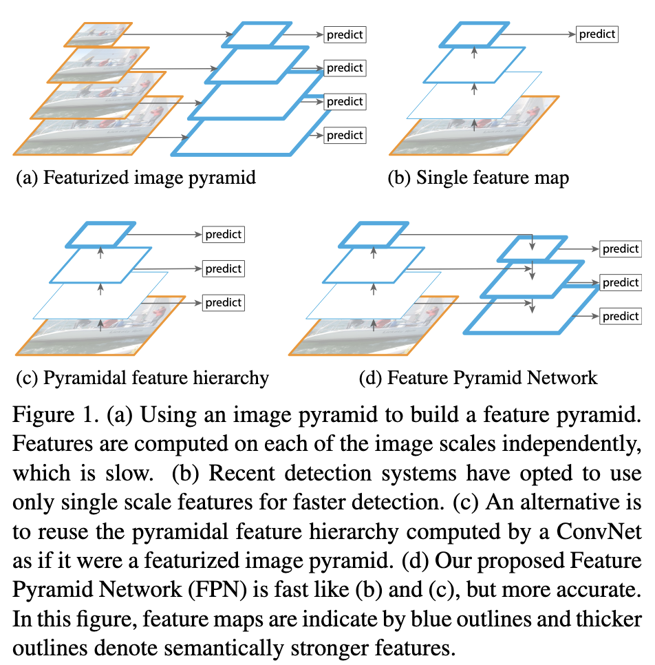

2017 年 Lin 等人提出 Feature Pyramid Networks（FPNs）

在 FPN 之前，大部分基于深度学习的检测器只在神经网络顶层的特征图上进行检测，即便神经网络深层的特征有利于目标分类，但是不利于目标定位。

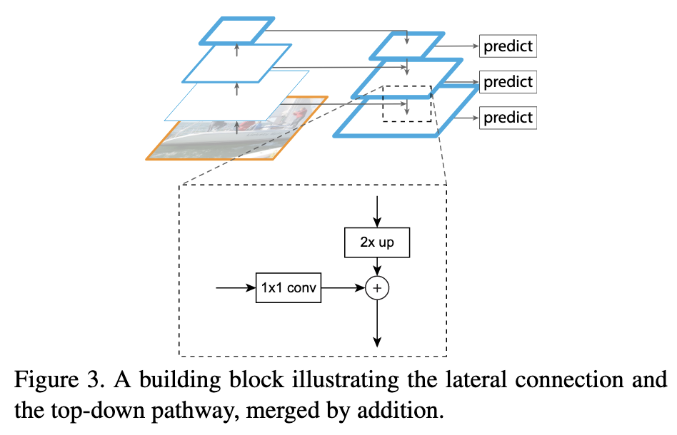

COCO mAP@.5 = 59.1%

### 2. 基于 CNN 的 One-Stage 检测器[^10-16]

大部分 Two-Stage 检测器遵循一种「由粗至细」的处理范式。

- 粗：关注提高召回率
- 细：在粗检测的基础上细化定位，关注判别能力

他们无需花哨手段就可以达到高 Precision，然而由于其速度较慢，且复杂性较高，很少应用于工程。

与之对比，One-Stage 检测器可以一步获取到所有目标，更可能应用于移动设备（实时、易部署）

然而在检测密、小目标时性能会受到显著影响。

#### 2015 | YOLO[^10]

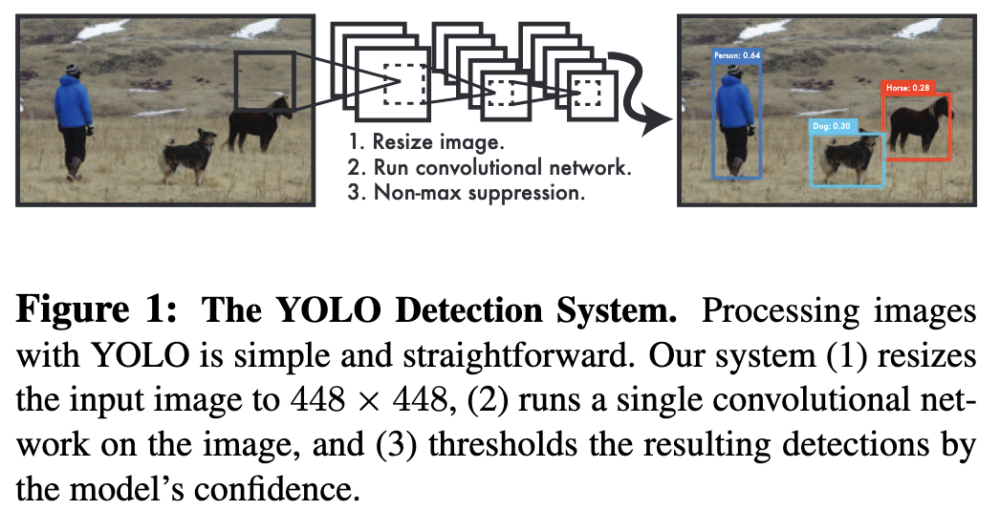

2015 年 Joseph 等人提出 You Only Look Once（YOLO），深度学习阶段的第一个 One-Stage 检测器。

速度极快（155 fps with VOC07 mAP = 52.7%），使用一个神经网络来处理整张图片，将图片分割为区域并同时预测边界框和其概率。

虽然检测速度快，但位置 Accuracy 与 Two-Stage 检测器相比有降低（尤其对于小目标）

**思路**：

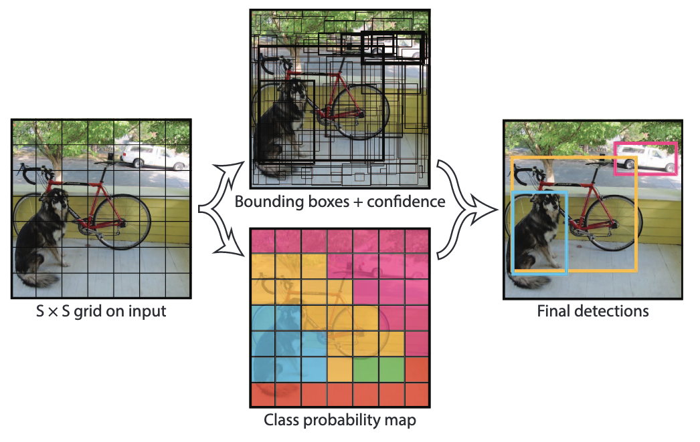

将整张图像分割为 $S \times S$ 的网格，对于每一个格子：

1. 预测 $B$ 个边界框及其置信度 $\Pr(Object) \times IOU^{truth}_{pred}$​

    每个边界框包含五个预测值：$x, y, w, h, confidence$​

    $x, y$ 表示边界框的中心与格子的相对值

2. 预测 $C$ 个类别可能性值 $\Pr(Class_i|Object)$

最终把它们乘起来即 $\Pr(Class_i) \times IOU_{pred}^{truth}$

**缺点**：

难以检测 小目标 和 密集目标（因为网格中每一个格子只能有一个类别，且只能有两个候选框）

#### 2015 | SSD[^11]

> https://github.com/lufficc/SSD
>
> COCO mAP@.5 = 46.5%, a fast version runs at 59 fps

2015 年 Liu 等人提出 Single-Shot Multibox Detector（SSD）

**主要贡献**：引入了 multireference and multiresolution detection techniques，显著提高了检测 One-Stage 检测器的 Accuracy。

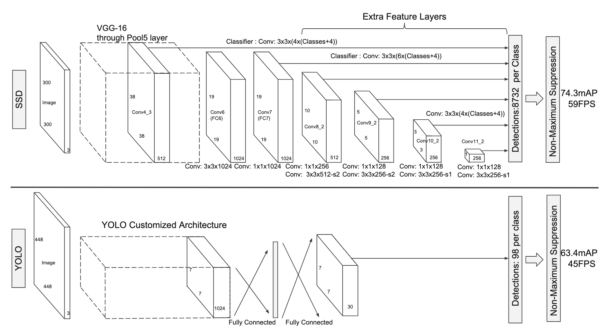

在网络的不同层检测不同尺寸的目标，而之前的检测器只在顶层检测。

与 YOLO 相比，在基础的网络后添加了多层特征层，用于预测不同大小和长宽比的候选框及置信度，且输入图像更小。

对于一个 $m \times n$ 的特征层，用于预测的基本元素为一个 $3 \times 3$ 的卷积核，产生一个分类的分数，或是一个到“default box”坐标偏移（default box 类似 R-CNN 中的 Anchor）

#### 2017 | RetinaNet[^12]

> https://github.com/facebookresearch/Detectron
>
> COCO mAP@.5 = 59.1%

One-Stage 检测器的准确度落后于 Two-Stage 检测器的原因是密集检测器训练过程中前景-背景类别的极端不平衡。提出了一个新的损失函数「focal loss」，替代了交叉熵，使得难以分类的样本会得到更多的关注。也改善了小目标的检测准确率

#### CornerNet[^13]

> COCO mAP@.5 = 57.8%

使用一个卷积网络将候选框作为一个点对（左上角和右下角）来预测。

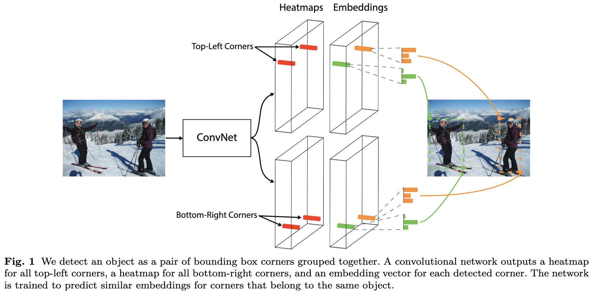

#### 2019 | CenterNet[^14]

> COCO mAP@.5 = 61.1%

将模型视作一个点（中心点），根据这个点回归得到所有属性（大小、方向等）。

基于此可以集成 3D 的目标检测、深度预测以及人的动作预测。

#### 2020 | DETR[^15] 与 Deformable DETR[^16]

> https://github.com/facebookresearch/detr
>
> COCO mAP@.5 = 71.9%

使用了 Transformers，目标检测进入一个全新的时代（不再需要 Anchor）。

直接进行集合预测，一次将所有目标预测出来。

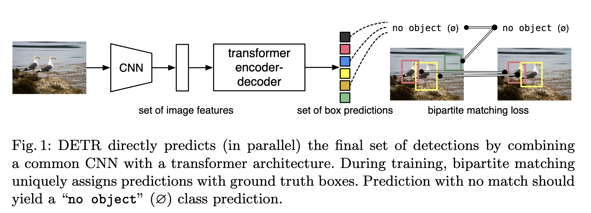

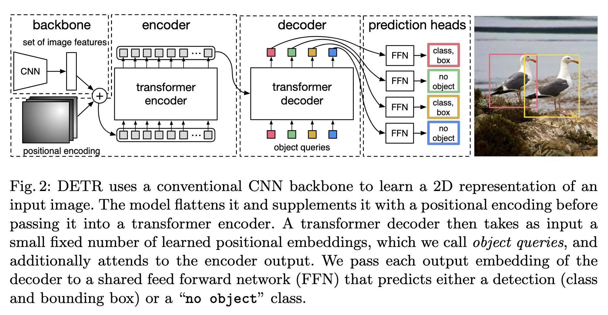

Deformable DETR：

引入可变形卷积，减轻了 DETR 收敛慢、复杂度高的问题，同时也改善了小目标检测。

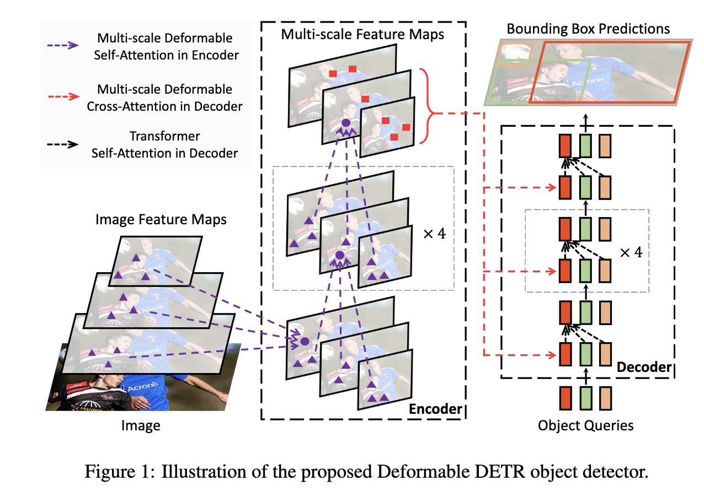

## 参考

@@zouObjectDetection202023a

{{#cite zouObjectDetection202023a}}

[^1]: {{#cite zouObjectDetection202023a}}
Zou, Zhengxia, Keyan Chen, Zhenwei Shi, Yuhong Guo和Jieping Ye. 《Object Detection in 20 Years: A Survey》. *Proceedings of the IEEE* 111, 期 3 (2023年3月): 257–76. https://doi.org/10.1109/JPROC.2023.3238524.
[^2]: Krizhevsky, Alex, Ilya Sutskever和Geoffrey E. Hinton. 《ImageNet classification with deep convolutional neural networks》. *Communications of the ACM* 60, 期 6 (2017年5月24日): 84–90. https://doi.org/10.1145/3065386.
[^3]: Girshick, Ross, Jeff Donahue, Trevor Darrell和Jitendra Malik. 《Rich Feature Hierarchies for Accurate Object Detection and Semantic Segmentation》. 收入 *2014 IEEE Conference on Computer Vision and Pattern Recognition*, 580–87, 2014. https://doi.org/10.1109/CVPR.2014.81.
[^4]: Uijlings, J. R. R., K. E. A. van de Sande, T. Gevers和A. W. M. Smeulders. 《Selective Search for Object Recognition》. *International Journal of Computer Vision* 104, 期 2 (2013年9月1日): 154–71. https://doi.org/10.1007/s11263-013-0620-5.
[^5]: Felzenszwalb, Pedro F., 和Daniel P. Huttenlocher. 《Efficient Graph-Based Image Segmentation》. *International Journal of Computer Vision* 59, 期 2 (2004年9月1日): 167–81. https://doi.org/10.1023/B:VISI.0000022288.19776.77.
[^6]: He, Kaiming, Xiangyu Zhang, Shaoqing Ren和Jian Sun. 《Spatial Pyramid Pooling in Deep Convolutional Networks for Visual Recognition》. 收入 *Computer Vision – ECCV 2014*, 编辑 David Fleet, Tomas Pajdla, Bernt Schiele和Tinne Tuytelaars, 346–61. Cham: Springer International Publishing, 2014. https://doi.org/10.1007/978-3-319-10578-9_23.
[^7]: Girshick, Ross. 《Fast R-CNN》. 收入 *2015 IEEE International Conference on Computer Vision (ICCV)*, 1440–48, 2015. https://doi.org/10.1109/ICCV.2015.169.
[^8]: Ren, Shaoqing, Kaiming He, Ross Girshick和Jian Sun. 《Faster R-CNN: Towards Real-Time Object Detection with Region Proposal Networks》. arXiv, 2016年1月6日. https://doi.org/10.48550/arXiv.1506.01497.
[^9]: Lin, Tsung-Yi, Piotr Dollár, Ross Girshick, Kaiming He, Bharath Hariharan和Serge Belongie. 《Feature Pyramid Networks for Object Detection》. arXiv, 2017年4月19日. https://doi.org/10.48550/arXiv.1612.03144.
[^10]: Redmon, Joseph, Santosh Divvala, Ross Girshick和Ali Farhadi. 《You Only Look Once: Unified, Real-Time Object Detection》. 收入 *2016 IEEE Conference on Computer Vision and Pattern Recognition (CVPR)*, 779–88, 2016. https://doi.org/10.1109/CVPR.2016.91.
[^11]: Liu, Wei, Dragomir Anguelov, Dumitru Erhan, Christian Szegedy, Scott Reed, Cheng-Yang Fu和Alexander C. Berg. 《SSD: Single Shot MultiBox Detector》. 收入 *Computer Vision – ECCV 2016*, 编辑 Bastian Leibe, Jiri Matas, Nicu Sebe和Max Welling, 21–37. Cham: Springer International Publishing, 2016. https://doi.org/10.1007/978-3-319-46448-0_2.
[^12]: Lin, Tsung-Yi, Priya Goyal, Ross Girshick, Kaiming He和Piotr Dollár. 《Focal Loss for Dense Object Detection》. *IEEE Transactions on Pattern Analysis and Machine Intelligence* 42, 期 2 (2020年2月): 318–27. https://doi.org/10.1109/TPAMI.2018.2858826.
[^13]: Law, Hei, 和Jia Deng. 《CornerNet: Detecting Objects as Paired Keypoints》. arXiv, 2019年3月18日. https://doi.org/10.48550/arXiv.1808.01244.
[^14]: Zhou, Xingyi, Dequan Wang和Philipp Krähenbühl. 《Objects as Points》. arXiv, 2019年4月25日. https://doi.org/10.48550/arXiv.1904.07850.
[^15]: Carion, Nicolas, Francisco Massa, Gabriel Synnaeve, Nicolas Usunier, Alexander Kirillov和Sergey Zagoruyko. 《End-to-End Object Detection with Transformers》. arXiv, 2020年5月28日. https://doi.org/10.48550/arXiv.2005.12872.
[^16]: Zhu, Xizhou, Weijie Su, Lewei Lu, Bin Li, Xiaogang Wang和Jifeng Dai. 《Deformable DETR: Deformable Transformers for End-to-End Object Detection》. arXiv, 2021年3月17日. https://doi.org/10.48550/arXiv.2010.04159.